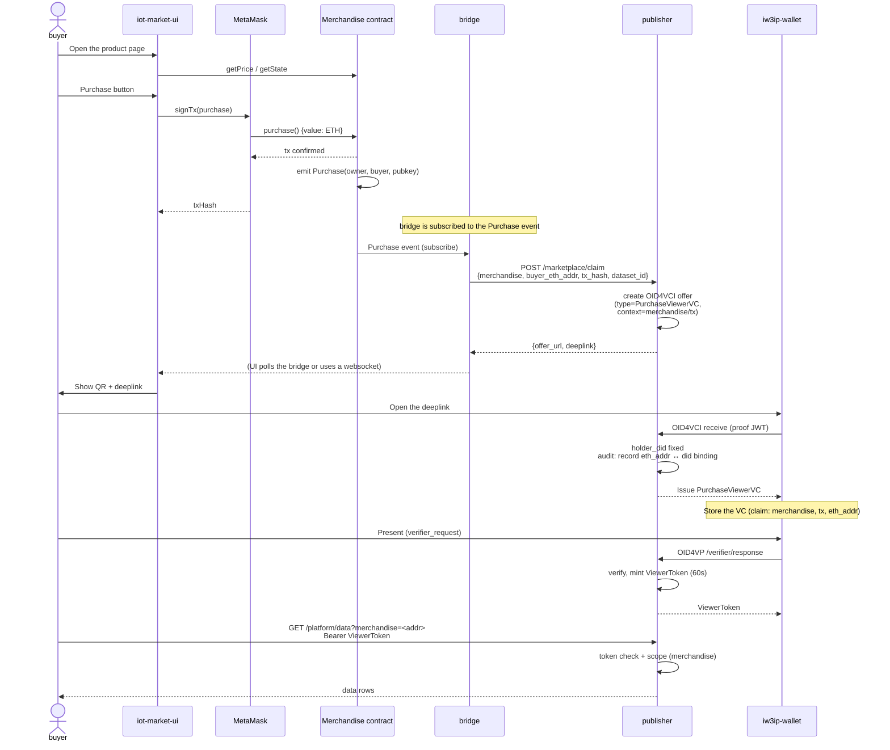

# Marketplace VC Bridge — v1 / v2 Design Spec

!!! abstract "Where this document fits"
    This is the design spec for **v2**, which connects the marketplace to an SSI (Self-Sovereign Identity) wallet on a smartphone.
    The existing system is called **v1** and the system implemented by this spec is called **v2**;
    the common parts and the derived parts are stated explicitly. This document is the draft for milestone M1 (design freeze) in §11.
    "Stage" in this document refers to the step numbers of the Phase 2 hands-on series (listed in §5 of the [VC architecture overview](vc-architecture-overview.md)).
    This spec corresponds to the Stage 5 hands-on [marketplace-vc-bridge](../hands-on/marketplace-vc-bridge.md).

## 1. Relationship between v1 and v2

### 1.1 Definitions of terms

| Term | What it refers to |
|---|---|
| **v1** | The current "Marketplace + MetaMask + encrypted IPFS delivery" system |
| **v2** | The smartphone SSI wallet integration system, which adds a **bridge service + PurchaseViewerVC + publisher data API** to v1. VC stands for Verifiable Credential |
| **bridge** | The service newly added in v2 that acts as an event listener and integrates with the publisher |
| **buyer** | The data purchaser (a human). Assumed to have both MetaMask and iw3ip-wallet |
| **seller** | The data provider. Operates both the Merchandise contract and the publisher |

### 1.2 Coexistence policy

v2 does not replace v1. The encrypted IPFS delivery of v1 is kept, and v2 runs in parallel with v1
as an additional path (a "lane" in the figure below) that becomes available after the purchase completes. After purchasing, the buyer can choose
to receive the data through the encrypted URI (v1) or through a VC (v2).

```
Purchase (common)
    ↓
    ├── v1 lane: Upload event → encryptURI → decrypt → data
    └── v2 lane: bridge → PurchaseViewerVC → wallet → ViewerToken → /platform/data
```

## 2. Overall architecture

### 2.1 v1 (current)

```
┌─────────────┐       ┌──────────────────┐       ┌─────────────┐
│   buyer     │──────▶│  iot-market-ui   │──────▶│ MetaMask    │
│             │       │  (Svelte / 5173) │       │             │
└─────────────┘       └────────┬─────────┘       └──────┬──────┘
                               │                         │
                               ▼ /api/sql-query          ▼ purchase()
                       ┌───────────────┐         ┌──────────────────┐
                       │  PostgreSQL   │         │  Merchandise     │
                       │  (ipfs_records│         │  contract (HH)   │
                       └───────────────┘         └──────┬───────────┘
                               ▲                        │ Upload event
                               │ enrich                  │
                       ┌───────┴───────┐         ┌──────▼──────────┐
                       │  IPFS         │◀────────│ seller (encrypt)│
                       └───────────────┘         └─────────────────┘
```

### 2.2 v2 (this spec)

```
                              ┌─────────────────────────────┐
                              │   buyer (human)              │
                              │   ┌──MetaMask──┬──Wallet──┐  │
                              │   │ ETH addr   │ did:jwk  │  │
                              │   └────────────┴──────────┘  │
                              └────┬────────────┬────────────┘
                                   │ purchase()  │ OID4VP
                                   ▼            ▼
┌─────────────────┐         ┌──────────────────┐       ┌──────────────────┐
│ iot-market-ui   │────────▶│  Merchandise     │       │  iw3ip-wallet    │
│ (post-purchase  │         │  contract (HH)   │       │  (RN, Sphereon)  │
│  VC delivery)   │         └──────────┬───────┘       └────────┬─────────┘
└─────────────────┘                    │ Purchase event           │
        │                              ▼                         │
        │                    ┌──────────────────┐                │
        │                    │  bridge service  │                │
        │                    │  (Node, listener)│                │
        │                    └──────────┬───────┘                │
        │                               │ /marketplace/claim     │
        ▼ POST /marketplace/claim       ▼                        │
                              ┌──────────────────┐               │
                              │   publisher      │◀──────────────┤ OID4VCI
                              │   (FastAPI)      │               │ OID4VP
                              │                  │               │
                              │  /issuer/...     │───PurchaseVC──┤
                              │  /verifier/...   │               │
                              │  /platform/data  │◀──────────────┘ ViewerToken
                              │  /audit/logs     │
                              └────────┬─────────┘
                                       │ enrich
                                       ▼
                              ┌──────────────────┐
                              │  IPFS / Postgres │
                              │ (shared with v1) │
                              └──────────────────┘
```

In the figures, HH means Hardhat and RN means React Native. OID4VCI (OpenID for Verifiable
Credential Issuance) is the protocol used to issue VCs, and OID4VP (OpenID for Verifiable Presentations) is
the protocol used to present them. did:jwk is a DID (Decentralized
Identifier) method that derives the identifier from a public key (JWK); here it is used to identify the wallet holder.

## 3. Common parts and derived parts

### 3.1 Reused as is (v1 = v2)

| Component | Role | Change |
|---|---|---|
| `iot-market` Solidity contracts | Merchandise / IoTMarket / PubKey | **None** |
| MetaMask | Payment at purchase | **None** |
| Hardhat local chain | Chain infrastructure | **None** |
| IPFS | Store for the data itself | **None** (common to v1/v2) |
| PostgreSQL `ipfs_records` | Metadata index | **None** |
| `iot-market-ui` home + list + existing purchase flow | Product discovery and purchase | **None** |

### 3.2 **Added** in v2 (not present in v1)

| Component | Role |
|---|---|
| **bridge service** (`bridge/`, Node) | Subscribes to Purchase events → calls the publisher API |
| **publisher** (existing) | (already exists for Phase 2 SSI) |
| **PurchaseViewerVC** | Viewing VC tied to a purchase (claims include `merchandise_address`, `tx_hash`, `buyer_eth_addr`) |
| `POST /marketplace/claim` | Integration endpoint from bridge → publisher |
| `GET /platform/data?merchandise=<addr>` | Purchase-linked retrieval endpoint, alongside the existing `?dataset_id=` |
| `/purchased/[txHash]` in iot-market-ui | Shows the deeplink/QR for receiving the VC after purchase |
| Via `iw3ip-wallet` | Uses the existing wallet as is (no modification) |

### 3.3 **Present in v1 and kept in v2** (run in parallel)

| Component | Handling in v2 |
|---|---|
| `Merchandise.emitUpload(encryptURI)` + Upload event | **Kept**. Works as the v1 path. Both the v1 and v2 paths run from the same Purchase event |
| `PubKey` contract (buyer public key registry) | **Kept**. Referenced only by the v1 path |
| Encrypt → decrypt flow | **Kept**. The hands-on treats it as a comparison between v1 and v2 |

### 3.4 **Absent from v1 and not built in v2 either**

| Item | Reason |
|---|---|
| KYC (Know Your Customer) / identity verification VC | Out of scope. To be considered in a future Stage 5+ |
| eth-did integration protocols such as did:ethr | In the MVP (Minimum Viable Product, the minimal implementation run in the hands-on), the publisher **records eth_addr ↔ did:jwk off-chain** |
| Multi-chain support | Assumes local Hardhat |
| Price negotiation / auctions | Unchanged from the v1 spec |

## 4. Actor responsibility matrix

| Action | v1 | v2 |
|---|---|---|
| Product discovery | iot-market-ui | iot-market-ui (same) |
| Payment | MetaMask + Merchandise.purchase() | MetaMask + Merchandise.purchase() (same) |
| Buyer identity | Ethereum address | Ethereum address + did:jwk |
| Authorization check | confirmedBuyers mapping | confirmedBuyers mapping + PurchaseViewerVC presentation |
| Data retrieval | Decrypt the encryptURI | `GET /platform/data?merchandise=<addr>` (Bearer ViewerToken) |
| Audit | On-chain Upload event only | publisher audit log (eth_addr, did, tx_hash, jti) |

## 5. Data flow (v2 sequence diagram)



## 6. PurchaseViewerVC schema

```json
{
  "vct": "https://iw3ip.example/credentials/PurchaseViewerVC/v1",
  "iss": "did:jwk:...",
  "sub": "did:jwk:<buyer_holder>",
  "iat": 1735000000,
  "exp": 1735086400,
  "merchandise_address": "0x...",
  "buyer_eth_addr": "0x...",
  "tx_hash": "0x...",
  "dataset_id": "home/env/temperature",
  "purchased_at": "2026-04-27T10:00:00Z",
  "allowed_actions": ["read"],
  "iw3ip_issuer": "iw3ip-publisher-issuer",
  "cnf": { "jwk": { ... } }
}
```

Differences from ViewerVC:

- The three claims `merchandise_address`, `buyer_eth_addr`, and `tx_hash` are required (purchase context)
- At design time, the VC lifetime was set to 24 hours after receipt in the wallet (assuming access right after the purchase). In the current implementation it follows the publisher setting `credential_ttl_days` (default 365 days), as for the other VCs. The ViewerToken obtained by presenting it is valid for 60 seconds
- `allowed_actions=["read"]` is the same as in ViewerVC

## 7. eth_addr ↔ did:jwk binding (options for the MVP)

### 7.1 Adopted approach (MVP): a naive method via query

When the bridge calls the publisher it passes `buyer_eth_addr`, and the publisher
records it bound to the `pre_authorized_code` of the OID4VCI offer. The holder_did becomes fixed
when the wallet receives the VC, so at that point
the publisher writes the `eth_addr ↔ did:jwk` mapping to the audit log.

- **Pros**: Simple to implement, and can be run right away in the hands-on.
- **Cons**: Assumes the bridge is trusted, and impersonation is possible. It cannot be used in production.
- **Handling in the hands-on**: State clearly that "this is for education; production requires the method in §7.2".

### 7.2 Production assumption (future): EIP-712 signature verification

The buyer signs, in EIP-712 format in the wallet, a statement that "this transaction (`tx_hash`) is mine",
and the publisher verifies it.

This is not implemented in the MVP; this spec only describes the method.

## 8. API spec (new in v2)

### 8.1 Publisher side (new)

#### `POST /marketplace/claim`

The bridge calls the publisher.

Request:

```json
{
  "merchandise_address": "0x...",
  "buyer_eth_addr": "0x...",
  "tx_hash": "0x...",
  "dataset_id": "home/env/temperature",
  "purchase_amount_wei": "10000000000000000"
}
```

Response:

```json
{
  "offer_url": "http://publisher:8080/issuer/offer?...&claim_id=<id>",
  "deeplink": "openid-credential-offer://...",
  "claim_id": "<id>"
}
```

#### `GET /marketplace/claim/{claim_id}`

Polled by iot-market-ui. Returns `status: pending|delivered|expired`.

#### `GET /platform/data?merchandise=<addr>`

A retrieval method alongside the existing `?dataset_id=`. The Bearer value is the ViewerToken obtained by presenting the PurchaseViewerVC.
Internally, `dataset_id` is looked up from the Merchandise, and the data is retrieved by the same processing as the existing `?dataset_id=`.

### 8.2 Bridge side (new)

#### `POST /bridge/notify` (optional)

An endpoint through which iot-market-ui tells the bridge that the Purchase transaction has been confirmed on the front end
and asks for the state of the claim. The bridge returns the matching claim from the Purchase events it subscribes to and
its internal map.

#### `GET /bridge/status?tx=<hash>`

Returns the progress of the claim.

## 9. Additional audit log fields

Values of `raw_topic`:

- `marketplace/claim`: at bridge → publisher integration (`reason=claim_received:<jti>`)
- `marketplace/issued`: when the PurchaseViewerVC is issued (`reason=purchase_vc_issued:<jti>`, `vc_hash`)
- `marketplace/data`: when `/platform/data?merchandise=<addr>` is used (`reason=viewer_token_used:<jti>:<read_count>`)

New recorded items:

- `merchandise_address`
- `tx_hash`
- `buyer_eth_addr`

These are added to the existing audit_log table with ALTER COLUMN.

## 10. Test strategy

### 10.1 Publisher unit tests

- pytest: new `tests/test_marketplace_bridge.py` (8–10 cases)
    - claim → offer generation
    - Handling of duplicate claims
    - PurchaseViewerVC issuance and verification of the claim contents
    - Presentation → ViewerToken
    - Retrieval through `/platform/data?merchandise=<addr>`
    - Expiry
    - Rejecting a presentation by a different buyer
    - Rejecting a presentation for a merchandise that was not purchased

### 10.2 Bridge unit tests

- Node test (vitest recommended): `bridge/test/listener.test.ts`
    - mock Hardhat provider
    - Verify Purchase event → call to the publisher mock

### 10.3 e2e (manual / real iPhone)

The e2e (end-to-end) test uses the hands-on procedure as is.

## 11. Milestones

| ID | Content | Duration | Completion criteria |
|---|---|---|---|
| **M1** | Design spec (= this document) | 1 week | The Pull Request that adds this spec is merged into the main branch |
| **M2** | bridge skeleton + `/marketplace/claim` | 1 week | event → API integration works with docker compose |
| **M3** | PurchaseViewerVC + eth↔did binding | 3-4 days | Received in the wallet on a real device, binding recorded in the audit log |
| **M4** | `/platform/data?merchandise=<addr>` + tests | 3-4 days | All tests pass, 200 OK in e2e |
| **M5** | iot-market-ui integration (deeplink/QR display) | 3-4 days | The wallet launches from the post-purchase screen |
| **M6** | Hands-on documentation | 3-4 days | The hands-on is published on the site |

## 12. Open questions

1. iot-market-ui is midway through its migration to SvelteKit + Svelte 5. Confirm the
   API version to use when adding new pages before starting M5
2. Whether to place the bridge in the `ssi-wallet` profile or create a separate profile (`marketplace-vc`).
   To be decided in M2
3. Whether a 24-hour TTL is right for the PurchaseViewerVC (7 days, if we assume the case where the buyer
   notices and views the data several days after the purchase?). To be decided in consultation with hands-on participants
4. The existing `mobile-viewer.md` is still based on v1 (= the unimplemented `/mobile`) and has not been
   updated. If this spec adds `/purchased/[txHash]`, include the rewrite of `mobile-viewer.md`
   in M6

## 13. Related documents

- [SSI Wallet hands-on (Stage 1)](../hands-on/ha-ssi-wallet.md)
- [SSI Viewer hands-on (Stage 3)](../hands-on/ha-ssi-viewer.md)
- [SSI Service hands-on (Stage 4 prep)](../hands-on/ha-ssi-service.md)
- [Marketplace × Wallet bridge hands-on (Stage 5)](../hands-on/marketplace-vc-bridge.md)
- [VC architecture overview](vc-architecture-overview.md) (the list of Stage numbers is in §5)
