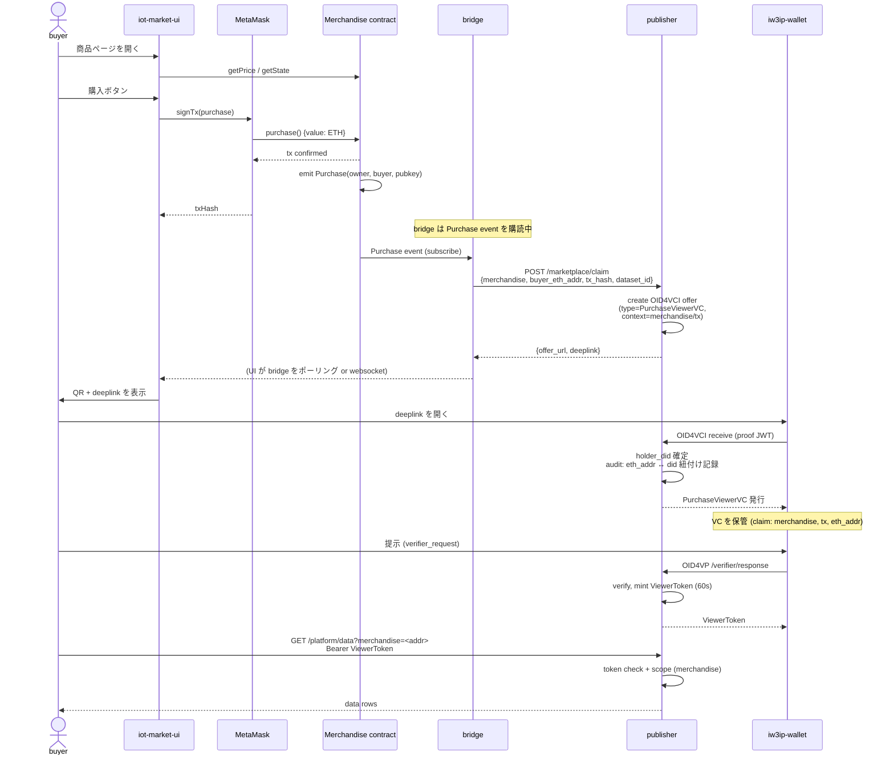

# Marketplace VC Bridge — v1 / v2 設計仕様

!!! abstract "このドキュメントの位置付け"
    マーケットプレイスと、スマホの SSI (Self-Sovereign Identity、自己主権型アイデンティティ) ウォレットを接続する **v2** の設計仕様である。
    既存システムを **v1**、本仕様で実装するシステムを **v2** と呼び、
    共通部分と派生部分を明示する。本書は、§11 のマイルストーン M1 (設計確定) のドラフトである。
    本文中の Stage は Phase 2 のハンズオンの段階番号を指す (一覧は [VC アーキテクチャ全体像](vc-architecture-overview.md) の §5)。
    本仕様は Stage 5 のハンズオン [marketplace-vc-bridge](../hands-on/marketplace-vc-bridge.md) に対応する。

## 1. v1 と v2 の関係

### 1.1 用語の定義

| 用語 | 指すもの |
|---|---|
| **v1** | 現行の「Marketplace + MetaMask + 暗号化 IPFS 配信」システム |
| **v2** | v1 に **bridge service + PurchaseViewerVC + publisher データ API** を追加した、スマホ SSI ウォレット連携システム。VC は Verifiable Credential (検証可能な資格情報) の略 |
| **bridge** | v2 で新設するイベントリスナー兼 publisher 連携サービス |
| **buyer** | データ購入者 (人間)。MetaMask と iw3ip-wallet の両方を持つ前提 |
| **seller** | データ提供者。Merchandise コントラクトと publisher の両方を運用 |

### 1.2 共存方針

v2 は v1 を置き換えない。v1 の暗号化 IPFS 配信は維持し、v2 は購入完了後に使える
追加の経路 (下図の lane) として v1 と並行して動作する。buyer は購入後に、暗号化 URI で
受け取る (v1) か、VC 経由で受け取る (v2) かを選択できる。

```
購入 (共通)
    ↓
    ├── v1 lane: Upload event → encryptURI → 復号 → データ
    └── v2 lane: bridge → PurchaseViewerVC → wallet → ViewerToken → /platform/data
```

## 2. アーキテクチャ全体図

### 2.1 v1 (現行)

```
┌─────────────┐       ┌──────────────────┐       ┌─────────────┐
│   buyer     │──────▶│  iot-market-ui   │──────▶│ MetaMask    │
│             │       │  (Svelte / 5173) │       │             │
└─────────────┘       └────────┬─────────┘       └──────┬──────┘
                               │                         │
                               ▼ /api/sql-query          ▼ purchase()
                       ┌───────────────┐         ┌──────────────────┐
                       │  PostgreSQL   │         │  Merchandise     │
                       │  (ipfs_records│         │  contract (HH)   │
                       └───────────────┘         └──────┬───────────┘
                               ▲                        │ Upload event
                               │ enrich                  │
                       ┌───────┴───────┐         ┌──────▼──────────┐
                       │  IPFS         │◀────────│ seller (encrypt)│
                       └───────────────┘         └─────────────────┘
```

### 2.2 v2 (本仕様)

```
                              ┌─────────────────────────────┐
                              │   buyer (人間)               │
                              │   ┌──MetaMask──┬──Wallet──┐  │
                              │   │ ETH addr   │ did:jwk  │  │
                              │   └────────────┴──────────┘  │
                              └────┬────────────┬────────────┘
                                   │ purchase()  │ OID4VP
                                   ▼            ▼
┌─────────────────┐         ┌──────────────────┐       ┌──────────────────┐
│ iot-market-ui   │────────▶│  Merchandise     │       │  iw3ip-wallet    │
│ (post-purchase  │         │  contract (HH)   │       │  (RN, Sphereon)  │
│  VC delivery)   │         └──────────┬───────┘       └────────┬─────────┘
└─────────────────┘                    │ Purchase event           │
        │                              ▼                         │
        │                    ┌──────────────────┐                │
        │                    │  bridge service  │                │
        │                    │  (Node, listener)│                │
        │                    └──────────┬───────┘                │
        │                               │ /marketplace/claim     │
        ▼ POST /marketplace/claim       ▼                        │
                              ┌──────────────────┐               │
                              │   publisher      │◀──────────────┤ OID4VCI
                              │   (FastAPI)      │               │ OID4VP
                              │                  │               │
                              │  /issuer/...     │───PurchaseVC──┤
                              │  /verifier/...   │               │
                              │  /platform/data  │◀──────────────┘ ViewerToken
                              │  /audit/logs     │
                              └────────┬─────────┘
                                       │ enrich
                                       ▼
                              ┌──────────────────┐
                              │  IPFS / Postgres │
                              │  (v1 と共有)      │
                              └──────────────────┘
```

図中の HH は Hardhat、RN は React Native を指す。OID4VCI (OpenID for Verifiable
Credential Issuance) は VC の発行、OID4VP (OpenID for Verifiable Presentations) は
VC の提示に使うプロトコルである。did:jwk は公開鍵 (JWK) から導出する DID (Decentralized
Identifier、分散型識別子) の方式で、ここではウォレットの持ち主の識別に使う。

## 3. 共通部分と派生部分

### 3.1 そのまま流用する (v1 = v2)

| コンポーネント | 役割 | 変更 |
|---|---|---|
| `iot-market` Solidity 契約 | Merchandise / IoTMarket / PubKey | **無し** |
| MetaMask | 購入時の支払い | **無し** |
| Hardhat ローカルチェーン | チェーン基盤 | **無し** |
| IPFS | データ本体ストア | **無し** (v1/v2 共通) |
| PostgreSQL `ipfs_records` | メタデータインデックス | **無し** |
| `iot-market-ui` ホーム + リスト + 既存 purchase 動線 | 商品発見と購入 | **無し** |

### 3.2 v2 で使うもの (新規に追加するものと、既存のものの再利用)

| コンポーネント | 役割 |
|---|---|
| **bridge service** (`bridge/`, Node) | Purchase イベント購読 → publisher API 呼び出し |
| **publisher** (既存) | (既に Phase 2 SSI 用に存在) |
| **PurchaseViewerVC** | 購入連動の閲覧用 VC (claim に `merchandise_address`, `tx_hash`, `buyer_eth_addr`) |
| `POST /marketplace/claim` | bridge → publisher の連携 endpoint |
| `GET /platform/data?merchandise=<addr>` | 既存 `?dataset_id=` と並列の購入連動取得 endpoint |
| iot-market-ui の `/purchased/[txHash]` | 購入後の VC 受領 deeplink/QR 表示 |
| `iw3ip-wallet` 経由 | 既存 wallet をそのまま使用 (改修なし) |

### 3.3 v1 に **存在し、v2 でも残す**もの (並走)

| コンポーネント | v2 での扱い |
|---|---|
| `Merchandise.emitUpload(encryptURI)` + Upload event | **残す**。v1 の経路として動作する。同じ Purchase イベントから v1 と v2 の両方の経路が動作する |
| `PubKey` コントラクト (買い手公開鍵レジストリ) | **残す**。v1 の経路でのみ参照される |
| 暗号化 → 復号フロー | **残す**。ハンズオンでは v1 と v2 の比較として扱う |

### 3.4 v1 に **無く、v2 でも作らない**もの

| 項目 | 理由 |
|---|---|
| KYC (Know Your Customer) / 身元確認 VC | スコープ外。将来 (Stage 8 以降) に検討 |
| did:ethr 等の eth-did 統合プロトコル | MVP (Minimum Viable Product、ハンズオンで動かす最小限の実装) では eth_addr ↔ did:jwk を publisher が **off-chain で記録** |
| マルチチェーン対応 | Hardhat ローカル前提 |
| 価格交渉・オークション | v1 仕様のまま |

## 4. アクター責務マトリクス

| アクション | v1 | v2 |
|---|---|---|
| 商品の発見 | iot-market-ui | iot-market-ui (同) |
| 支払い | MetaMask + Merchandise.purchase() | MetaMask + Merchandise.purchase() (同) |
| 買い手身元 | Ethereum address | Ethereum address + did:jwk |
| 認可確認 | confirmedBuyers mapping | confirmedBuyers mapping + PurchaseViewerVC presentation |
| データ取得 | encryptURI 復号 | `GET /platform/data?merchandise=<addr>` (Bearer ViewerToken) |
| 監査 | on-chain Upload event のみ | publisher audit log (eth_addr, did, tx_hash, jti) |

## 5. データフロー (v2 シーケンス図)


```mermaid
sequenceDiagram
    actor B as buyer
    participant UI as iot-market-ui
    participant MM as MetaMask
    participant MC as Merchandise contract
    participant BR as bridge
    participant PUB as publisher
    participant W as iw3ip-wallet

    B->>UI: 商品ページを開く
    UI->>MC: getPrice / getState
    B->>UI: 購入ボタン
    UI->>MM: signTx(purchase)
    MM->>MC: purchase() {value: ETH}
    MC-->>MM: tx confirmed
    MC->>MC: emit Purchase(owner, buyer, pubkey)
    MM-->>UI: txHash
    Note over BR: bridge は Purchase event を購読中
    MC->>BR: Purchase event (subscribe)
    BR->>PUB: POST /marketplace/claim<br/>{merchandise, buyer_eth_addr, tx_hash, dataset_id}
    PUB->>PUB: create OID4VCI offer<br/>(type=PurchaseViewerVC,<br/>context=merchandise/tx)
    PUB-->>BR: {offer_url, deeplink}
    BR-->>UI: (UI が bridge をポーリング or websocket)
    UI->>B: QR + deeplink を表示
    B->>W: deeplink を開く
    W->>PUB: OID4VCI receive (proof JWT)
    PUB->>PUB: holder_did 確定<br/>audit: eth_addr ↔ did 紐付け記録
    PUB-->>W: PurchaseViewerVC 発行
    Note over W: VC を保管 (claim: merchandise, tx, eth_addr)

    B->>W: 提示 (verifier_request)
    W->>PUB: OID4VP /verifier/response
    PUB->>PUB: verify, mint ViewerToken (60s)
    PUB-->>W: ViewerToken
    B->>PUB: GET /platform/data?merchandise=<addr><br/>Bearer ViewerToken
    PUB->>PUB: token check + scope (merchandise)
    PUB-->>B: data rows
```

## 6. PurchaseViewerVC スキーマ

```json
{
  "vct": "https://iw3ip.example/credentials/PurchaseViewerVC/v1",
  "iss": "did:jwk:...",
  "sub": "did:jwk:<buyer_holder>",
  "iat": 1735000000,
  "exp": 1766536000,
  "merchandise_address": "0x...",
  "buyer_eth_addr": "0x...",
  "tx_hash": "0x...",
  "dataset_id": "home/env/temperature",
  "purchased_at": "2026-04-27T10:00:00Z",
  "allowed_actions": ["read"],
  "iw3ip_issuer": "iw3ip-publisher-issuer",
  "cnf": { "jwk": { ... } }
}
```

ViewerVC との違い:

- `merchandise_address`, `buyer_eth_addr`, `tx_hash` の 3 つが必須 (購入文脈)
- VC の有効期間は、設計時点ではウォレットでの受領後 24 時間 (購入直後のアクセスを想定) としていた。現在の実装では、他の VC と同じく publisher の設定値 `credential_ttl_days` (既定 365 日) に従う。提示して得る ViewerToken の有効期間は 60 秒である
- `allowed_actions=["read"]` は ViewerVC と同じ

## 7. eth_addr ↔ did:jwk 紐付け (MVP の選択肢)

### 7.1 採用案 (MVP): query 経由の素朴な方式

bridge が publisher を呼ぶときに `buyer_eth_addr` を渡し、publisher は
OID4VCI offer の `pre_authorized_code` に紐付けて記録する。ウォレットが VC を
受領するときに holder_did が確定するので、その時点で
audit log に `eth_addr ↔ did:jwk` の対応を書く。

- **長所**: 実装が単純で、ハンズオンですぐに実行できる。
- **短所**: bridge を信用する前提であり、なりすましができる。本番環境では使えない。
- **ハンズオンでの扱い**: 「教育用であり、本番では §7.2 の方式が必要」と明記する。

### 7.2 本番想定 (将来): EIP-712 署名検証

buyer がウォレットで「このトランザクション (`tx_hash`) は私のもの」という内容に EIP-712
形式で署名し、publisher がそれを検証する。

MVP では実装せず、本仕様では方式を記すだけとする。

## 8. API 仕様 (v2 で新規)

### 8.1 publisher 側 (新設)

#### `POST /marketplace/claim`

bridge が publisher を呼び出す。

Request:
```json
{
  "merchandise_address": "0x...",
  "buyer_eth_addr": "0x...",
  "tx_hash": "0x...",
  "dataset_id": "home/env/temperature",
  "purchase_amount_wei": "10000000000000000"
}
```

Response:
```json
{
  "offer_url": "http://publisher:8080/issuer/offer?...&claim_id=<id>",
  "deeplink": "openid-credential-offer://...",
  "claim_id": "<id>"
}
```

#### `GET /marketplace/claim/{claim_id}`

iot-market-ui がポーリングする。`status: pending|delivered|expired` を返す。

#### `GET /platform/data?merchandise=<addr>`

既存の `?dataset_id=` と並ぶ取得方法である。Bearer には PurchaseViewerVC の提示で得た ViewerToken を指定する。
内部では Merchandise から `dataset_id` を逆引きし、既存の `?dataset_id=` と同じ処理で取得する。

### 8.2 bridge 側 (新設)

#### `POST /bridge/notify` (任意)

iot-market-ui が bridge に、フロントで Purchase トランザクションが確定したことを伝え、
claim の状態を問い合わせる endpoint である。bridge は、購読している Purchase event と
内部のマップから該当する claim を返す。

#### `GET /bridge/status?tx=<hash>`

claim の進行状況を返す。

## 9. audit log の追加フィールド

`raw_topic` の値:

- `marketplace/claim`: bridge → publisher の連携時 (`reason=claim_received:<jti>`)
- `marketplace/issued`: PurchaseViewerVC 発行時 (`reason=purchase_vc_issued:<jti>`, `vc_hash`)
- `marketplace/data`: `/platform/data?merchandise=<addr>` 利用時 (`reason=viewer_token_used:<jti>:<read_count>`)

新規記録項目:

- `merchandise_address`
- `tx_hash`
- `buyer_eth_addr`

これらは既存の audit_log テーブルに `ALTER TABLE ... ADD COLUMN` で追加する。

## 10. テスト戦略

### 10.1 publisher 単体

- pytest: `tests/test_marketplace_bridge.py` 新規 (8〜10 件)
    - claim → offer 生成
    - 二重 claim の扱い
    - PurchaseViewerVC 発行・claim 内容の検証
    - 提示 → ViewerToken
    - `/platform/data?merchandise=<addr>` 取得
    - 期限切れ
    - 違う buyer での提示拒否
    - 未購入の merchandise への提示拒否

### 10.2 bridge 単体

- Node test (vitest 推奨): `bridge/test/listener.test.ts`
    - mock Hardhat provider
    - Purchase event → publisher mock 呼び出し検証

### 10.3 e2e (手動 / iPhone 実機)

e2e (end-to-end) テストには、ハンズオンの手順をそのまま用いる。

## 11. マイルストーン

| ID | 内容 | 期間 | 完了条件 |
|---|---|---|---|
| **M1** | 設計仕様 (= 本ドキュメント) | 1 週間 | 本仕様を追加する Pull Request が main ブランチにマージされる |
| **M2** | bridge スケルトン + `/marketplace/claim` | 1 週間 | docker compose で event → API 連携が動く |
| **M3** | PurchaseViewerVC + eth↔did 紐付け | 3-4 日 | 実機のウォレットで受領、audit に紐付け記録 |
| **M4** | `/platform/data?merchandise=<addr>` + テスト | 3-4 日 | 全テスト pass、e2e で 200 OK |
| **M5** | iot-market-ui 統合 (deeplink/QR 表示) | 3-4 日 | 購入後画面でウォレット起動 |
| **M6** | ハンズオン文書化 | 3-4 日 | site にハンズオン公開 |

## 12. オープンクエスチョン

1. iot-market-ui は SvelteKit + Svelte 5 への移行途中。新規 page 追加時の
   API バージョンを M5 着手前に確認する
2. bridge を `ssi-wallet` profile に同居させるか、別 profile (`marketplace-vc`) を
   作るか。M2 で決定する
3. PurchaseViewerVC の TTL は 24 時間で良いか (購入後数日して気付いて閲覧する
   ケースを想定するなら 7 日?)。→ 実装では個別の TTL を設けず、他の VC と同じ
   `credential_ttl_days` (既定 365 日) とした (§6 参照)
4. 既存の `mobile-viewer.md` は v1 ベース (= 動作未実装の `/mobile`) のまま更新
   されていない。本仕様で `/purchased/[txHash]` を新設するなら、`mobile-viewer.md`
   の刷新を M6 に含める

## 13. 関連ドキュメント

- [SSI Wallet ハンズオン (Stage 1)](../hands-on/ha-ssi-wallet.md)
- [SSI Viewer ハンズオン (Stage 3)](../hands-on/ha-ssi-viewer.md)
- [SSI Service ハンズオン (Stage 4 prep)](../hands-on/ha-ssi-service.md)
- [Marketplace × Wallet bridge ハンズオン (Stage 5)](../hands-on/marketplace-vc-bridge.md)
- [VC アーキテクチャ全体像](vc-architecture-overview.md) (Stage 番号の一覧は §5)
