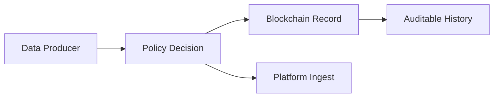

# Blockchain Basics

## Goal

- understand what blockchain is used for
- explain its role in IW3IP (auditability and tamper resistance)

## General Explanation

### Minimum Concepts

- Ledger: a record of transactions
- Block: a unit that groups transactions
- Hash: fixed-size digest used for integrity checks
- Smart Contract: program executed on-chain

### How Blockchain Builds Trust

Instead of relying on a single server, blockchain shares transaction history across multiple participants and links blocks with hashes.  
The main benefit is not \"magic immutability\", but that history becomes easier to verify, compare, and detect tampering against.

### What It Is Good At, and What It Is Not

- Good at:
  - traceable history
  - shared verification across participants
  - programmable rule execution via smart contracts
- Not good at:
  - storing large raw data directly
  - ultra-low-latency high-throughput data streams
  - storing secrets in plain form

### Common Misunderstandings

- \"Blockchain is always fast\": no, it optimizes trust and verifiability, not raw throughput
- \"Store all raw data on-chain\": usually no, keep large payloads off-chain and store references/digests
- \"Smart contracts are legal contracts themselves\": it is more accurate to first think of them as deterministic programs enforcing rules

## Position in This System

### Why It Matters in IW3IP

In centralized systems, access policy and usage history are often hidden in one operator database.  
IW3IP increases transparency by keeping verifiable records for policy-related operations.

### Intuition Diagram

### Connection to IW3IP

- This sample focuses on consent policy + audit pipeline first
- Later phases can add stronger on-chain evidence and access governance

### What Is On-Chain vs Off-Chain Here

- On-chain candidates:
  - contract summaries
  - verification hashes
  - auditable usage evidence
- Off-chain candidates:
  - raw IoT data
  - large media files
  - high-frequency sensor streams

## Sources

- Ethereum documentation: <https://ethereum.org/en/developers/docs/>
- Bitcoin Whitepaper: <https://bitcoin.org/bitcoin.pdf>
