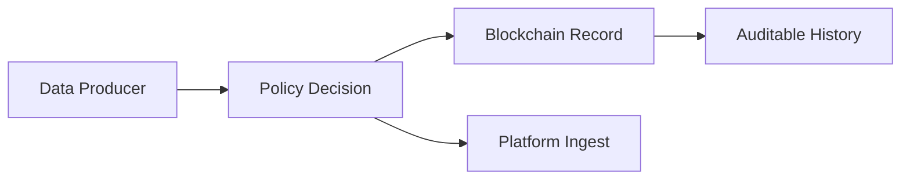

# Blockchain Basics

## Goal

Blockchain is widely discussed, but it is often unclear what it is actually good for and where it should not be used.  
This chapter first explains the general mechanism and then places it inside the IW3IP architecture.

- understand what blockchain is used for
- explain its role in IW3IP (auditability and tamper resistance)

## General Explanation

### Minimum Concepts

At minimum, these four terms cover the essentials.

- Ledger: a record of transactions
- Block: a unit that groups transactions
- Hash: fixed-size digest used for integrity checks
- Smart Contract: program executed on-chain

### How Blockchain Builds Trust

Instead of keeping records on a single server, blockchain has multiple participants share the same history and links each block with hashes, which makes the record hard to rewrite after the fact.  
The point is not that tampering is impossible, but that **tampering is easy to detect and history can be reconciled across participants.**

### What It Is Good At, and What It Is Not

Blockchain is not a universal tool. You need to decide what to put on it and what to leave to other systems.

- Good at:
  - tracing who recorded what and when
  - sharing history without depending entirely on one central administrator
  - automating rule execution through smart contracts
- Not good at:
  - storing large raw data directly
  - ultra-low-latency high-throughput data streams
  - storing secrets in plain form

### Common Misunderstandings

- \"Blockchain is fast at everything\": no. Its strengths are verifiability and decentralization
- \"Put all raw data on-chain\": no. Large data is usually stored off-chain, with digests or references recorded on-chain
- \"Smart contracts are legal contracts themselves\": no. Here, treat them as programs that run according to defined conditions

## Position in This System

### Why It Matters in IW3IP

In centralized systems, access policy and usage history are often hidden in one operator database.  
IW3IP increases transparency by keeping verifiable records for policy-related operations.

### Conceptual Diagram

### Connection to IW3IP

The samples in this site prioritize one idea first: what to record and what not to record.

- This sample implements consent decisions and audit logs first
- It leaves room to later connect contract terms and verification data on-chain

### What Is On-Chain vs Off-Chain Here

If this is left vague, neither the reasons to use blockchain nor the reasons not to become clear.  
IW3IP separates information suited to verification and audit trails from information that is large or updated frequently.

- On-chain candidates:
  - contract summaries
  - verification hashes
  - auditable usage evidence
- Off-chain candidates:
  - raw IoT data
  - large media files
  - high-frequency sensor streams

## Sources

- Ethereum documentation: <https://ethereum.org/en/developers/docs/>
- Bitcoin Whitepaper: <https://bitcoin.org/bitcoin.pdf>
