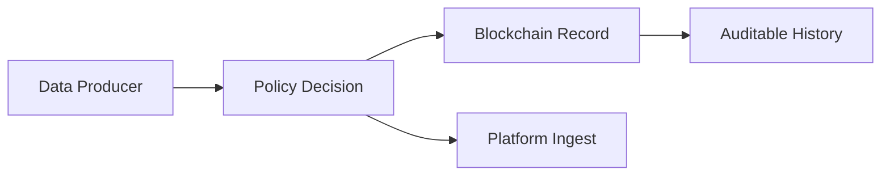

# Blockchain Basics

## Goal

- understand what blockchain is used for
- explain its role in IW3IP (auditability and tamper resistance)

## Minimum Concepts

- Ledger: a record of transactions
- Block: a unit that groups transactions
- Hash: fixed-size digest used for integrity checks
- Smart Contract: program executed on-chain

## Why It Matters in IW3IP

In centralized systems, access policy and usage history are often hidden in one operator database.  
IW3IP increases transparency by keeping verifiable records for policy-related operations.

## Intuition Diagram

## Common Misunderstandings

- "Blockchain is always fast": no, it optimizes trust and verifiability, not raw throughput
- "Store all raw data on-chain": usually no, keep large payloads off-chain and store references/digests

## Connection to IW3IP

- This sample focuses on consent policy + audit pipeline first
- Later phases can add stronger on-chain evidence and access governance

## Sources

- Ethereum documentation: <https://ethereum.org/en/developers/docs/>
- Bitcoin Whitepaper: <https://bitcoin.org/bitcoin.pdf>
