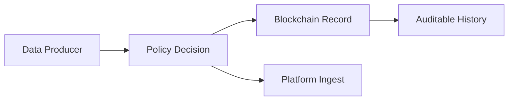

# ブロックチェーン基礎

## この章の目的

- ブロックチェーンを「何のために使うか」を理解する
- IW3IPでの役割（監査可能性・改ざん困難性）を説明できるようにする

## 最低限の概念

- 台帳（Ledger）: 取引履歴を記録するデータ構造
- ブロック: 複数の取引をまとめた単位
- ハッシュ: データを固定長に要約した値（改ざん検知に使う）
- スマートコントラクト: 台帳上で実行されるプログラム

## なぜ必要か（IW3IP視点）

従来型では、アクセス許可・データ利用履歴が事業者DBに閉じるため、利用者が後から検証しにくい課題があります。  
IW3IPでは、利用条件や操作履歴の一部を検証可能な形で扱うことで、透明性を高めます。

## 直感図

## 初学者が誤解しやすい点

- ブロックチェーン = 何でも速い: いいえ。検証可能性と分散性が強み
- ブロックチェーンに生データを全部置く: いいえ。大きなデータは外部保存し、要約や参照情報を記録する設計が一般的

## IW3IPとの接続

- 本サンプルでは、まず同意判定と監査ログを中心に実装
- 将来、契約条件や検証情報をオンチェーン連携する余地を確保

## 出典

- Ethereum documentation: <https://ethereum.org/en/developers/docs/>
- Bitcoin Whitepaper: <https://bitcoin.org/bitcoin.pdf>
