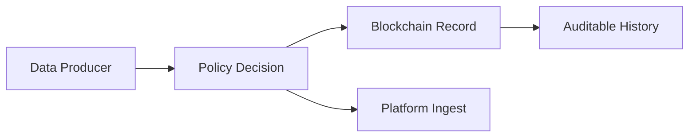

# ブロックチェーン基礎

## この章の目的

ブロックチェーンは名前が先行しがちで、得意・不得意が曖昧なまま語られることが多い技術です。  
この章ではまず一般的な仕組みを整理し、IW3IP の中でどこを担うかを確認します。

- ブロックチェーンを「何のために使うか」を理解する
- IW3IPでの役割（監査可能性・改ざん困難性）を説明できるようにする

## 一般的な説明

### 最低限の概念

まず次の 4 つを押さえれば十分です。

- 台帳（Ledger）: 取引履歴を記録するデータ構造
- ブロック: 複数の取引をまとめた単位
- ハッシュ: データを固定長に要約した値（改ざん検知に使う）
- スマートコントラクト: 台帳上で実行されるプログラム

### どのように信頼を作るか

ブロックチェーンは、1台のサーバだけに記録を置くのではなく、複数の参加者が同じ履歴を共有し、
各ブロックをハッシュでつなぐことで「あとから勝手に書き換えにくい」状態を作ります。

ポイントは「絶対に改ざんできない」ことではなく、**改ざんを検出しやすく、参加者間で履歴を照合できる** ことです。

### 何が得意で、何が不得意か

ブロックチェーンは万能ではなく、何を載せて何を別の仕組みに任せるかの切り分けが必要です。

- 得意:
  - 誰がいつ何を記録したかを追跡しやすい
  - 中央管理者1人に完全依存しない形で履歴を共有できる
  - スマートコントラクトによりルール実行を自動化できる
- 不得意:
  - 大容量データの直接保存
  - 低遅延・高頻度処理を大量にさばくこと
  - 秘密情報のそのまま保存

### よくある誤解

- ブロックチェーン = 何でも速い: いいえ。検証可能性と分散性が強み
- ブロックチェーンに生データを全部置く: いいえ。大きなデータは外部保存し、要約や参照情報を記録する設計が一般的
- スマートコントラクト = 法律上の契約そのもの: いいえ。ここでは「条件に従って動くプログラム」と理解するのが出発点です

## 本システムでの位置付け

### なぜIW3IPで必要か

従来型では、アクセス許可・データ利用履歴が事業者DBに閉じるため、利用者が後から検証しにくい課題があります。  
IW3IPでは、利用条件や操作履歴の一部を検証可能な形で扱うことで、透明性を高めます。

### 直感図

### IW3IPとの接続

本サイトのサンプルでは、まず「何を記録し、何を記録しないか」の考え方を押さえることを優先しています。

- 本サンプルでは、まず同意判定と監査ログを中心に実装
- 将来、契約条件や検証情報をオンチェーン連携する余地を確保

### どこがオンチェーンで、どこがオフチェーンか

ここが曖昧だと、ブロックチェーンを使う理由も使わない理由も見えなくなります。IW3IP では、検証・証跡向きの情報と、容量や更新頻度が大きい情報を分けて扱います。

- オンチェーン向き:
  - 契約条件の要約
  - 検証用ハッシュ
  - 利用履歴の証跡
- オフチェーン向き:
  - 生のIoTデータ
  - 動画や画像などの大きなファイル
  - 高頻度なセンサストリーム

## 出典

- Ethereum documentation: <https://ethereum.org/en/developers/docs/>
- Bitcoin Whitepaper: <https://bitcoin.org/bitcoin.pdf>
