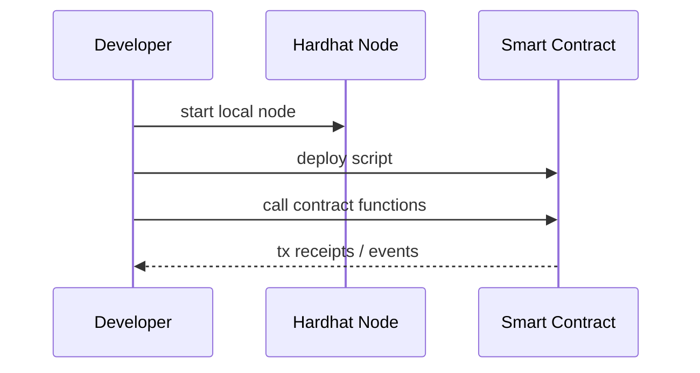

# Hardhat Basics (Blockchain Used in This Site)

This chapter explains Hardhat, the blockchain development environment used in this site.  
It is not for production; it is an environment for running and verifying smart contracts locally.

## General Explanation

### What is Hardhat?

Hardhat is a development environment for Ethereum smart contracts.

In this site, it is used as a **local development blockchain** for safe and reproducible exercises.

### What You Can Do

- start local chain (`npx hardhat node`)
- deploy contracts (`npx hardhat run ... --network localhost`)
- run tests (`npx hardhat test`)

### Why It Is Good for Learning

A learning environment needs failures that are easy to redo and steps that can be reproduced any number of times.  
Hardhat handles this well, so even those new to blockchain can experiment freely.

- you can experiment locally on one machine
- test accounts and balances are provided by default
- deploy/call/observe cycles are short and repeatable

### Minimal Flow

## Position in This System

### Role in IW3IP

- learning phase: use Hardhat to understand the flow of contract execution
- production review: move on to selecting public/permissioned chains and designing their operation

### What You Actually Touch in This Site

Rather than studying Hardhat itself in depth, this site uses it as the experiment platform for IW3IP.

- `npx hardhat node`: starts local blockchain
- deploy scripts: place contracts on the local network
- MetaMask: connects to the local chain and sends transactions from the UI

### Typical Issues

- stale MetaMask network state -> reset/sync accounts and network
- deploy script failures -> restart local node and redeploy
- port conflicts -> check `8545` usage

### Difference from Production

Keep this difference in mind so you do not confuse a learning-oriented local chain with a production network.

- Hardhat is mainly for development and education
- production use requires separate consideration for network operations, gas costs, incident handling, and key management

## Sources

- Hardhat official docs: <https://hardhat.org/docs>
- Hardhat getting started: <https://hardhat.org/hardhat-runner/docs/getting-started>
