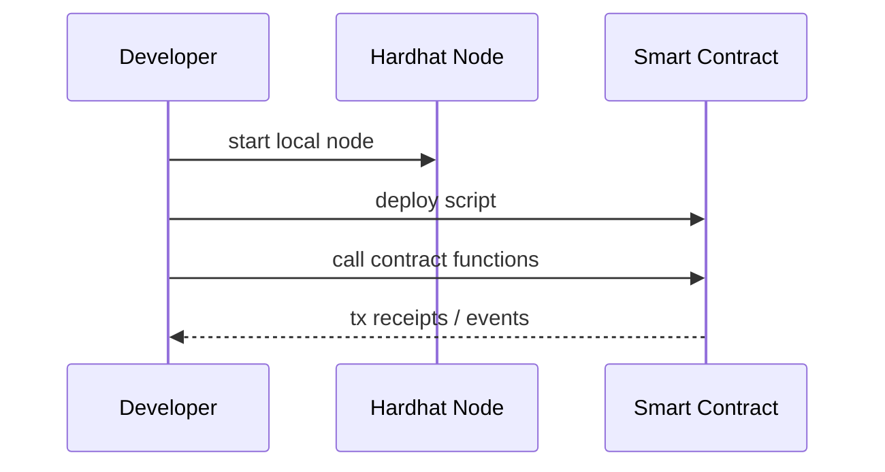

# Hardhat Basics (Blockchain Used in This Site)

This chapter explains Hardhat as the blockchain environment used in this site.  
It is best understood first as a local environment for observing contract execution and reproducible experiments, not as a production network.

## General Explanation

### What is Hardhat?

Hardhat is a development environment for Ethereum smart contracts.

In this site, it is used as a **local development blockchain** for safe and reproducible exercises.

### What You Can Do

- start local chain (`npx hardhat node`)
- deploy contracts (`npx hardhat run ... --network localhost`)
- run tests (`npx hardhat test`)

### Why It Is Good for Learning

For learning, the important point is that failures are easy to reset and the same steps can be repeated.  
Hardhat works well in that role and makes it easier to experiment with blockchain behavior on one machine.

- you can experiment locally on one machine
- test accounts and balances are provided by default
- deploy/call/observe cycles are short and repeatable

### Minimal Flow

## Position in This System

### Role in IW3IP

- learning phase: understand contract execution and traceability
- future phase: evaluate production network choices and operations

### What You Actually Touch in This Site

In this site, Hardhat is used less as a topic by itself and more as the execution environment behind the IW3IP samples.

- `npx hardhat node`: starts local blockchain
- deploy scripts: place contracts on the local network
- MetaMask: connects to the local chain and sends transactions from the UI

### Typical Issues

- stale MetaMask network state -> reset/sync accounts and network
- deploy script failures -> restart local node and redeploy
- port conflicts -> check `8545` usage

### Difference from Production

Keeping this difference clear helps avoid mixing up a local development chain with a real deployment target.

- Hardhat is mainly for development and education
- production use requires separate consideration for network operations, gas costs, incident handling, and key management

## Sources

- Hardhat official docs: <https://hardhat.org/docs>
- Hardhat getting started: <https://hardhat.org/hardhat-runner/docs/getting-started>
