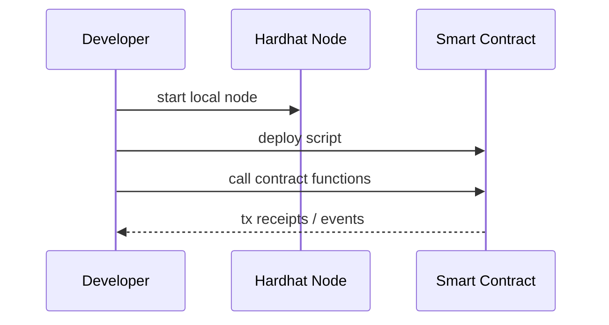

# Hardhat Basics (Blockchain Used in This Site)

## What is Hardhat?

Hardhat is a development environment for Ethereum smart contracts.

In this site, it is used as a **local development blockchain** for safe and reproducible exercises.

## What You Can Do

- start local chain (`npx hardhat node`)
- deploy contracts (`npx hardhat run ... --network localhost`)
- run tests (`npx hardhat test`)

## Minimal Flow

## Role in IW3IP

- learning phase: understand contract execution and traceability
- future phase: evaluate production network choices and operations

## Typical Issues

- stale MetaMask network state -> reset/sync accounts and network
- deploy script failures -> restart local node and redeploy
- port conflicts -> check `8545` usage

## Sources

- Hardhat official docs: <https://hardhat.org/docs>
- Hardhat getting started: <https://hardhat.org/hardhat-runner/docs/getting-started>
