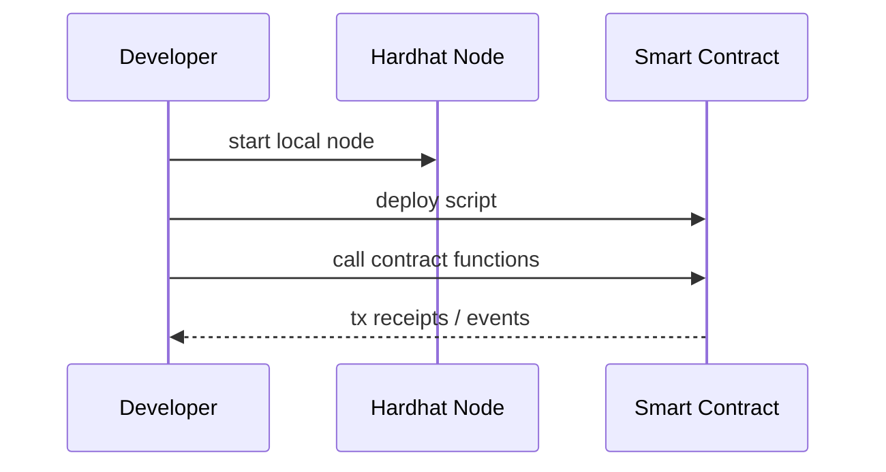

# Hardhat基礎（このサイトで使うブロックチェーン）

## Hardhatとは

Hardhatは、Ethereum系スマートコントラクトの開発・テスト・デプロイを行うための開発環境です。

このサイトでは、**ローカル開発チェーン**として使い、実験を安全かつ再現可能に行います。

## 何ができるか

- ローカルノード起動（`npx hardhat node`）
- コントラクトデプロイ（`npx hardhat run ... --network localhost`）
- テスト実行（`npx hardhat test`）

## 開発フロー（最小）

## IW3IPにおける位置づけ

- 学習段階: Hardhatで「契約実行の流れ」を理解
- 実運用検討: 公開チェーン/許可型チェーンの選定と運用設計へ展開

## よくあるつまずき

- MetaMaskのネットワーク状態が古い -> アカウント/ネットワークを再同期
- デプロイスクリプト失敗 -> ノード再起動後に再デプロイ
- ポート衝突 -> `8545` 利用状況を確認

## 出典

- Hardhat official docs: <https://hardhat.org/docs>
- Hardhat getting started: <https://hardhat.org/hardhat-runner/docs/getting-started>
