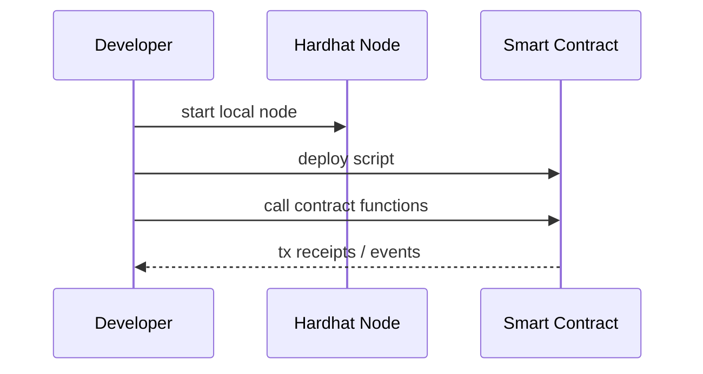

# Hardhat基礎（このサイトで使うブロックチェーン）

この章では、このサイトで使うブロックチェーン環境として Hardhat を説明します。  
本番運用向けの基盤ではなく、まずスマートコントラクトの実行と検証の流れを手元で確かめるための環境として捉えると分かりやすくなります。

## 一般的な説明

### Hardhatとは

Hardhatは、Ethereum系スマートコントラクトの開発・テスト・デプロイを行うための開発環境です。

このサイトでは、**ローカル開発チェーン**として使い、実験を安全かつ再現可能に行います。

### 何ができるか

- ローカルノード起動（`npx hardhat node`）
- コントラクトデプロイ（`npx hardhat run ... --network localhost`）
- テスト実行（`npx hardhat test`）

### なぜ学習に向いているか

学習で重要なのは、失敗してもすぐにやり直せて、同じ手順を何度でも再現できることです。  
Hardhat はこの点で扱いやすく、ブロックチェーンを初めて触る段階でも試行錯誤しやすい環境です。

- 手元PCだけでブロックチェーン実験ができる
- テスト用アカウントと残高が最初から用意される
- デプロイ・呼び出し・イベント確認を短いサイクルで試せる

### 開発フロー（最小）

## 本システムでの位置付け

### IW3IPにおける役割

- 学習段階: Hardhatで「契約実行の流れ」を理解
- 実運用検討: 公開チェーン/許可型チェーンの選定と運用設計へ展開

### このサイトで実際に触るもの

このサイトでは、Hardhat をそれ自体の学習対象として深く掘り下げるより、IW3IP の実験基盤として使います。

- `npx hardhat node`: ローカルチェーンの起動
- デプロイスクリプト: コントラクトをローカルネットワークへ配置
- MetaMask: ローカルチェーンへ接続し、UIから取引を送る

### よくあるつまずき

- MetaMaskのネットワーク状態が古い -> アカウント/ネットワークを再同期
- デプロイスクリプト失敗 -> ノード再起動後に再デプロイ
- ポート衝突 -> `8545` 利用状況を確認

### 実運用との違い

ここを理解しておくと、学習用のローカルチェーンと実運用のネットワークを混同しにくくなります。

- Hardhat はあくまで開発・学習用
- 本番では、ネットワーク運用、ガスコスト、障害対応、秘密鍵管理を別途考える必要がある

## 出典

- Hardhat official docs: <https://hardhat.org/docs>
- Hardhat getting started: <https://hardhat.org/hardhat-runner/docs/getting-started>
