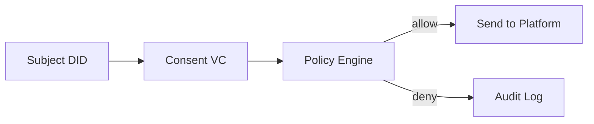

# SSI / DID / VC Basics

## Goal

- understand Self-Sovereign Identity (SSI)
- understand how DID and VC are used in policy decisions

## Terms

- SSI: users manage identity credentials under user control
- DID: decentralized identifier (example: `did:example:alice`)
- VC: Verifiable Credential; here used as Consent VC

## Minimal Model in This Site

- Consent VC includes `subject_did`, `dataset_id`, `allowed_purposes`, `valid_from/to`
- Data Publisher validates these fields and decides allow/deny

## Why It Works

- machine-checkable constraints: who, for what purpose, until when
- easier audit trace of policy decisions

## Future Extensions

- full signature verification (placeholder now)
- DID resolution against DID Documents
- PEP in front of publisher

## Sources

- W3C DID Core: <https://www.w3.org/TR/did-core/>
- W3C Verifiable Credentials Data Model 2.0: <https://www.w3.org/TR/vc-data-model-2.0/>
- DIF (Decentralized Identity Foundation): <https://identity.foundation/>
