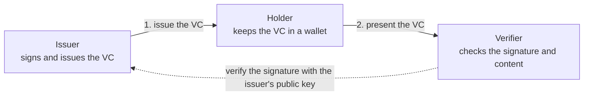
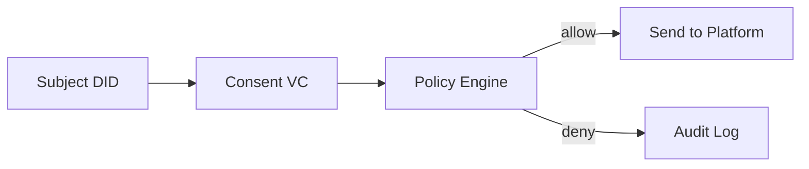

# SSI / DID / VC Basics

## Goal

SSI, DID, and VC often appear together, which makes their boundaries hard to see at first.  
This chapter separates their roles and then reconnects them inside the IW3IP design.

- understand Self-Sovereign Identity (SSI)
- understand how DID and VC are used in policy decisions

## General Explanation

### Terms

- SSI: users manage identity credentials under user control
- DID: decentralized identifier (example: `did:example:alice`)
- VC: Verifiable Credential; here used as Consent VC

### Relationship Between the Three

- SSI is the design philosophy
- DID identifies a subject
- VC expresses verifiable claims about that subject

As a practical starting analogy, it is helpful to read this as: **DID = ID, VC = certificate, SSI = user-controlled identity architecture**.

### Why They Matter

In many conventional systems, one service provider stores both identity and permission data, making reuse and independent verification difficult.  
SSI-oriented systems aim to let users or organizations hold credentials and present them only when needed.

### Issuer, Holder, and Verifier

Three roles are involved in a VC.

```mermaid
flowchart LR
  I["Issuer<br/>signs and issues the VC"] -->|"1. issue the VC"| H["Holder<br/>keeps the VC in a wallet"]
  H -->|"2. present the VC"| V["Verifier<br/>checks the signature and content"]
  V -.->|"verify the signature with the issuer's public key"| I
```

| Role | What it does | Who plays it on this site |
|---|---|---|
| Issuer | Signs the content of a VC and issues it | publisher |
| Holder | Receives and stores the VC, and presents it when needed | the phone wallet |
| Verifier | Checks the signature and content of a presented VC and decides whether to allow the request | publisher |

The verifier can check the signature with the issuer's public key without contacting the issuer. The holder decides which VC to show to whom and when.

### Issuance and presentation protocols

The wallet-based hands-on pages (Part 2) use the following standards.

| Term | Meaning |
|---|---|
| OID4VCI (OpenID for Verifiable Credential Issuance) | How an issuer hands a VC to a wallet. The wallet receives it by scanning a QR code |
| OID4VP (OpenID for Verifiable Presentations) | How a wallet presents a VC to a verifier. The wallet scans a QR code shown by the verifier |
| Presentation Definition (PD) | The verifier's request stating which fields of which VC it wants to see |
| SD-JWT VC | A VC format that lets the holder disclose only the fields that are needed |
| did:jwk | A DID that uses the public key itself as the identifier. The wallet creates one at first run |

### VCs and tokens

A VC is a long-lived credential and is not presented on every API call. On this site, once a VC presentation is verified, the publisher issues a short-lived **token**, and APIs are called with that token. The mapping between VC kinds and tokens is summarized in the [VC architecture overview](../design/vc-architecture-overview.md).

## Position in This System

### Minimal Model in This Site

To keep the first explanation manageable, this site uses a minimal model focused on consent-based decisions.

- Consent VC includes `subject_did`, `dataset_id`, `allowed_purposes`, `valid_from/to`
- Data Publisher validates these fields and decides allow/deny

```mermaid
flowchart LR
A[Subject DID] --> B[Consent VC]
B --> C[Policy Engine]
C -->|allow| D[Send to Platform]
C -->|deny| E[Audit Log]
```

### Why It Works

- machine-checkable constraints: who, for what purpose, until when
- easier audit trace of policy decisions

### What This Sample Simplifies

Stating these simplifications explicitly makes it easier to distinguish the purpose of the sample from future extensions.

- signature verification is still a placeholder
- DID resolution is not fully implemented
- advanced VC expression/presentation formats are not covered yet

### Future Extensions

- full signature verification (placeholder now)
- DID resolution against DID Documents
- PEP in front of publisher

## Sources

- W3C DID Core: <https://www.w3.org/TR/did-core/>
- W3C Verifiable Credentials Data Model 2.0: <https://www.w3.org/TR/vc-data-model-2.0/>
- DIF (Decentralized Identity Foundation): <https://identity.foundation/>
