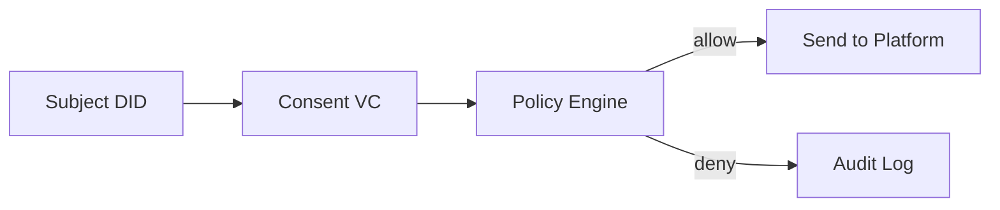

# SSI / DID / VC 基礎

## この章の目的

- SSI（Self-Sovereign Identity）の考え方を理解する
- DID と VC がポリシー判定でどう使われるかを把握する

## 用語

- SSI: 利用者が自分の識別情報・資格情報を主体的に管理する考え方
- DID: 分散型識別子（例: `did:example:alice`）
- VC: Verifiable Credential。検証可能な資格情報（このサイトでは Consent VC を利用）

## 本サイトでの最小モデル

- Consent VCに `subject_did`, `dataset_id`, `allowed_purposes`, `valid_from/to` を含める
- Data Publisherがこれを検証し、送信可否を決定する

## なぜ有効か

- 「誰が」「何の目的で」「いつまで」を機械判定できる
- 監査時に、判定根拠を追跡しやすい

## 今後の拡張

- 署名検証の本実装（現在はプレースホルダ）
- DID解決（DID Document参照）
- PEP（Policy Enforcement Point）前段化

## 出典

- W3C DID Core: <https://www.w3.org/TR/did-core/>
- W3C Verifiable Credentials Data Model 2.0: <https://www.w3.org/TR/vc-data-model-2.0/>
- DIF (Decentralized Identity Foundation): <https://identity.foundation/>
