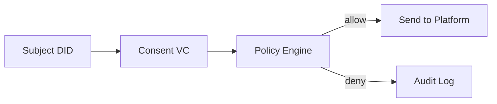

# SSI / DID / VC 基礎

## この章の目的

SSI、DID、VC は似た文脈で並んで登場するため、最初は境界が分かりにくくなりがちです。  
この章では、それぞれの役割を分けて説明し、最後に IW3IP の中でどのように組み合わさるかを確認します。

- SSI（Self-Sovereign Identity）の考え方を理解する
- DID と VC がポリシー判定でどう使われるかを把握する

## 一般的な説明

### 用語

- SSI: 利用者が自分の識別情報・資格情報を主体的に管理する考え方
- DID: 分散型識別子（例: `did:example:alice`）
- VC: Verifiable Credential。検証可能な資格情報（このサイトでは Consent VC を利用）

### 3つの関係

- SSI は考え方
- DID は「誰か」を表す識別子
- VC は「その人に関する主張」を検証可能な形で表したもの

はじめは、**DID = ID、VC = 証明書、SSI = それを利用者主体で扱う設計思想** と捉えると、全体像をつかみやすくなります。

### なぜ必要か

従来のID管理では、1つのサービス事業者がアカウント情報と権限を握ることが多く、利用者は他サービスへの持ち運びや検証を行いにくいことがあります。  
SSI系の考え方では、利用者や組織が資格情報を持ち、必要な場面で提示・検証することを目指します。

## 本システムでの位置付け

### 本サイトでの最小モデル

このサイトでは、概念を増やしすぎず、まず同意条件の判定に必要な最小構成に絞って扱います。

- Consent VCに `subject_did`, `dataset_id`, `allowed_purposes`, `valid_from/to` を含める
- Data Publisherがこれを検証し、送信可否を決定する

### なぜ有効か

- 「誰が」「何の目的で」「いつまで」を機械判定できる
- 監査時に、判定根拠を追跡しやすい

### 本サンプルで簡略化している点

ここを先に明示しておくと、サンプルの目的と、今後の拡張対象を切り分けやすくなります。

- 署名検証はプレースホルダ
- DID解決は本実装していない
- VCの JSON-LD 表現や高度な提示方式は扱っていない

### 今後の拡張

- 署名検証の本実装（現在はプレースホルダ）
- DID解決（DID Document参照）
- PEP（Policy Enforcement Point）前段化

## 出典

- W3C DID Core: <https://www.w3.org/TR/did-core/>
- W3C Verifiable Credentials Data Model 2.0: <https://www.w3.org/TR/vc-data-model-2.0/>
- DIF (Decentralized Identity Foundation): <https://identity.foundation/>
