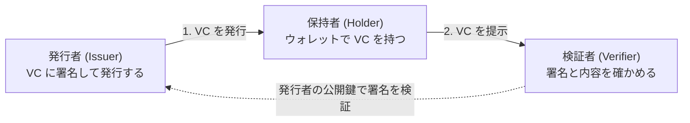
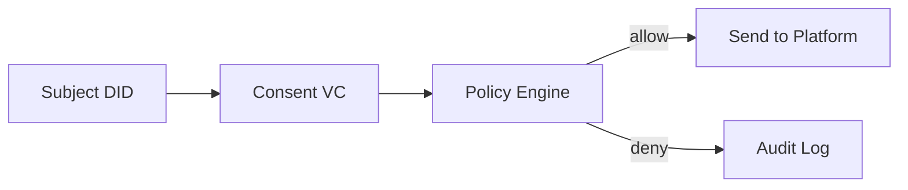

# SSI / DID / VC 基礎

## この章の目的

SSI、DID、VC は一緒に登場することが多く、最初は区別しにくい用語です。  
この章ではそれぞれの役割を分けて説明し、IW3IP での組み合わせ方を確認します。

- SSI（Self-Sovereign Identity）の考え方を理解する
- DID と VC がポリシー判定でどう使われるかを把握する

## 一般的な説明

### 用語

- SSI: 利用者が自分の識別情報・資格情報を主体的に管理する考え方
- DID: 分散型識別子（例: `did:example:alice`）
- VC: Verifiable Credential。検証可能な資格情報（このサイトでは Consent VC を利用）

### 3つの関係

- SSI は考え方
- DID は「誰か」を表す識別子
- VC は「その人に関する主張」を検証可能な形で表したもの

最初は **DID = ID、VC = 証明書、SSI = それを利用者主体で扱う設計思想** と覚えておけば十分です。

### なぜ必要か

従来の ID 管理では一事業者がアカウント情報と権限を管理するため、利用者が資格情報を他のサービスへ持ち運ぶことも、第三者が検証することも困難です。SSI では利用者や組織が資格情報を自ら保持し、必要な場面で提示・検証します。

### 発行者・保持者・検証者

VC には 3 つの役割が関わります。

```mermaid
flowchart LR
  I["発行者 (Issuer)<br/>VC に署名して発行する"] -->|"1. VC を発行"| H["保持者 (Holder)<br/>ウォレットで VC を持つ"]
  H -->|"2. VC を提示"| V["検証者 (Verifier)<br/>署名と内容を確かめる"]
  V -.->|"発行者の公開鍵で署名を検証"| I
```

| 役割 | すること | 本サイトでの担当 |
|---|---|---|
| 発行者 (Issuer) | VC の内容に署名して発行する | publisher |
| 保持者 (Holder) | VC を受け取って保管し、必要なときに提示する | スマホのウォレット |
| 検証者 (Verifier) | 提示された VC の署名と内容を確かめ、要求を許可するか決める | publisher |

検証者は、発行者に問い合わせなくても、発行者の公開鍵で署名を確かめられます。保持者は、どの VC をいつ誰に見せるかを自分で決められます。

### 発行と提示の手順

ウォレットを使うハンズオン (Part 2) では、次の標準仕様を使います。

| 用語 | 意味 |
|---|---|
| OID4VCI (OpenID for Verifiable Credential Issuance) | 発行者がウォレットに VC を渡す手順。QR コードを読み取って受け取る |
| OID4VP (OpenID for Verifiable Presentations) | ウォレットが検証者に VC を提示する手順。検証者が出した QR コードを読み取って提示する |
| Presentation Definition (PD) | 検証者が「どの VC のどの項目を見せてほしいか」を書いた要求 |
| SD-JWT VC | VC の形式の 1 つ。持っている項目のうち、必要なものだけを選んで開示できる |
| did:jwk | 公開鍵をそのまま識別子にした DID。ウォレットが最初に作る |

### VC とトークン

VC は長く使う証明書で、API を呼ぶたびに提示するものではありません。本サイトでは、VC の提示が検証されると、publisher が有効期間の短い **トークン** を発行し、API はそのトークンで呼び出します。VC の種類とトークンの対応は [VC アーキテクチャ全体像](../design/vc-architecture-overview.md) にまとめています。

## 本システムでの位置付け

### 本サイトでの最小モデル

本サイトでは概念を広げすぎず、同意条件の判定に必要な最小構成に絞っています。

- Consent VCに `subject_did`, `dataset_id`, `allowed_purposes`, `valid_from/to` を含める
- Data Publisherがこれを検証し、送信可否を決定する

```mermaid
flowchart LR
A[Subject DID] --> B[Consent VC]
B --> C[Policy Engine]
C -->|allow| D[Send to Platform]
C -->|deny| E[Audit Log]
```

### なぜ有効か

- 「誰が」「何の目的で」「いつまで」を機械判定できる
- 監査時に、判定根拠を追跡しやすい

### 本サンプルで簡略化している点

Phase 1 のサンプル（Consent VC に相当する JSON を `/consents` に登録する方式）では、次の点を簡略化しています。ウォレットを使う Part 2 のハンズオンでは、SD-JWT VC の発行・提示・検証を扱います。

- 署名検証はプレースホルダ
- DID解決は本実装していない
- VCの JSON-LD 表現や高度な提示方式は扱っていない

### 今後の拡張

- 署名検証の本実装（現在はプレースホルダ）
- DID解決（DID Document参照）
- PEP（Policy Enforcement Point。ポリシー判定の結果に従ってアクセスを許可・遮断する箇所）を publisher の前段に置く

## 出典

- W3C DID Core: <https://www.w3.org/TR/did-core/>
- W3C Verifiable Credentials Data Model 2.0: <https://www.w3.org/TR/vc-data-model-2.0/>
- DIF (Decentralized Identity Foundation): <https://identity.foundation/>
