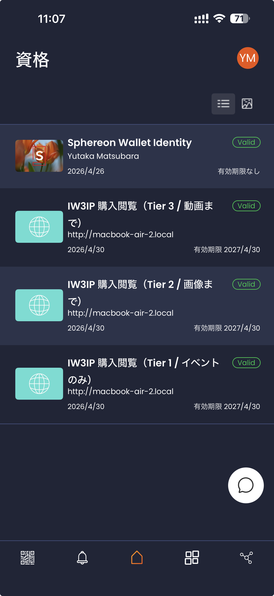
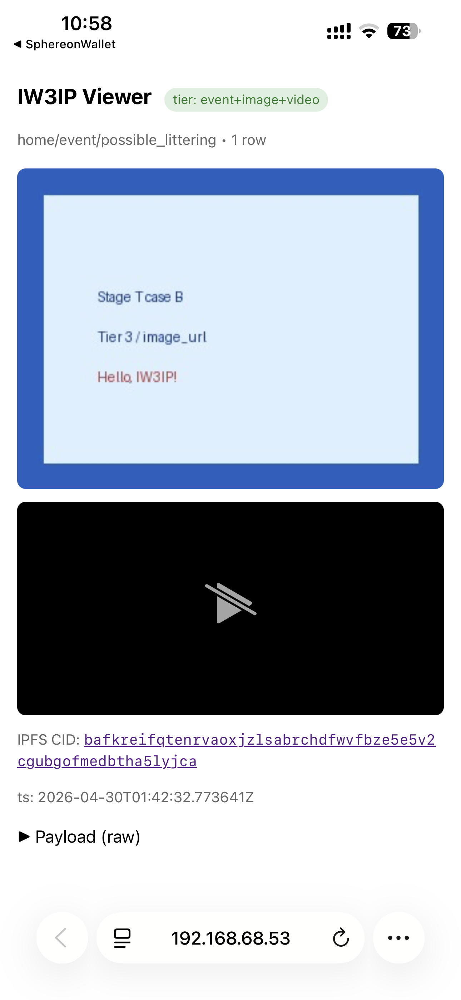
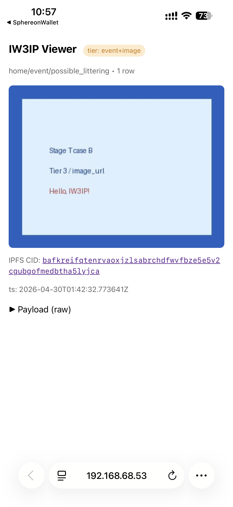
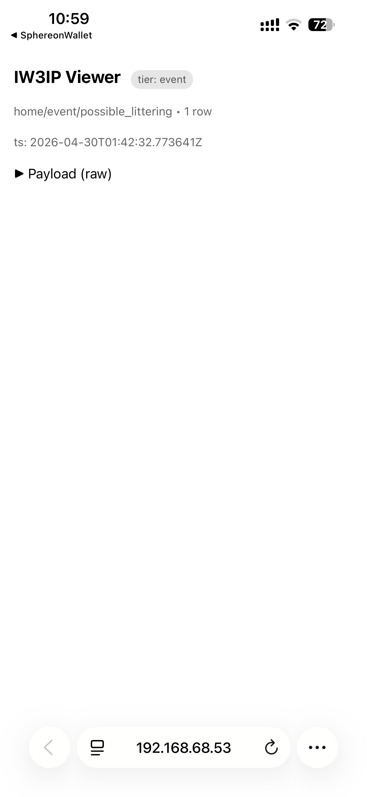

# 画像・動画を段階アクセスで配信する (DataUserVC / Stage T)

[信頼度に応じて見せる中身を変える](data-user-vc-tiered.md)（§0〜§7）の続きです。画像 / 動画の実体も含めて、提供から受信までを通して実行します。節番号は 1 ページ目からの通し番号（§8〜§11）です。

> **やること**: HTTP メディア・ゲートウェイ（案 B）と IPFS（案 C）による画像 / 動画の配信、PWA Viewer での受信、PWA Provider での提供
>
> **前提**: [信頼度に応じて見せる中身を変える](data-user-vc-tiered.md) の §0〜§7 を済ませていること
>
> **使うもの**: PC + スマホ (iw3ip-wallet)
>
> **所要時間**: 90 分くらい

コマンド例は 1 ページ目と同じく、教材リポジトリを `~/program/Blockchain_IoT_Marketplace` に clone した前提で示します。`$HOST_IP` と `<HOST_IP>` は PC の LAN IP です (設定のしかたは [ハンズオンの概要](index.md#host-ip) を参照)。案 A / 案 B / 案 C の違いは
[§0b](data-user-vc-tiered.md#0b-実データ画像--動画統合の選び方) を参照してください。

## 8. 実データ統合（案 B：HTTP メディア・ゲートウェイ）

[1 ページ目](data-user-vc-tiered.md)の §7 までで、ティアごとに `image_cid` / `video_cid` のキーが応答に含まれるかどうかが
変わることを確認しました。ここでは**画像 / 動画の実体**も含めて、提供から受信までを
通して実行します。提供側でダミーの JPEG / MP4 を生成し、publisher の `/media/upload` に
POST して、返ってきた URL を payload の `image_url` / `video_url` に入れます。

### 8.1 提供側スクリプトを実行する

```bash
cd ~/program/Blockchain_IoT_Marketplace
python examples/hands_on/data_user_vc_tiered/provider_with_media.py \
  --base-url http://$HOST_IP:8080
```

このスクリプトは次の 3 ステップを順に実行します。

1. 1×1 JPEG / MP4 fixture を生成（`fixtures/` 配下）
2. `POST /media/upload` で 2 つアップロード（sha256 が同じファイルは重複保存しない）
3. `image_url` / `video_url` 付きイベントを `/simulate/publish` に送る

スクリプト出力に `image_url` / `video_url` の `http://<HOST_IP>:8080/media/...`
形式の URL が表示されます。

### 8.2 受信側（既存の Tier 3 / 2 / 1 フロー）

[§3〜§7](data-user-vc-tiered.md#3-marketplaceclaim-を-3-通り呼び出す) の流れをそのまま使います。Tier 別に `/platform/data` を取得すると、次のようになります。

- **Tier 3 (gov full)** → `event` + `image_url` + `video_url` + `video_duration_sec` 全部
- **Tier 2 (enterprise)** → `event` + `image_url` のみ。`video_url` キーは欠落
- **Tier 1 (default)** → `event` のみ

iPhone Safari で `image_url` をタップすると、1×1 JPEG が表示されます。
自分で用意した画像 / 動画を使う場合は、次のように指定します。

```bash
python examples/hands_on/data_user_vc_tiered/provider_with_media.py \
  --base-url http://$HOST_IP:8080 \
  --image /path/to/snapshot.jpg \
  --video /path/to/clip.mp4 \
  --video-duration-sec 12
```

### 8.3 案 B の制限

- `image_url` / `video_url` は、`image_cid` / `video_cid`（案 A 用）と同じ対応表で投影されるので、併用できます
- コンテンツアドレシング（内容のハッシュ値をアドレスにする方式）ではありません。URL を知っていれば誰でも GET できます
- publisher は単一インスタンスで、レプリカや pinning（IPFS 上でデータを保持し続ける設定）はありません

コンテンツアドレシングと分散保存が必要な場合は **案 C（IPFS）** に
進みます。`/media/upload` のレスポンスの形式は同じ（`{url, sha256, content_type, byte_size, cid, ipfs_gateway_url}`）
なので、提供側スクリプトは変更せず、保存先の backend だけが切り替わります。

## 9. 案 C：ローカル kubo IPFS daemon で分散配信

案 B では、単一の publisher インスタンスが blob（画像 / 動画のバイト列）を配信しました。
案 C では、同じ blob を**コンテンツアドレシング（CID）**で IPFS ネットワーク上に置きます。
IPFS のノードには kubo（IPFS の Go 実装）を使います。
受信者は CID を使って**任意の IPFS gateway**（publisher 内蔵の `/ipfs/<cid>`、
公開 `https://ipfs.io/ipfs/<cid>` など）から取得できるので、publisher が停止しても
データは失われません。

### 9.1 kubo を一緒に起動する

`docker-compose.yml` の `ipfs` profile を有効にして起動します。

```bash
cd ~/program/Blockchain_IoT_Marketplace
export IPFS_API_URL=http://ipfs:5001
export IPFS_GATEWAY_URL=http://ipfs:8080

docker compose -f infra/docker-compose.yml --profile ipfs up -d --force-recreate publisher ipfs
docker compose -f infra/docker-compose.yml ps ipfs
# iw3ip-ipfs container が Up になっていれば OK
```

publisher の設定に `IPFS_API_URL=http://ipfs:5001` が反映されたことを確認します。

```bash
curl -s http://$HOST_IP:8080/.well-known/openid-credential-issuer >/dev/null
docker compose -f infra/docker-compose.yml exec publisher \
  python -c "from publisher.app.config import Settings; \
             print('IPFS_API_URL=', Settings().ipfs_api_url); \
             print('IPFS_GATEWAY_URL=', Settings().ipfs_gateway_url)"
```

### 9.2 アップロード時に CID が返ることを確認

`provider_with_media.py` のレスポンスに `cid` と `ipfs_gateway_url` が増えます。
`/tmp/stage_t_demo.jpg` は例なので、手元のファイルのパスに読み替えてください。

```bash
python examples/hands_on/data_user_vc_tiered/provider_with_media.py \
  --base-url http://$HOST_IP:8080 \
  --image /tmp/stage_t_demo.jpg \
  --video /tmp/stage_t_demo.jpg
```

期待する出力は次のとおりです（`cid` フィールドが `bafk...` で始まります）。

```json
[upload] {
  "image": {
    "url": "http://<HOST_IP>:8080/media/<sha256>.jpg",
    "sha256": "...",
    "content_type": "image/jpeg",
    "byte_size": 7645,
    "cid": "bafkreigb...",
    "ipfs_gateway_url": "http://<HOST_IP>:8080/ipfs/bafkreigb..."
  },
  ...
}
```

provider が payload に `image_cid` / `video_cid` を自動的に入れるので、
受信側の [§3〜§7](data-user-vc-tiered.md#3-marketplaceclaim-を-3-通り呼び出す) のフローはそのまま動きます。

### 9.3 受信側：CID でも URL でも取れる

Tier 3 / 2 の `/platform/data` 応答に `image_cid` と `image_url` の両方が出ます。

```bash
curl -s -H "authorization: Bearer $TOK_GOV" \
  "http://$HOST_IP:8080/platform/data?dataset_id=home/event/possible_littering" \
  | jq --arg h "$HOST_IP" '.rows[0] | {image_cid, image_url, ipfs_gateway: ("http://"+$h+":8080/ipfs/"+.image_cid)}'
```

iPhone Safari でいずれかを開いてください。

| 取得方法 | URL 例 |
|---|---|
| publisher の HTTP gateway | `http://<HOST_IP>:8080/media/<sha256>.jpg`（案 B 互換） |
| publisher の IPFS proxy | `http://<HOST_IP>:8080/ipfs/<cid>` |
| 公開 IPFS gateway | `https://ipfs.io/ipfs/<cid>`（インターネット接続が必要） |

最後の**公開 IPFS gateway** で取得できれば、publisher が停止していても CID だけで
データを取得できること（コンテンツアドレシングが機能していること）を確認できます。

### 9.4 案 C の利点と注意

利点:

- **コンテンツアドレシング**: CID は中身のハッシュです。内容を改竄すると CID が変わるので検出でき、複数の gateway から同じデータを取得できます
- **publisher が停止してもデータが残る**: 他の IPFS ピアにレプリカがあれば取得できます
- **案 B と互換**: レスポンスには `cid` と `ipfs_gateway_url` が増えるだけです

注意:

- kubo daemon が停止していると、`/media/upload` のレスポンスは `cid: null` になります（案 B と同じ動作にフォールバックします）
- 公開 gateway 経由の取得では、IPFS ネットワークへの伝播を待つ時間（分単位）がかかることがあります
- Web3.Storage / Pinata などの pinning service と組み合わせると永続性が上がります（未対応で、今後の課題です）

### 9.5 トラブルシュート

| 症状 | 対処 |
|---|---|
| `cid: null` がレスポンスに返る | `docker compose ... ps ipfs` で kubo container が Up か確認。停止していたら `docker compose ... --profile ipfs up -d ipfs` で起動する |
| `/ipfs/<cid>` が 502 | publisher から `http://ipfs:8080` に到達できない。Docker network 共有を確認 |
| `/ipfs/<cid>` が 404 | `IPFS_GATEWAY_URL` が空。`.env` か `export` 設定を確認 |
| 公開 gateway で取得できない | NAT 配下の場合、kubo がピアに見えていない。`ipfs swarm peers` でピア接続を確認 |

## 10. PWA Viewer（スマホ + PC 共通 UX）

§3〜§9（§3〜§7 は [1 ページ目](data-user-vc-tiered.md)）では、ターミナルから `/verifier/request` を呼び出して token を取得し、
`/platform/data` に curl でアクセスするという、開発者向けの手順を使いました。
publisher 内蔵の **PWA Viewer**（`/buyer/start` + `/viewer`。PWA は Progressive Web App の略）を使うと、
スマホでも PC でも、ブラウザでページを開くだけで提示から表示までが自動で進みます。

```
[iPhone Safari] ─ /buyer/start                            [publisher]
   │  ↓ 自動で deeplink                                       │
   │  iw3ip-wallet 起動 → Tier 3 提示 ───────────────────────► │ mint ViewerToken
   │  ↑ redirect_uri=/viewer?vt=...                            │
   │  Safari 戻る → /viewer が image/video 自動表示             │

[PC Chrome] ─ /buyer/start                                [publisher]
   │  ↓ QR 表示 + ロングポーリング                              │
   │      QR を iPhone で読む → ウォレット → Tier 3 提示 ──────► │
   │  ↑ /verifier/status から viewer_url を取得                 │
   │  PC ブラウザが /viewer に自動遷移 → 画像表示                │
```

### 10.1 起動

特別な準備は不要です。`/buyer/start?ds=<dataset_id>` を **同じ URL でスマホでも PC でも** 開くと、
ページが User-Agent（ブラウザの種類を示す情報）を見て動作を切り替えます。

```
iPhone Safari:  http://<HOST_IP>:8080/buyer/start?ds=home/event/possible_littering
PC Chrome:      http://<HOST_IP>:8080/buyer/start?ds=home/event/possible_littering
```

### 10.2 同一デバイス（iPhone）の挙動

1. 上記 URL を Safari で開く
2. ページが内部で `/verifier/request` を呼び出して deeplink を取得
3. `window.location = deeplink` で **iw3ip-wallet が自動起動**
4. ウォレットで「購入閲覧（Tier 3 / 動画まで）」を選んで提示
5. ウォレットが `redirect_uri=/viewer?vt=...&ds=...` を受け取る
6. **Safari に自動で戻り、画像/動画が描画される**

curl で URL をコピーして貼り付ける手順は不要です。

### 10.3 異デバイス（PC + iPhone）の挙動

1. PC ブラウザで上記 URL を開く
2. ページに **大きな QR コード**が表示される（中身は OID4VP deeplink）
3. iPhone のカメラかウォレットで QR を読むと、ウォレットが起動するので VC を提示する
4. PC のページは裏で `/verifier/status?state=...` を 2 秒ごとにロングポーリング
5. ウォレットでの提示が完了するとレスポンスに `viewer_url` が含まれ、PC のページが自動で遷移する
6. **PC ブラウザに同じ画像/動画が描画される**

### 10.4 Viewer ページの中身

`/viewer?vt=<viewer_token>&ds=<dataset_id>` は次を表示します。

- 上部に **Tier バッジ**（`event` / `event+image` / `event+image+video`）
- `image_url` を `` でインライン表示
- `video_url` を `<video controls>` で再生可能
- `image_cid` がある場合（案 C が有効な場合）は、`/ipfs/<cid>` へのリンクを表示
- 末尾の `details` で生レスポンス JSON を確認可能

ViewerToken の TTL（60 秒）が切れた場合は 401 と共に「再提示してください」のメッセージが出ます。

### 10.5 Tier 別の見え方（実機スクリーンショット）

#### ウォレット側：3 ティアが別カードとして並ぶ

iPhone の iw3ip-wallet（Sphereon mobile-wallet fork）に PurchaseViewerVC を 3 枚受領すると、
Tier 別の表示名で 3 つの異なるカードとして並びます。

<figure markdown>
{ width=320 }
<figcaption>
ウォレットの credential 一覧（縦スクロール）。同じ VCT
<code>https://iw3ip.example/credentials/PurchaseViewerVC/v1</code>
を共有しつつ、 <code>credential_configuration_id</code>
（<code>PurchaseViewerVC.full</code> / <code>.access</code> / <code>.event</code>）の差で
3 種類の display name が出ます。
</figcaption>
</figure>

#### Viewer 側：提示したティアでレスポンスが切り替わる

iPhone（iw3ip-wallet）で一連の流れを実行したときの `/viewer` 画面のスクリーンショットです。
バッジの色と、表示されるコンテンツの違いから、どのティアで取得したかが分かります。

| Tier 3（gov / Full） | Tier 2（enterprise / Access） | Tier 1（default / Event-only） |
|---|---|---|
|  |  |  |
| 緑のバッジ `tier: event+image+video` | オレンジのバッジ `tier: event+image` | 灰色のバッジ `tier: event` |
| 画像 + 動画プレーヤー両方 | 画像のみ、動画プレーヤーなし | テキストとタイムスタンプのみ |
| `image_cid` / `image_url` / `video_url` / `video_duration_sec` 全部 | `image_cid` / `image_url` のみ | すべての media キー欠落 |

3 枚は同じデータセット（`home/event/possible_littering`）に対して、提示する PurchaseViewerVC のティアを
変えて取得した `/platform/data` の結果です。**サーバ側のデータは同一**で、受信者に返す
キーは ViewerToken の `allowed_views` で決まります。

### 10.6 PC + スマホ両対応のメリット

| 観点 | 案 A〜C（手動 curl） | PWA Viewer |
|---|---|---|
| スマホで簡単に確認 | ✗（URL をコピーして貼り付け）| ✓ |
| PC で確認 | ✗（PC にウォレットなし）| ✓（QR + ロングポーリング） |
| アプリ追加インストール | iw3ip-wallet（スマホのみ） | iw3ip-wallet のみ（PC は不要） |
| 失効後の再取得 | curl やり直し | ページリロード |
| 公開デモ | 手順説明が長い | URL を 1 つ渡すだけ |

### 10.7 トラブルシュート

| 症状 | 対処 |
|---|---|
| iPhone で deeplink が起動しない | Safari → ウォレットで開く リンクをタップ。Safari の「アプリ起動許可」を確認 |
| PC で QR が表示されない | ブラウザが CDN（`cdn.jsdelivr.net`）に到達できるか確認。オフライン環境ではエラーになる |
| PC のロングポーリングが終わらない | ウォレット側で正しい VC を提示できているか `docker compose logs publisher` で `/verifier/response` の 200 を確認 |
| `/viewer` が 401 | ViewerToken TTL 60 秒切れ。`/buyer/start` から再開 |
| `/buyer/start` に「データセットが一致しません」バナー | §10.8 の deny UX を参照 |

### 10.8 deny UX（提示拒否時の振る舞い）

verifier が VC 提示を拒否すると、`/verifier/status` レスポンスに `reason` コードと
`human_message_ja` / `human_message_en`（人が読むためのメッセージ）が含まれます。
`/buyer/start` ページはロングポーリング中にこれを検出して、QR の代わりに赤バナーと
「購入画面から再提示」リンクを表示します（実装: `publisher/app/ssi/verifier_routes.py`）。

主要な reason コードと表示文（JA / EN）:

| reason | JA バナー文言 | EN |
|---|---|---|
| `dataset_mismatch` | 提示された VC のデータセットが、要求されたデータセットと一致しません。 | The presented VC is bound to a different dataset. |
| `action_not_allowed` | 提示された VC では、このデータの読み取り権限がありません。 | The presented VC does not include the required action (read). |
| `purpose_mismatch` | 提示された VC の許可目的に、今回の用途が含まれていません。 | The presented VC's allowed_purposes does not cover this purpose. |
| `missing_entityType` 等 | DataUserVC に *XXX* が含まれていません。 | DataUserVC is missing *XXX*. |
| `verification_failed` | VC の署名検証に失敗しました。 | VC verification failed. |

**期待される動作（実機では未確認で、実装から読み取った内容です）:**

1. PC で `/buyer/start?ds=home/event/possible_littering` を開く → QR が出る
2. iPhone のウォレットで、**異なる dataset にバインドされた** PurchaseViewerVC（例: `home/event/another_dataset`）をわざと選んで提示
3. publisher は `/verifier/response` を受け取り、`{"verified": false, "reason": "dataset_mismatch"}` を記録
4. PC の `/verifier/status` ロングポーリングが `status: "denied"` + `human_message_ja` を返す
5. PC ページは QR を `<div class="deny-banner">提示された VC のデータセットが、要求されたデータセットと一致しません。</div>` に置き換え、`/buyer/start?ds=...` への再提示リンクを表示
6. 同時に `docker compose logs publisher` 側で `_write_audit(action="presentation", reason="dataset_mismatch", verified="false")` の監査ログ行が出る

実機で確認する場合は、§10.5 と同じ環境で、**別のデータセットに対する claim** から
`/issuer/offer?vc_kind=PurchaseViewerVC&claim_id=<別 claim>` を発行し、ウォレットに 4 枚目の
カードを入れます。その状態で QR を読み、4 枚目のカードを提示すると再現します。

## 11. PWA Provider（データ提供者向け PWA）

§10 までは、**受信側**が PWA Viewer でデータを取得するフローでした。
§11 では、**提供側**が PWA 上で SSI 認証を済ませてデータを提供するフローを
扱います。同じ publisher コンテナの `/provider/start`、`/provider`、
`/provider/publish` だけで動作し、§8 の `provider_with_media.py` で行った操作を
ブラウザだけで実行できます。

```
[PC ブラウザ] ─ /provider/start                       [publisher]
   │  ↓ QR 表示 + ロングポーリング                         │
   │      QR を iPhone で読む → ウォレット → SellerVC 提示 ─►│ mint SellerToken
   │  ↑ /verifier/status で seller_token + licensed_datasets
   │  PC ページが「許可データセット」一覧を出す
   │  ↓ 1 つ選んで「アップロードへ進む」                     │
   │  /provider?pt=<seller_token>&ds=<dataset_id>          │
   │     ファイル選択 / カメラ撮影 / ブラウザ録画 ─────────►│ /media/upload
   │     ↑ URL + (CID) を払い出し                          │
   │     「Publish」ボタン                                  │
   │     POST /provider/publish (Bearer SellerToken) ─────►│ use_seller_token
   │                                                        │ → process_message
   │  ↑ {"status":"allowed", ...} を表示                     │
```

`/provider/start` は SellerVC を提示する **OID4VP のフロー**で、§10 の `/buyer/start`
と同じ実装パターンです。違いは `vc_kind=SellerVC` を要求する点と、成功時に
`SellerToken` を発行する点です。

### 11.1 起動

特別な準備は不要です（`docker compose ... up -d publisher` で publisher が動いていれば使えます）。
PC ブラウザで次の URL を開きます。

```
http://<HOST_IP>:8080/provider/start?ds=home/event/possible_littering
```

`ds=` は表示用の**ヒント**です。SellerVC の検証はデータセット単位ではないので
省略しても動きますが、画面ヘッダに表示されるので、付けておくと作業中のデータセットが分かります。

### 11.2 SellerVC を提示する（OID4VP）

PC では QR が表示されます。iPhone のウォレットで読み取って **SellerVC** を提示
してください。ここで提示するのは SellerVC です。PurchaseViewerVC を選ばないよう注意してください。

提示が成功すると、PC ページが次の状態に切り替わります。

- 「SellerVC 提示が承認されました」の緑バナー
- **出品許可データセット一覧**（SellerVC の `licensed_datasets[]` がそのまま並ぶ）
- `seller_id` と SellerToken の有効期限（既定 24 時間）
- 1 つ選んで **「アップロードへ進む →」** ボタン

ボタンを押すと `/provider?pt=<seller_token>&ds=<選んだデータセット>` に遷移します。

!!! note "deny UX"
    SellerVC に `seller_id` や `licensed_datasets` が欠けている場合、
    `/verifier/status` から返る `human_message_ja` が画面の赤バナーに出ます
    （reason コード: `missing_seller_id` / `missing_licensed_datasets`）。
    その場で別の VC で再試行できるよう、リロードリンクが添えられています。

### 11.3 データを提供する 3 つの方法

`/provider` ページには、**データ実体を提供する方法が 3 つ**あります。
どれを選んでも `/media/upload` を経由して同じ URL/CID の配信処理を通るので、
受信側の `/viewer` での見え方は変わりません。

| モード | 動作 | 推奨 |
|---|---|---|
| 📁 ファイルから選ぶ | OS のファイルピッカー。既存のファイルをそのまま選択 | PC / スマホ両用 |
| 📷 カメラで撮影 | `<input capture="environment">`。iPhone Safari ではカメラが直接起動。PC ではファイルピッカーにフォールバック | iPhone での即時撮影 |
| 🔴 ブラウザで録画 | `MediaRecorder` + `getUserMedia({video,audio})`。「録画開始」→ ライブプレビュー → 「停止」で WebM/VP9 として自動アップロード。Firefox は VP8 にフォールバック。Safari 16 以下のみ MP4 にフォールバック（Safari 17+ は WebM/VP9 をネイティブ対応） | PC のウェブカメラ |

3 つのモードはすべて同じ `uploadBlob()` の処理を通り、
プレビュー → `POST /media/upload` → 結果パネル表示 → Publish 有効化、という流れは共通です。
SHA-256 で重複排除されるので、同じファイルを複数回アップロードしてもストレージは増えません。

!!! tip "ブラウザ録画のメリット"
    PC のウェブカメラでの撮影から SSI 認証、Publish までをブラウザ 1 画面で
    実行できるので、デモやワークショップで「来歴付きデータの提供」を 30 秒ほどで
    見せられます。USB ウェブカメラ + MQTT のハンズオン（[USB ウェブカメラ
    イベント共有サンプル](webcam-event-sharing.md)）は常時ストリーミングする構成でしたが、
    こちらは人がその場で撮影したデータに来歴を付けて提供する使い方です。

録画で停止を押すと `video_duration_sec` フォームに **実測秒数が自動入力**される
ので、手動で値を合わせる必要はありません。

### 11.4 イベント発行と licensed_datasets ゲート

アップロードが完了すると Publish ボタンが有効になります。フォームの次の項目を
確認・入力して **Publish event** を押します。

- `topic` — 既定で `homeassistant/event/<dataset の末尾セグメント>` が入る
- `purpose` — 既定 `community_cleaning`
- `camera_id`、`video_duration_sec`
- `extra payload keys`（任意の JSON マージ）

ブラウザは `Authorization: Bearer <seller_token>` を付けて `/provider/publish` に
POST します。

サーバー側では次の順に処理します。

1. `schemas.normalize(topic, payload)` で **dataset_id を topic から導出**
2. `ssi_state.use_seller_token(token, dataset_id=<resolved>)` で
   **`licensed_datasets[]` に `dataset_id` が含まれること**を検証
3. 検証に通ったら `processor.process_message` を呼ぶ（`/simulate/publish` と同じ経路）
4. レスポンスに `seller_token_jti` と `register_count` を加えて返す

`SellerToken` は有効期限内なら繰り返し使えます（**multi-use**。`/marketplace/register` と同じ仕様）。
そのため、**1 回の SellerVC 提示で複数のイベントを続けて発行できます**。`register_count` が
増えていく様子は、画面下部の details パネルで確認できます。

拒否（deny）される場合の応答は次のとおりです。

| 失敗パターン | HTTP | reason |
|---|---|---|
| `Authorization` ヘッダなし | 401 | `missing_authorization_header` |
| 不明な SellerToken | 401 | `seller_token_unknown` |
| TTL 切れ SellerToken | 401 | `seller_token_expired` |
| `topic` から導出した dataset が `licensed_datasets[]` に無い | 403 | `seller_token_dataset_not_licensed` |
| `topic` が `normalize()` で受け付けられない | 400 | `unsupported_topic:...` |

すべて `/audit/logs` に `action=deny` で記録されます。

### 11.5 受信側で確認

`/provider` ページの末尾には、対象データセットの `/buyer/start` への
リンクが自動生成されています。別タブで開いて Tier 3 の PurchaseViewerVC を
提示すると、たった今 Publish した画像 / 動画が `/viewer` に表示されます
（§10.5 のスクリーンショットと同じ画面）。

提供、認証、発行、受信、検証の一連の流れを、**ブラウザの 2 つのタブだけ**で実行できます。

!!! success "実機検証済み (2026-04-30)"
    iPhone Safari で撮影 → 提供 → Publish した **`video/quicktime`** の動画を、
    macOS Safari の `/viewer` で **`<video>` タグ経由でインライン再生**できることを
    確認しました（§11.8 のシナリオ A を参照）。同じウォレットが SellerVC（提供側）と
    PurchaseViewerVC.full（受信側）の両方を保持し、提示先のページに応じて自動的に
    使い分けられます。スクリーンショットは
    `images/data-user-vc-tiered/provider/A-macsafari-viewer-tier3.jpg` にあります。

### 11.6 `/provider/start` と `/buyer/start` の対応関係

| 観点 | `/buyer/start`（§10） | `/provider/start`（§11） |
|---|---|---|
| 提示する VC | PurchaseViewerVC | **SellerVC** |
| 検証成功で発行 | ViewerToken (TTL 60s) | **SellerToken** (TTL 24h) |
| 用途 | `/platform/data` の Bearer | **`/provider/publish` の Bearer** |
| 単発 / 複数 | multi-use（読み取りは継続的） | **multi-use**（1 回の認証で複数 publish） |
| dataset スコープ | VC が dataset_id にバインド | SellerVC は `licensed_datasets[]` の集合 |
| deny メッセージ | §10.8 の共通形式 | 同じ `human_message_ja/en` 形式 |

### 11.7 トラブルシュート

| 症状 | 対処 |
|---|---|
| `/provider/start` で「SellerVC のオファーを受け取っていない」 | 先に `POST /issuer/offer?vc_kind=SellerVC&seller_id=...&licensed_datasets=...` でウォレットに SellerVC を入れる必要があります |
| iPhone Safari で「📷 カメラで撮影」がファイルピッカーになる | iOS のバージョンによっては `accept="image/*,video/*" capture="environment"` が組み合わせで効かないことがあります。`accept="video/*"` だけにすると、カメラが直接起動します |
| 「🔴 ブラウザで録画」のボタンが反応しない | `getUserMedia` は HTTPS / `localhost` でしか動きません。LAN の IP（`http://192.168.x.x`）で開いた場合はブラウザがマイク/カメラ権限を拒否します。`localhost:8080` か HTTPS 経由でアクセスしてください |
| `/provider/publish` が 403 `seller_token_dataset_not_licensed` | SellerVC の `licensed_datasets[]` に `topic` から導出される dataset_id が含まれていません。例: `topic=homeassistant/event/possible_littering` → dataset_id は `home/event/possible_littering` |
| Publish レスポンスに `status: send_error` | publisher の `PLATFORM_API_URL` が到達不能。SellerToken のゲートは通っており、`register_count` も上がっているはずです（処理は許可、配信が失敗）|
| `/provider/publish` が 401 `seller_token_unknown` | `SSIStateStore` はインメモリのため publisher container を再起動するとすべての token が消えます。`/provider/start` から再度 SellerVC を提示すれば新しい SellerToken で復旧します（SellerVC 自体はウォレットに残っているので追加発行は不要です）。ハンズオンで container を再起動する場合はこの再提示を 1 回挟みます |
| ウォレットで「Retrieving access token failed: 400 / Error Screen」 | OID4VCI の offer は 1 回しか使えません（**single-use**）。Sphereon 系のウォレットは内部で `/issuer/token` をリトライすることがあり、2 回目の呼び出しは `invalid_grant` で 400 になります。**1 回目の呼び出しで VC はウォレットに発行済み**なので、エラー画面を Dismiss してウォレットの credential 一覧を確認してください。新しいカードが追加されています |

### 11.8 実機検証ログ

§11.3 の 3 つの入力モードについて、4 つの環境で提供から受信までを通して実行した結果を記録します。
スクリーンショットは `docs/hands-on/images/data-user-vc-tiered/provider/`
配下に置いています。

| シナリオ | 環境 | 状態 | 観測値 |
|---|---|---|---|
| **A** iPhone カメラ撮影（`capture="environment"`） | iPhone Safari (iOS 18.x) | 検証済 (2026-04-30) | upload `video/quicktime` 273KB → Publish `status=allowed` → 受信側 `/viewer` で `video/quicktime` がインライン再生（macOS Safari） |
| **B** PC ブラウザ録画（MediaRecorder） | macOS Chrome 147 | codec のみ確認済 (2026-04-30) | サポート 4 種類: `vp9,opus` / `vp8,opus` / `webm` / `mp4` → 選好順で **VP9 を選択**。録画 + Publish は wallet IP 切替後に検証 |
| **C** Firefox VP8 フォールバック | macOS Firefox 139 | **検証済 (2026-04-30)** | サポート 2 種類: `vp8,opus` / `webm` (VP9 なし — Firefox の MediaRecorder は VP9 未対応) → **VP8 を選択**。録画 → アップロード → Publish 完走、`media_uploaded ext=.webm bytes=89909` (WebM/VP8 89KB) + `POST /provider/publish 200 OK`。`pickRecorderMime()` の VP8 fallback 経路を実機で確認できました |
| **D** macOS Safari WebM/VP9（当初の想定は MP4 フォールバック） | macOS Safari 17+ | **検証済 (2026-04-30)** | サポート 4 種類: `vp9,opus` / `vp8,opus` / `webm` / `mp4` → 選好順で **VP9 を選択**（MP4 ではない）。録画 → アップロード → Publish 完走、`seller_token_issued ertl-bcd-final` + `POST /provider/publish 200 OK`。**Safari 17+ は WebM/VP9 にネイティブ対応**しているため、当初の仕様で想定した「Safari は MP4 にフォールバックする」は Safari 16 以下にだけ当てはまります |

#### 実機検証で見つかったバグ（A シナリオ初回試行）

シナリオ A の 1 回目の検証で、**実装のバグ 2 件と運用上の挙動 2 件**が見つかりました。
実機の User-Agent、iPhone 固有のファイル形式、インメモリの state、ウォレットの
リトライ動作に起因するもので、いずれもユニットテストでは検出できませんでした。
バグ 2 件は最新の main で修正済みです。

| # | 症状 | 原因 | 修正 / 対応 |
|---|---|---|---|
| 1 | `/provider/start` で `HTTP 404 no_presentation_definition_for_dataset` | `/provider/start` ページの JavaScript が `dataset_id=<hint>` を `/verifier/request` に渡していた。verifier は SellerVC を `*` 配下にしか登録していないため、検索に失敗していた | [Blockchain_IoT_Marketplace#41](https://github.com/ertlnagoya/Blockchain_IoT_Marketplace/pull/41) で `dataset_id="*"` 固定に修正済み |
| 2 | アップロード時に `HTTP 415 unsupported media type` | iPhone Safari の `<input capture>` は QuickTime `.MOV`（`video/quicktime`）で保存するが、`media_routes._ALLOWED_EXT` に含まれていなかった | [Blockchain_IoT_Marketplace#42](https://github.com/ertlnagoya/Blockchain_IoT_Marketplace/pull/42) で `.mov` 追加 |
| 3 | Publish 直前に `HTTP 401 seller_token_unknown` | `SSIStateStore` がインメモリのため、container を再ビルドするとすべての token が消える。`/provider/start` から SellerVC を提示し直せば復旧する | 仕様どおりの動作です。ハンズオンでは container の起動後に SellerVC を提示する必要があり、§11.7 に記載しています |
| 4 | ウォレットに「Retrieving access token failed: 400」のエラー画面が出る | OID4VCI の offer は 1 回しか使えない（**single-use**）が、Sphereon 系のウォレットが `/issuer/token` をリトライし、2 回目が `invalid_grant` で 400 になる。実際には 1 回目で VC はウォレットに入っている | ウォレット側の挙動です。エラー画面を閉じて credential 一覧を見ると PurchaseViewerVC.full が入っています。§11.7 に記載しています |

各シナリオの再現手順と確認内容は以下のとおりです。検証する人は各項を
通して実施し、上の表の「状態」列を「検証済」に更新して、観測値とスクリーンショットを
このページに追記してください。

#### 共通の前提

すべてのシナリオで次を前提とします。

1. `docker compose -f infra/docker-compose.yml up -d publisher bridge mosquitto` が稼働
2. `licensed_datasets` に `home/event/possible_littering` を含む SellerVC を 1 枚ウォレットに持っている
3. publisher のホストは PC からも iPhone からも到達可能（同じ LAN 推奨）

「ブラウザで録画」モード (B/C/D) は、`getUserMedia` の制約により **`localhost`
または HTTPS でしか動きません**。LAN IP (`http://192.168.x.x:8080`) で
開くとブラウザがマイク/カメラの権限を拒否するため、PC ブラウザでは必ず
**publisher と同じマシンで `http://localhost:8080`** を開いてください。

#### A. iPhone カメラ撮影（`capture="environment"`）

**目的**: `<input type="file" accept="image/*,video/*" capture="environment">`
が iOS Safari でカメラを直接起動するかを確認します。

**手順**:

1. iPhone Safari で `http://<publisher-host>:8080/provider/start?ds=home/event/possible_littering` を開く
2. ウォレットで SellerVC を提示 → `/provider?pt=...&ds=...` に遷移
3. **「📷 カメラで撮影」** の input をタップ
4. iOS のシートで「ビデオを撮影」が **デフォルト**で出るか、もしくは Safari が
   そのままカメラに遷移するかを確認
5. 5〜10 秒の動画を撮影 → 戻る → 自動的に `/media/upload` に POST される
6. 「Publish event」を押して 200 が返ることを確認

**実機での観測 (2026-04-30, iPhone Safari, iOS 18.x)**:

- [x] 「📷 カメラで撮影」をタップ → 「ファイルを選択」 → iOS シートで「ビデオを撮影」を選択 → カメラ起動
  - **注意**: シートに「写真を撮る / ビデオを撮影 / フォトライブラリ / ファイルを選択」の選択肢が並び、カメラは直接起動しません。`accept="image/*,video/*"` + `capture` の指定は、「カメラ優先」というヒントとして扱われます
- [x] アップロード結果: `content_type: video/quicktime` / `byte_size: 273897` / `sha256=11367cf4cb1b...`
  - `video/mp4` を期待していましたが、iPhone Safari は録画を **QuickTime (`.MOV`)** で保存することが分かりました
- [x] Publish レスポンス: `status: allowed`、`dataset_id=home/event/possible_littering`、`seller_token_jti=49bf45c467a65ddc`、`register_count=1`
- [x] 受信側 `/viewer` (macOS Safari, Tier 3 PurchaseViewerVC.full): 緑バッジ `tier: event+image+video` + `<video>` タグでインライン再生成功
  - **macOS Safari は `video/quicktime` をネイティブ再生できます**。案 B（HTTP メディア・ゲートウェイ）で QuickTime 形式を扱えることを確認できました

**スクリーンショット**:

```
images/data-user-vc-tiered/provider/A-iphone-404-original.png       # 修正前: 404 no_presentation_definition_for_dataset
images/data-user-vc-tiered/provider/A-iphone-415-mov-rejected.png   # 修正前: 415 .MOV unsupported
images/data-user-vc-tiered/provider/A-iphone-401-token-unknown.png  # 運用上: container 再ビルドで token wipe
images/data-user-vc-tiered/provider/A-iphone-after-publish.png      # 成功: Published 緑バナー + register_count=1
images/data-user-vc-tiered/provider/A-macsafari-viewer-tier3.jpg    # 受信側: /viewer で .MOV インライン再生
```

**iOS バージョン依存の注意**: iOS 18.x では `accept="image/*,video/*"` +
`capture="environment"` の組み合わせで **カメラ直起動にはならず**、
「ビデオを撮影 / 写真ライブラリ / ファイルを選択」の選択肢が並ぶシートが出ます。
カメラを直接起動させるには `accept="video/*"` だけに絞る必要がありますが、
そうすると既存の画像ファイルを選べなくなります。現在の実装は両方を指定したままに
しており、操作が 1 回増える代わりに既存ファイルも選べます。

#### B. PC ブラウザ録画 — Chrome（VP9）

**目的**: MediaRecorder + `getUserMedia` を使い、PC ウェブカメラから直接録画
→ アップロード → Publish が動くこと、Chromium 系では VP9 が選択されることを
確認します。

**手順**:

1. 同じ PC で publisher を起動した状態で、Chrome で `http://localhost:8080/provider/start?ds=home/event/possible_littering` を開く
2. iPhone のウォレットで SellerVC を提示（QR を読む / 同 LAN にいる前提）
3. 成功パネルから dataset を選んで `/provider` に遷移
4. **「🔴 ブラウザで録画」** セクションの「録画開始」を押す
5. ブラウザのカメラ/マイク権限ダイアログで **許可**
6. ライブプレビュー `<video>` にウェブカメラ映像が出ることを確認
7. 5〜10 秒待って「停止 & アップロード」
8. `recStatus` が「録画完了 (Ns) — アップロード中…」→「録画完了 (Ns)」と遷移
9. アップロード結果に `content_type: video/webm` が出るのを確認
10. `video_duration_sec` フォームに **実測秒数が自動入力**されているか確認
11. Publish 成功

**確認内容（codec）**:

DevTools コンソールで次を実行します。

```js
['video/webm;codecs=vp9,opus','video/webm;codecs=vp8,opus','video/webm','video/mp4']
  .filter(m => MediaRecorder.isTypeSupported(m))
```

期待値は `["video/webm;codecs=vp9,opus", "video/webm;codecs=vp8,opus", "video/webm"]` です
（先頭の要素が実際に使われます）。

**スクリーンショット（未配置）**:

```
images/data-user-vc-tiered/provider/B-chrome-permission.png         # カメラ権限ダイアログ
images/data-user-vc-tiered/provider/B-chrome-recording.png          # 録画中（赤バナー + プレビュー）
images/data-user-vc-tiered/provider/B-chrome-uploaded.png           # 録画完了 + URL/CID
images/data-user-vc-tiered/provider/B-chrome-publish-ok.png         # Publish 成功
images/data-user-vc-tiered/provider/B-chrome-devtools-codec.png     # DevTools の codec 判定
```

#### C. PC ブラウザ録画 — Firefox（VP8 フォールバック）

**目的**: Firefox でも録画から Publish までが動くこと、VP9 が無い場合に VP8 へ
フォールバックすることを確認します。

**手順**: B と同じ手順を Firefox で実施します。

**確認内容**:

DevTools で B と同じスニペットを実行して MediaRecorder.isTypeSupported を呼び出し、
**`vp9,opus` が `false` で、`vp8,opus` または `webm` が `true`** であることを
確認します。アップロードされたファイルの `content_type` も `video/webm` になっていれば成功です。

**スクリーンショット（未配置）**:

```
images/data-user-vc-tiered/provider/C-firefox-permission.png
images/data-user-vc-tiered/provider/C-firefox-recording.png
images/data-user-vc-tiered/provider/C-firefox-publish-ok.png
images/data-user-vc-tiered/provider/C-firefox-devtools-codec.png    # vp9=false, vp8=true
```

#### D. macOS Safari (Safari 17+ は WebM/VP9, Safari 16 以下は MP4 fallback)

**目的**: Safari 17 以降と 16 以下で codec の選択が分かれることを
確認します。**実機検証 (2026-04-30) で Safari 17+ は WebM/VP9 にネイティブ対応している
ことが分かった**ため、「Safari 17 以降も MP4 にフォールバックする」という当初の想定は当てはまりません。

**手順**: B と同じ手順を macOS Safari で実施します。

**確認内容**:

| Safari バージョン | サポート codec | 選ばれる codec | アップロード `content_type` |
|---|---|---|---|
| **17+** (modern) | vp9, vp8, webm, mp4 | **VP9** | `video/webm` |
| 16 以下 | mp4 のみ | MP4 | `video/mp4` |

`MediaRecorder.isTypeSupported('video/webm;codecs=vp9,opus')` の結果で動作が分かれます。

- Safari 17+ で `true` → VP9 が選ばれる（Chrome と同じ挙動）
- Safari 16 以下で `false` → MP4 にフォールバック

DevTools コンソールで実際の codec 一覧を出力すると、どちらに分かれたかを確認できます。

**Safari 固有の注意**:

- Safari 14.1 未満では `MediaRecorder` 自体が無く、`recStatus` が「このブラウザは
  録画に対応していません」になります。その場合は §11.7 のトラブルシュートに該当バージョン
  の情報を追記してください。
- マイク/カメラ権限を **アドレスバー左の Safari 設定アイコン**から付与する必要が
  ある場合があります。

**スクリーンショット（未配置）**:

```
images/data-user-vc-tiered/provider/D-safari-permission.png
images/data-user-vc-tiered/provider/D-safari-recording.png
images/data-user-vc-tiered/provider/D-safari-publish-ok.png
images/data-user-vc-tiered/provider/D-safari-devtools-codec.png     # mp4=true
```

#### 検証完了後のチェックリスト

すべてのシナリオで:

- [ ] スクリーンショットを `docs/hands-on/images/data-user-vc-tiered/provider/`
      に上記のパスで配置
- [ ] §11.8 冒頭の表の「状態」列を「検証済」に更新
- [ ] 実機で観測した codec 値・OS バージョン・特異な挙動を該当サブセクションに追記
- [ ] §11.7 トラブルシュートに、検証中に発見した新しい症状があれば追記

## 次に進む

- 戻る: [信頼度に応じて見せる中身を変える](data-user-vc-tiered.md) — §0〜§7（DataUserVC の発行と tier による出し分け）
- 続き: [意味レベルで段階化する](data-user-vc-tiered-semantic.md) — §12〜§13（VLM による意味レベルの段階化、意味的中間表現）
