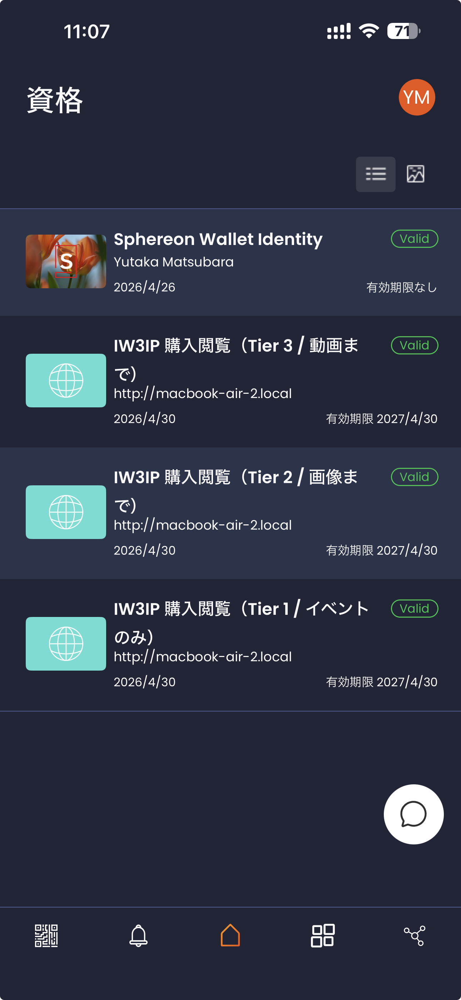
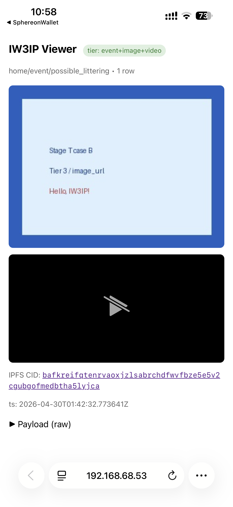
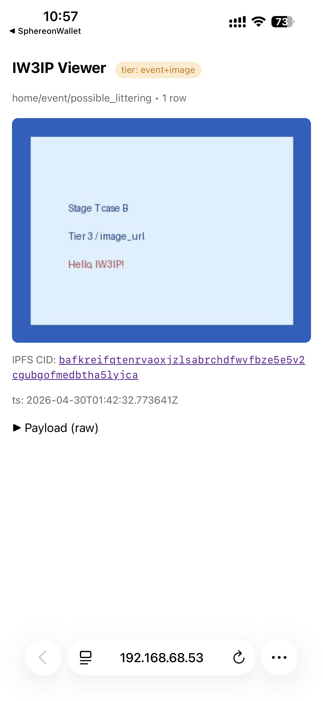
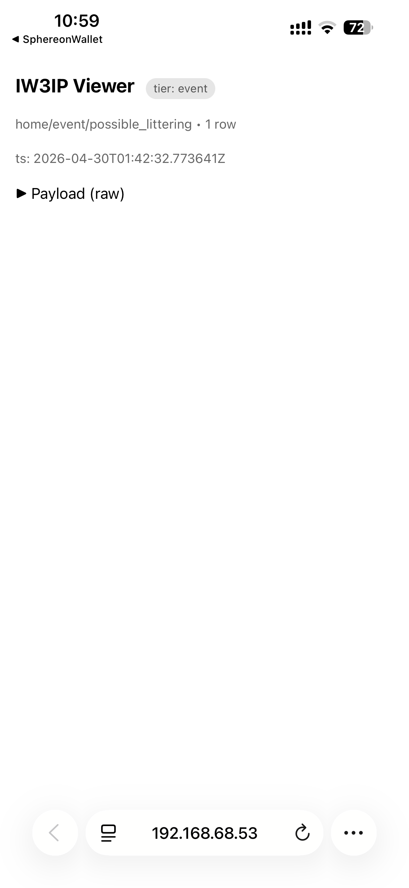

# DataUserVC × Tiered Access (Phase 2 extension)

This walk-through builds on the
[Mobile SSI Wallet sample](ha-ssi-wallet.md) and the
[USB Webcam Event Sharing sample](webcam-event-sharing.md) and exercises
**narrowing the camera view to three tiers based on the recipient's
trust attributes**.

Read [DataUserVC × Tiered Access Spec](data-user-vc-tiered-spec.md) first
if you want the design rationale.

Pipeline:

`Wallet -> DataUserVC presentation -> trustScore -> /marketplace/claim -> PurchaseViewerVC -> /platform/data shows/hides image|video`

## Quickest path

1. Bring up publisher / hardhat / bridge
2. Issue **DataUserVC** with three different profiles (gov-full, enterprise-access, low-deny)
3. Hit `/marketplace/claim` for each and compare `allowed_views`
4. Present PurchaseViewerVC and inspect `/platform/data` differences

## What you'll learn

- The OID4VCI / OID4VP flow for DataUserVC
- How combinations of `entityType / purpose / legalCompliance /
  dataHandlingPolicy / misuseRecord` drive `full / access / denied`
- When `image_cid` / `video_cid` appear or disappear from
  `/platform/data`

## Common pitfalls

- Omitting `data_user_attrs` defaults to **`event` only** — image/video
  will not appear
- Even at `score >= 80`, leaving `entityType` as `Enterprise` does **not**
  reach `full`
- Changing `data_user_attrs` after a ViewerToken has been minted **does
  not** retroactively widen the existing token

## Prerequisites

- You have run the [Mobile SSI Wallet sample](ha-ssi-wallet.md) once
- You understand the [USB Webcam Event Sharing sample](webcam-event-sharing.md)
- Docker / Docker Compose
- `curl`, `jq`

## 0b. Choosing how to carry the actual image / video bytes

This walkthrough has three options for the data body itself. **Option B
(publisher-hosted HTTP media gateway, recommended)** is the
real-device-validated default; the iPhone walkthrough below covers it.

| Option | Source of `image` / `video` | Receiver can fetch the blob? | Effort | Use case |
|---|---|---|---|---|
| A | placeholder CID strings only | no | none | tier-projection demo only |
| **B** | publisher serves `/media/<sha256>.<ext>` | yes — direct HTTP | shipped | demo / hands-on |
| **C** (recommended) | local kubo IPFS daemon, content-addressed | yes — publisher's `/ipfs/<cid>` proxy + any public gateway | shipped (`--profile ipfs`) | production-flavoured distributed demo |

§2–§7 below cover the core DataUserVC + tier-projection loop. **Option
B real-data integration is in §8**, **Option C IPFS integration is in
§9.** Option C is a strict superset of B — `/media/upload`'s response
just gains a `cid` field, so the provider script needs no changes.

## 1. Bring up services

```bash
cd ~/program/Blockchain_IoT_Marketplace
docker compose -f infra/docker-compose.yml up -d publisher hardhat bridge mosquitto
```

Sanity check:

```bash
curl -s localhost:8080/healthz | jq .
curl -s localhost:8080/.well-known/openid-credential-issuer \
  | jq '.credential_configurations_supported | keys'
# -> ["ConsentVC", "DataUserVC", "PurchaseViewerVC", "SellerVC", "ServiceVC", "ViewerVC"]
```

`DataUserVC` must appear in the list.

## 2. Mint three DataUserVC offers

### 2a. Tier 3 (full) — government + crime search + ISO27001

```bash
curl -s -X POST 'localhost:8080/issuer/offer?vc_kind=DataUserVC&entity_type=GovernmentOrganization&purpose=CrimeSearch&legal_compliance=true&data_handling_policy=ISO27001&misuse_record=false' | jq .
```

### 2b. Tier 2 (access) — enterprise + research + ISO27001

```bash
curl -s -X POST 'localhost:8080/issuer/offer?vc_kind=DataUserVC&entity_type=Enterprise&purpose=Research&legal_compliance=true&data_handling_policy=ISO27001&misuse_record=false' | jq .
```

### 2c. Tier 1 (denied) — enterprise + research + no policy + misuse

```bash
curl -s -X POST 'localhost:8080/issuer/offer?vc_kind=DataUserVC&entity_type=Enterprise&purpose=Research&legal_compliance=false&data_handling_policy=Other&misuse_record=true' | jq .
```

Scan each `credential_offer_uri` from your iPhone wallet and store the
DataUserVC.

## 3. Three `/marketplace/claim` calls

Reuse a `merchandise_id` already listed via webcam-event-sharing (list
one beforehand).

### 3a. Tier 3 — opens up to video

```bash
curl -s -X POST localhost:8080/marketplace/claim \
  -H 'content-type: application/json' \
  -d '{
    "merchandise_id": "M-0001",
    "buyer_did": "did:jwk:GOV_USER_DID",
    "data_user_attrs": {
      "entityType": "GovernmentOrganization",
      "purpose": "CrimeSearch",
      "legalCompliance": true,
      "dataHandlingPolicy": "ISO27001",
      "misuseRecord": false
    }
  }' | jq '.allowed_views, .access_level, .trust_score'
# -> ["event","image","video"]
#    "full"
#    80
```

### 3b. Tier 2 — image only

```bash
# data_user_attrs.entityType: "Enterprise", purpose: "Research"
# allowed_views: ["event", "image"], access_level: "access", score: 75
```

### 3c. Tier 1 — defaults when `data_user_attrs` is omitted

```bash
curl -s -X POST localhost:8080/marketplace/claim \
  -H 'content-type: application/json' \
  -d '{"merchandise_id":"M-0001","buyer_did":"did:jwk:LOW_USER_DID"}' | jq .
# allowed_views: ["event"]
```

## 4. Issue PurchaseViewerVC, present, fetch `/platform/data`

Issue a PurchaseViewerVC per buyer with
`/issuer/offer?vc_kind=PurchaseViewerVC&claim_id=...`, store it in the
wallet, then present it.

Once the resulting ViewerToken is in hand, hit `/platform/data`:

| Profile | `event` | `image_cid` | `video_cid` |
|---|---|---|---|
| 3a Tier 3 (gov full) | yes | yes | yes |
| 3b Tier 2 (enterprise) | yes | yes | **no** |
| 3c Tier 1 (default) | yes | **no** | **no** |

```bash
curl -s -H "authorization: Bearer $VIEWER_TOKEN" \
     localhost:8080/platform/data?dataset_id=home/event/possible_littering | jq .
```

Confirm the `image_cid` / `video_cid` keys are **missing** (the keys
are dropped, not nulled).

## 5. Audit log

```bash
curl -s localhost:8080/audit/logs | jq '.[-5:]'
```

You should see a `vc_kind: "DataUserVC"` verify line, followed by the
`claim`, the token mint, and the `/platform/data` fetch — all stitched
together by `holder_did` / `claim_id`.

## 6. Cross-check with tests

```bash
cd ~/program/Blockchain_IoT_Marketplace
uv run pytest tests/test_data_user_vc_tiered.py -v
```

The four pure-function tests
(GovernmentOrganization / Enterprise / low-score / `score>=80` but
non-gov/police) lock the parity between `trust_score.py` and
`DataUserVerifier.sol`.

## 7. Values observed on real-device runs

Walking through end-to-end on iPhone (iw3ip-wallet) produces these
values per tier in both the ViewerToken mint log
(`viewer_token_issued ... views=...`) and the `/platform/data` response.

| Tier | DataUserVC profile | trust_score | views | image_cid | video_cid | video_duration_sec |
|---|---|---|---|---|---|---|
| **3** gov | gov + crime + ISO27001 | 80 | `event+image+video` | yes | yes | yes |
| **2** ent | enterprise + research + ISO27001 | 75 | `event+image` | yes | **no** | **no** |
| **1** low | `data_user_attrs` omitted | n/a (default) | `event` | **no** | **no** | **no** |

The wallet shows three distinct PurchaseViewerVC cards (one per tier)
because the issuer publishes
`PurchaseViewerVC.full / .access / .event` as separate
`credential_configuration_ids` with distinct `display.name`s. All three
share the same VCT.

!!! tip "Pitfalls observed during real-device validation"
    A few first-run symptoms have been folded back into the codebase
    via PRs `fix/stage-t-purchase-viewer-binding` and
    `feat/stage-t-tier-display-and-projection`. On a current `main`
    you should not hit them, but if you do:

    - "No Available Credential" → the issuer must include `subject_id`
      in PurchaseViewerVC plain claims (now done).
    - Three identical cards → tier-aware
      `credential_configuration_id` per Tier (now done).
    - `image_cid` invisible at `/platform/data` even when supplied via
      `/simulate/publish` → the pipeline now hoists the media CIDs to
      the envelope's top level.
    - Always use the `deeplink` returned from `/marketplace/claim`
      directly. Driving the wallet from `/issuer/offer?claim_id=...` is
      now also OK after the fix, but the deeplink path is the simplest.

## 8. Real-data integration (Option B — HTTP media gateway)

Through §7 you verified the **keys** `image_cid` / `video_cid` /
`video_duration_sec` appear or disappear per tier. To carry the actual
image / video bytes end-to-end, the provider side uploads a JPEG / MP4
fixture to the publisher's `/media/upload`, takes back the URL, and
folds it into the event payload as `image_url` / `video_url`.

### 8.1 One-shot provider script

```bash
cd ~/program/Blockchain_IoT_Marketplace
python examples/hands_on/data_user_vc_tiered/provider_with_media.py \
  --base-url http://192.168.68.53:8080
```

The script:

1. Generates a 1×1 JPEG / MP4 fixture under `fixtures/`.
2. Uploads both via `POST /media/upload` (sha256 dedupe).
3. Posts a `possible_littering` event carrying `image_url` /
   `video_url` / `video_duration_sec` to `/simulate/publish`.

### 8.2 Receiver (unchanged — same Tier 3 / 2 / 1 flow as §3–§7)

After re-running §6 + §7 with the new event in flight you should see:

- **Tier 3 (gov full)** → `event` + `image_url` + `video_url` + `video_duration_sec`
- **Tier 2 (enterprise)** → `event` + `image_url` only
- **Tier 1 (default)** → `event` only

Tap `image_url` in iPhone Safari → the JPEG opens directly. To try a
real photo / clip:

```bash
python examples/hands_on/data_user_vc_tiered/provider_with_media.py \
  --base-url http://192.168.68.53:8080 \
  --image /path/to/snapshot.jpg \
  --video /path/to/clip.mp4 \
  --video-duration-sec 12
```

### 8.3 Limitations of Option B

- ✅ Coexists with `image_cid` / `video_cid` (Option A / coming-up Option C).
- ❌ Not content-addressed — anyone with the URL can GET the blob.
- ❌ Single replica, no pinning.

When content-addressing + distributed storage matter, move on to
**Option C (real IPFS / Web3.Storage)**. The `/media/upload` response
shape (`{url, sha256, content_type, byte_size, cid, ipfs_gateway_url}`)
stays the same so the provider script doesn't change — only the
backend swaps.

## 9. Option C: local kubo IPFS daemon for distributed delivery

Option B served the blob from a single publisher instance. Option C
hashes the same blob into a **content-addressed CID** and stores it on
an IPFS network. Receivers can dereference the CID through **any IPFS
gateway** — the publisher's built-in `/ipfs/<cid>` proxy, the public
`https://ipfs.io/ipfs/<cid>`, etc. — so the data survives a publisher
outage.

### 9.1 Bring kubo up alongside the publisher

Activate the `ipfs` compose profile:

```bash
cd ~/program/Blockchain_IoT_Marketplace
export IPFS_API_URL=http://ipfs:5001
export IPFS_GATEWAY_URL=http://ipfs:8080

docker compose -f infra/docker-compose.yml --profile ipfs up -d --force-recreate publisher ipfs
docker compose -f infra/docker-compose.yml ps ipfs
# iw3ip-ipfs container should be Up
```

Verify the publisher picked up the env vars:

```bash
curl -s http://192.168.68.53:8080/.well-known/openid-credential-issuer >/dev/null
docker compose -f infra/docker-compose.yml exec publisher \
  python -c "from publisher.app.config import Settings; \
             s=Settings(); \
             print('IPFS_API_URL=', s.ipfs_api_url); \
             print('IPFS_GATEWAY_URL=', s.ipfs_gateway_url)"
```

### 9.2 Confirm CIDs come back from upload

`provider_with_media.py` is unchanged but now sees `cid` and
`ipfs_gateway_url` in the response:

```bash
python examples/hands_on/data_user_vc_tiered/provider_with_media.py \
  --base-url http://192.168.68.53:8080 \
  --image /tmp/stage_t_demo.jpg \
  --video /tmp/stage_t_demo.jpg
```

Expected output (`cid` starts with `bafy...`):

```json
[upload] {
  "image": {
    "url": "http://192.168.68.53:8080/media/<sha256>.jpg",
    "sha256": "...",
    "content_type": "image/jpeg",
    "byte_size": 7645,
    "cid": "bafkreigb...",
    "ipfs_gateway_url": "http://192.168.68.53:8080/ipfs/bafkreigb..."
  },
  ...
}
```

The provider script automatically folds the CID into the event payload
as `image_cid` / `video_cid`, so the receiver §3–§7 flow keeps
working.

### 9.3 Receiver: CID or URL — pick one

`/platform/data` now hands back **both** `image_cid` and `image_url`
for Tier 2 / Tier 3:

```bash
curl -s -H "authorization: Bearer $TOK_GOV" \
  "http://192.168.68.53:8080/platform/data?dataset_id=home/event/possible_littering" \
  | jq '.rows[0] | {image_cid, image_url, ipfs_gateway: ("http://192.168.68.53:8080/ipfs/"+.image_cid)}'
```

Open any of these on the buyer's iPhone Safari:

| Method | Example URL |
|---|---|
| Publisher HTTP gateway | `http://192.168.68.53:8080/media/<sha256>.jpg` (Option B compatible) |
| Publisher IPFS proxy | `http://192.168.68.53:8080/ipfs/<cid>` |
| Public IPFS gateway | `https://ipfs.io/ipfs/<cid>` (needs internet) |

The last entry is the punchline: even with the publisher offline, the
CID is enough to fetch the asset from any cooperating peer.

### 9.4 Pros, caveats, and follow-ups

- ✅ **Content-addressed**: CID is a hash of the bytes — tamper-evident, multi-gateway.
- ✅ **Publisher outage tolerant**: any peer with a replica can serve.
- ✅ **Option-B compatible**: response gains `cid` + `ipfs_gateway_url`; existing fields are unchanged.
- ⚠️ If the kubo daemon is unreachable, `/media/upload` still returns 200 but with `cid: null` — graceful fallback to Option B.
- ⚠️ Public-gateway resolution depends on IPFS network propagation (can take minutes).
- 🔜 Pair with a pinning service (Web3.Storage / Pinata) for cross-network durability — follow-up TODO.

### 9.5 Troubleshooting

| Symptom | Fix |
|---|---|
| `cid: null` in upload response | `docker compose ... ps ipfs` — bring kubo back up if down |
| `/ipfs/<cid>` returns 502 | Publisher can't reach `http://ipfs:8080`. Check Docker network membership |
| `/ipfs/<cid>` returns 404 | `IPFS_GATEWAY_URL` is empty. Set `.env` or export and recreate |
| Public gateway can't fetch | Behind NAT, kubo not visible to peers. `ipfs swarm peers` to verify |

## 10. PWA viewer (one UX for phone *and* PC)

§3–§9 walked through the dev-style flow ("call /verifier/request,
collect the token, curl /platform/data"). The publisher now ships a
**built-in PWA viewer** (`/buyer/start` + `/viewer`) so a buyer just
opens **one URL** and the rest is automatic, on iPhone Safari **or**
PC Chrome / Edge / Firefox.

```
[iPhone Safari] ─ /buyer/start                            [publisher]
   │  ↓ auto-redirect to deeplink                              │
   │  iw3ip-wallet opens → present Tier 3 ────────────────────►│ mint ViewerToken
   │  ↑ redirect_uri = /viewer?vt=...                          │
   │  Safari resumes → /viewer auto-renders image/video        │

[PC Chrome] ─ /buyer/start                                [publisher]
   │  ↓ shows QR + long-polls                                  │
   │  Scan QR with iPhone → wallet → present ────────────────► │
   │  ↑ /verifier/status returns viewer_url                    │
   │  PC browser auto-navigates to /viewer → image renders     │
```

### 10.1 Bring it up

No special setup. Open `/buyer/start?ds=<dataset_id>` from **the same
URL** on either device — the page detects the user agent and switches
mode:

```
iPhone Safari:  http://192.168.68.53:8080/buyer/start?ds=home/event/possible_littering
PC Chrome:      http://192.168.68.53:8080/buyer/start?ds=home/event/possible_littering
```

### 10.2 Same-device (iPhone) flow

1. Open the URL in Safari.
2. The page calls `/verifier/request` to fetch a deeplink.
3. `window.location = deeplink` launches **iw3ip-wallet** automatically.
4. In the wallet, pick "Purchase Viewer (Tier 3 / Full)" and present.
5. The wallet receives `redirect_uri = /viewer?vt=...&ds=...` and...
6. ...Safari **resumes automatically and the image / video renders**.

No more URL-copy-paste.

### 10.3 Cross-device (PC + iPhone) flow

1. Open the URL on a PC browser.
2. The page renders a **large QR code** (the OID4VP deeplink).
3. Scan it with the iPhone camera or directly inside the wallet → wallet → present.
4. The PC page long-polls `/verifier/status?state=...` every 2 s.
5. Once the wallet completes, the response includes `viewer_url`.
6. The PC navigates to `/viewer` and **the same image / video renders**.

### 10.4 What `/viewer` shows

`/viewer?vt=<viewer_token>&ds=<dataset_id>` renders:

- A **tier badge** (`event` / `event+image` / `event+image+video`) up top.
- `image_url` as an inline ``.
- `video_url` as a playable `<video controls>`.
- `image_cid` (if Option C is on) as a clickable link to the publisher's `/ipfs/<cid>` proxy.
- Raw row JSON tucked under a `<details>` toggle.

If the ViewerToken's 60-second TTL has expired you get a 401 plus a
human-readable nudge to "reload from /buyer/start."

### 10.5 What each tier looks like (real-device screenshots)

#### Wallet side: three distinct cards

After receiving the three deeplinks, iw3ip-wallet (Sphereon mobile-wallet fork)
shows the PurchaseViewerVCs as three independent cards — same VCT, different
`credential_configuration_id`, different display name.

<figure markdown>
{ width=320 }
<figcaption>
Wallet credential list (vertical scroll). All three share VCT
<code>https://iw3ip.example/credentials/PurchaseViewerVC/v1</code>;
the <code>credential_configuration_id</code> split (<code>.full</code> /
<code>.access</code> / <code>.event</code>) is what gives them their distinct
labels.
</figcaption>
</figure>

#### Viewer side: response shape changes per presented tier

Below are real-device `/viewer` screenshots from iPhone Safari (`◀ SphereonWallet`
in the top-left = Safari was opened by the wallet via `redirect_uri`). The
badge color and which media keys disappear tell the tier story at a glance.

| Tier 3 (gov / Full) | Tier 2 (enterprise / Access) | Tier 1 (default / Event-only) |
|---|---|---|
|  |  |  |
| 🟢 `tier: event+image+video` | 🟠 `tier: event+image` | ⚪️ `tier: event` |
| inline image + video player | image only, video player gone | timestamp + raw payload only |
| `image_cid` / `image_url` / `video_url` / `video_duration_sec` all present | `image_cid` / `image_url` only | every media key dropped |

The three screenshots come from the **same dataset** (`home/event/possible_littering`)
fetched with three different PurchaseViewerVC tiers. The server-side data is
identical — what changes is which keys ViewerToken's `allowed_views` lets
through. That's Stage T's whole point.

### 10.6 Why both devices matter

| | Manual curl flow (§§3–9) | PWA viewer |
|---|---|---|
| Easy on phone | ✗ — copy URLs | ✓ |
| Works on PC | ✗ — no wallet on PC | ✓ — QR + long-poll |
| App install on PC | iw3ip-wallet (phone) | none beyond a browser |
| Re-fetch after TTL | redo curl | reload the page |
| Public demo cost | long handout | hand over one URL |

### 10.7 Troubleshooting

| Symptom | Fix |
|---|---|
| iPhone deeplink doesn't open the wallet | Tap the visible "Open in wallet" link; check Safari's "Open in App" permission |
| PC doesn't show a QR | The browser couldn't reach the CDN (`cdn.jsdelivr.net`). Plug in. |
| PC poll never finishes | Confirm the wallet actually presented a valid VC: `docker compose logs publisher` should show a `200 /verifier/response` |
| `/viewer` returns 401 | ViewerToken TTL (60 s) lapsed. Reload `/buyer/start` |
| `/buyer/start` shows a "dataset mismatch" red banner | See §10.8 below |

### 10.8 Deny UX (when the verifier rejects a presentation)

When the verifier rejects a presented VC, `/verifier/status` returns a
`reason` code together with a human-readable `human_message_ja` /
`human_message_en` pair. The `/buyer/start` page picks that up during
its long-poll and replaces the QR with a red banner plus a "re-present
from /buyer/start" link (see `publisher/app/ssi/verifier_routes.py`).

Main reason codes and their banner copy:

| reason | EN banner | JA |
|---|---|---|
| `dataset_mismatch` | The presented VC is bound to a different dataset. | 提示された VC のデータセットが、要求されたデータセットと一致しません。 |
| `action_not_allowed` | The presented VC does not include the required action (read). | 提示された VC では、このデータの読み取り権限がありません。 |
| `purpose_mismatch` | The presented VC's allowed_purposes does not cover this purpose. | 提示された VC の許可目的に、今回の用途が含まれていません。 |
| `missing_entityType` etc. | DataUserVC is missing *XXX*. | DataUserVC に *XXX* が含まれていません。 |
| `verification_failed` | VC verification failed. | VC の署名検証に失敗しました。 |

**Expected flow (not yet validated on a real device — implementation in Stage T):**

1. PC opens `/buyer/start?ds=home/event/possible_littering` → QR appears.
2. From the wallet, intentionally pick a PurchaseViewerVC bound to a *different* dataset (e.g. `home/event/another_dataset`) and present it.
3. publisher receives `/verifier/response` and records `{"verified": false, "reason": "dataset_mismatch"}`.
4. The PC's `/verifier/status` long-poll returns `status: "denied"` with the `human_message_*` strings.
5. The page replaces the QR with `<div class="deny-banner">The presented VC is bound to a different dataset.</div>` plus a re-present link to `/buyer/start?ds=...`.
6. `docker compose logs publisher` shows the audit row `_write_audit(action="presentation", reason="dataset_mismatch", verified="false")`.

To reproduce on a real device, reuse the §10.5 setup but issue an extra
`POST /issuer/offer?vc_kind=PurchaseViewerVC&claim_id=<other-claim>` so the
wallet ends up holding a 4th card bound to a different dataset, then scan
the QR with that card selected.

## 11. PWA Provider (the data-provider side)

§10 covered the **receiver** side reading data through the PWA Viewer.
§11 covers the symmetric **provider** side: a PWA where a data provider
authenticates with SSI and uploads + publishes data through the same
publisher container — `/provider/start` + `/provider` + `/provider/publish`
replace the curl steps in `provider_with_media.py` with a browser-only
flow.

```
[PC browser] ── /provider/start                      [publisher]
   │  ↓ QR + long-poll                                  │
   │     scan QR with iPhone wallet → present SellerVC ►│ mint SellerToken
   │  ↑ /verifier/status returns seller_token + licensed_datasets
   │  PC page renders the licensed_datasets list
   │  ↓ pick one and click "Continue to upload"          │
   │  /provider?pt=<seller_token>&ds=<dataset_id>        │
   │     file pick / camera capture / browser recorder ►│ /media/upload
   │     ↑ URL + (CID)                                   │
   │     "Publish" button                                │
   │     POST /provider/publish (Bearer SellerToken) ───►│ use_seller_token
   │                                                     │ → process_message
   │  ↑ {"status":"allowed", ...}                         │
```

`/provider/start` is the SellerVC counterpart of `/buyer/start` — same
OID4VP plumbing, just with `vc_kind=SellerVC` and a SellerToken minted
on success.

### 11.1 Open the page

No special prep beyond having `docker compose ... up -d publisher`
running. From a PC browser:

```
http://192.168.68.53:8080/provider/start?ds=home/event/possible_littering
```

`ds=` is a **hint** only (SellerVC verification isn't dataset-scoped),
but it shows in the page header so the operator knows which dataset
they're working on.

### 11.2 Present a SellerVC (OID4VP)

PC shows a QR. Scan it from the iPhone wallet and present a **SellerVC**
(not a PurchaseViewerVC — they're different cards in the wallet).

On success the page swaps to a result panel:

- Green banner "SellerVC 提示が承認されました" / "Presentation accepted"
- The full **licensed_datasets** list straight from the SellerVC claims
- `seller_id` and the SellerToken expiry (default 24 h)
- A "Continue to upload →" button next to a radio list

Click through to land on `/provider?pt=<seller_token>&ds=<chosen ds>`.

!!! note "Deny UX"
    If the SellerVC is missing `seller_id` or `licensed_datasets`,
    `/verifier/status` surfaces `human_message_ja` / `human_message_en`
    via a red banner (reason codes: `missing_seller_id` /
    `missing_licensed_datasets`), and offers a one-click reload to retry
    with a different VC.

### 11.3 Three ways to provide data

The `/provider` page exposes **three peer-equivalent input modes**, all
funneling through the same `/media/upload` URL/CID delivery — the
receiver side at `/viewer` cannot tell which one was used.

| Mode | Behaviour | Best on |
|---|---|---|
| 📁 File picker | OS file dialog, pick an existing file | PC + phone |
| 📷 Camera capture | `<input capture="environment">` — iPhone Safari opens the rear camera directly; PC falls back to file picker | iPhone (capture-on-the-spot) |
| 🔴 Browser recorder | `MediaRecorder` against `getUserMedia({video,audio})`. Click 録画開始, see live preview, click 停止 to auto-upload as WebM/VP9. Firefox falls back to VP8. Only Safari 16 and earlier fall back to MP4 — Safari 17+ has native WebM/VP9 support | PC webcam |

All three call the same `uploadBlob()` pipeline: preview →
`POST /media/upload` → result panel → enable the Publish button.
Storage stays bounded because uploads are deduplicated by SHA-256.

!!! tip "Why browser recording matters for demos"
    PC webcam → SSI auth → publish in **one browser tab** is a 30-second
    demo of "data with provenance attached." It complements the
    [USB Webcam Event Sharing sample](webcam-event-sharing.md): that
    one streams continuously, this one captures discrete clips with
    on-the-spot attribution.

When you stop a recording, the `video_duration_sec` form field is
**auto-filled** with the measured length.

### 11.4 Publish + the licensed_datasets gate

Once an upload completes, the Publish button enables. The form holds:

- `topic` — defaults to `homeassistant/event/<last segment of ds>`
- `purpose` — defaults to `community_cleaning`
- `camera_id`, `video_duration_sec`
- `extra payload keys` — optional JSON merge

Click **Publish event**. The browser POSTs to `/provider/publish` with
`Authorization: Bearer <seller_token>`. Server-side:

1. `schemas.normalize(topic, payload)` derives `dataset_id` from the topic.
2. `ssi_state.use_seller_token(token, dataset_id=<resolved>)` enforces
   that `dataset_id ∈ licensed_datasets[]`.
3. On success it calls `processor.process_message` (same path as
   `/simulate/publish`).
4. Response is augmented with `seller_token_jti` + `register_count`.

`SellerToken` is **multi-use** (same semantics as `/marketplace/register`),
so a single SellerVC presentation covers a whole upload session — you
can watch `register_count` grow in the response details panel.

Deny cases:

| Failure | HTTP | reason |
|---|---|---|
| missing `Authorization` header | 401 | `missing_authorization_header` |
| unknown SellerToken | 401 | `seller_token_unknown` |
| expired SellerToken | 401 | `seller_token_expired` |
| dataset (resolved from topic) not in `licensed_datasets[]` | 403 | `seller_token_dataset_not_licensed` |
| topic not recognised by `normalize()` | 400 | `unsupported_topic:...` |

All denials are recorded in `/audit/logs` with `action=deny`.

### 11.5 Confirm from the receiver side

The footer of `/provider` auto-generates a link to `/buyer/start` for
the same dataset. Open it in a separate tab, present a Tier 3
PurchaseViewerVC, and the image / video you just published renders in
`/viewer` (the same screen as §10.5 screenshots).

That makes the full **provide → auth → publish → receive → verify** loop
a **two-tab** experience in the browser.

!!! success "Verified end-to-end (2026-04-30)"
    A `video/quicktime` clip recorded on iPhone Safari, published via
    `/provider`, was rendered inline by the `<video>` tag in `/viewer`
    on **macOS Safari** (see §11.8.A). The same wallet held both the
    SellerVC (provider side) and the PurchaseViewerVC.full (receiver
    side); each `/buyer/start` or `/provider/start` page picked the
    right one automatically. Screenshot:
    `images/data-user-vc-tiered/provider/A-macsafari-viewer-tier3.jpg`
    (to be added by follow-up commit).

### 11.6 Symmetry with `/buyer/start`

| Aspect | `/buyer/start` (§10) | `/provider/start` (§11) |
|---|---|---|
| VC presented | PurchaseViewerVC | **SellerVC** |
| Token minted on verify | ViewerToken (TTL 60 s) | **SellerToken** (TTL 24 h) |
| Used as Bearer for | `/platform/data` | **`/provider/publish`** |
| Single-use vs multi-use | multi-use (continuous read) | **multi-use** (one auth, many publishes) |
| Dataset scoping | VC is bound to a dataset_id | SellerVC carries `licensed_datasets[]` set |
| Deny message shape | §10.7 common format | same `human_message_ja/en` shape |

### 11.7 Troubleshooting

| Symptom | Fix |
|---|---|
| `/provider/start` says no SellerVC offer received | Issue one first: `POST /issuer/offer?vc_kind=SellerVC&seller_id=...&licensed_datasets=...` and scan the offer URI from the wallet |
| 📷 Camera capture opens the file picker on iPhone Safari | Some iOS versions don't honor the combination `accept="image/*,video/*" capture="environment"`. Switching `accept` to `video/*` only forces the camera reliably |
| 🔴 Browser recorder button does nothing | `getUserMedia` only works on HTTPS or `localhost`. Opening over a LAN IP (`http://192.168.x.x`) makes the browser deny camera/mic permission. Use `localhost:8080` or run behind HTTPS |
| `/provider/publish` returns 403 `seller_token_dataset_not_licensed` | The dataset_id derived from `topic` isn't in your SellerVC's `licensed_datasets[]`. Example: `topic=homeassistant/event/possible_littering` → dataset_id is `home/event/possible_littering` |
| Publish response has `status: send_error` | The publisher's `PLATFORM_API_URL` is unreachable. The SellerToken gate did pass and `register_count` did increment — auth was OK, downstream delivery failed |
| `/provider/publish` returns 401 `seller_token_unknown` | `SSIStateStore` is in-memory; restarting the publisher container wipes every token. Re-present the SellerVC at `/provider/start` to mint a fresh one (the SellerVC itself stays in the wallet, no re-issuance needed). For hands-on sessions that bounce the container, plan one extra OID4VP loop after each restart |
| Wallet shows "Retrieving access token failed: 400 / Error Screen" | OID4VCI offers are **single-use**. Sphereon-family wallets retry `/issuer/token` internally; the second call fails with `invalid_grant` (400). The **first call already issued the VC into the wallet** — the error screen is misleading. Dismiss it and check the wallet's credential list; the new card should be there |

### 11.8 Real-device validation log

End-to-end runs of the three §11.3 input modes across four
environments. Screenshots live under
`docs/hands-on/images/data-user-vc-tiered/provider/`.

| Scenario | Environment | Status | Observation |
|---|---|---|---|
| **A** iPhone camera capture (`capture="environment"`) | iPhone Safari (iOS 18.x) | ✅ verified (2026-04-30) | upload `video/quicktime` 273KB → Publish `status=allowed` → receiver `/viewer` plays the `.MOV` inline (macOS Safari) |
| **B** PC browser recording (MediaRecorder) | macOS Chrome 147 | ⚠️ codec confirmed (2026-04-30) | Supports all 4: `vp9,opus` / `vp8,opus` / `webm` / `mp4` → preference picks **VP9**. Recording + Publish pending wallet rebuild |
| **C** Firefox VP8 fallback | macOS Firefox 139 | ✅ **verified (2026-04-30)** | Supports 2: `vp8,opus` / `webm` (no VP9 — Firefox MediaRecorder lacks VP9 support) → **VP8 selected**. Recording → upload → Publish round-trip completed: `media_uploaded ext=.webm bytes=89909` (WebM/VP8, 89KB) + `POST /provider/publish 200 OK`. The `pickRecorderMime()` VP8 fallback path is exercised end-to-end |
| **D** ~~macOS Safari MP4 fallback~~ macOS Safari WebM/VP9 | macOS Safari 17+ | ✅ **verified (2026-04-30)** | Supports all 4: `vp9,opus` / `vp8,opus` / `webm` / `mp4` → preference picks **VP9** (not MP4). Recording → upload → Publish round-trip completed: `seller_token_issued ertl-bcd-final` + `POST /provider/publish 200 OK`. **Safari 17+ has native WebM/VP9 support**; the original "Safari falls back to MP4" assumption applies only to Safari 16 and earlier |

#### Bugs surfaced during the first real-device run (scenario A)

The first scenario-A pass exposed **2 implementation bugs and 2 operational
behaviors** that unit tests cannot catch (real-device UA, iPhone-specific file
formats, in-memory state, wallet retry behavior). The two implementation bugs
are fixed in the latest `main`.

| # | Symptom | Cause | Fix / Resolution |
|---|---|---|---|
| 1 | `/provider/start` returned `HTTP 404 no_presentation_definition_for_dataset` | The c1 page-side JS was passing `dataset_id=<hint>` to `/verifier/request`. The verifier only registers SellerVC presentation defs under the `*` sentinel, so the lookup missed | [Blockchain_IoT_Marketplace#41](https://github.com/ertlnagoya/Blockchain_IoT_Marketplace/pull/41) — hard-codes `dataset_id="*"` |
| 2 | Upload returned `HTTP 415 unsupported media type` | iPhone Safari `<input capture>` saves video as QuickTime `.MOV` (`video/quicktime`); `media_routes._ALLOWED_EXT` didn't include it | [Blockchain_IoT_Marketplace#42](https://github.com/ertlnagoya/Blockchain_IoT_Marketplace/pull/42) — adds `.mov` to allowlist |
| 3 | Publish returned `HTTP 401 seller_token_unknown` right before success | `SSIStateStore` is in-memory; container rebuilds wipe every token. Re-presenting the SellerVC via `/provider/start` mints a fresh one (the SellerVC itself stays in the wallet, no re-issuance needed) | Documented as operational behavior in §11.7 |
| 4 | Wallet showed "Retrieving access token failed: 400 / Error Screen" | OID4VCI offers are **single-use**, but Sphereon-family wallets retry `/issuer/token` internally. The 2nd call fails with `invalid_grant` (400). The **1st call already issued the VC into the wallet** — the error screen is misleading. Dismiss it and the credential list shows the new card | Wallet behavior, documented in §11.7 |

Reproduction steps and verification points for each scenario are
below. Walk each subsection end-to-end, flip the `status` column to
✅, and append the observed values + screenshots to this page (PR
welcome).

#### Common preconditions

For all scenarios:

1. `docker compose -f infra/docker-compose.yml up -d publisher hardhat bridge mosquitto` is up
2. Wallet holds a SellerVC whose `licensed_datasets` contains `home/event/possible_littering`
3. Publisher host is reachable from both PC and iPhone (same LAN recommended)

The "browser recorder" mode (B/C/D) only works over **`localhost` or
HTTPS** because of `getUserMedia`. Open the page on the same machine
running the publisher, via `http://localhost:8080`. A LAN IP
(`http://192.168.x.x:8080`) makes the browser deny camera/mic
permission silently.

#### A. iPhone camera capture (`capture="environment"`)

**Goal**: confirm
`<input type="file" accept="image/*,video/*" capture="environment">`
opens the camera directly in iOS Safari.

**Steps**:

1. iPhone Safari → `http://<publisher-host>:8080/provider/start?ds=home/event/possible_littering`
2. Present a SellerVC from the wallet → land on `/provider?pt=...&ds=...`
3. Tap the **"📷 カメラで撮影"** input
4. Confirm whether iOS shows "Take Video" as the **default**, or jumps straight to the camera
5. Record 5–10 s → return → page auto-POSTs to `/media/upload`
6. Press "Publish event" and confirm 200

**Observed (2026-04-30, iPhone Safari, iOS 18.x)**:

- [x] Tap "📷 カメラで撮影" → "ファイルを選択" → iOS sheet shows "Take Video / Photo Library / Choose File" → pick "Take Video" → camera opens ✅
  - **Note**: the sheet does **not** open the camera directly. `accept="image/*,video/*"` + `capture` is a *hint*, not a hard switch.
- [x] Upload result: `content_type: video/quicktime` / `byte_size: 273897` / `sha256=11367cf4cb1b...` ✅
  - Expected `video/mp4`, but iPhone Safari saves recordings as **QuickTime (`.MOV`)**.
- [x] Publish response: `status: allowed`, `dataset_id=home/event/possible_littering`, `seller_token_jti=49bf45c467a65ddc`, `register_count=1` ✅
- [x] Receiver `/viewer` (macOS Safari, Tier 3 PurchaseViewerVC.full): green badge `tier: event+image+video` and the `<video>` tag plays the clip inline ✅
  - **macOS Safari natively plays `video/quicktime`** — important data point: Stage T option B handles QuickTime end-to-end.

**Screenshots (to be added by follow-up commit)**:

```
images/data-user-vc-tiered/provider/A-iphone-404-original.png       # pre-fix: 404 no_presentation_definition_for_dataset
images/data-user-vc-tiered/provider/A-iphone-415-mov-rejected.png   # pre-fix: 415 .MOV unsupported
images/data-user-vc-tiered/provider/A-iphone-401-token-unknown.png  # operational: container rebuild wiped token
images/data-user-vc-tiered/provider/A-iphone-after-publish.png      # success: green Published banner + register_count=1
images/data-user-vc-tiered/provider/A-macsafari-viewer-tier3.jpg    # receiver: /viewer plays the .MOV inline
```

**iOS-version note**: on iOS 18.x, `accept="image/*,video/*"` +
`capture="environment"` does **not** open the camera directly — the
"Take Video / Photo Library / Choose File" sheet appears first. To
force camera-only behavior, narrow `accept` to `video/*` (at the cost
of losing the existing-file path). The current implementation keeps
both modes; the extra tap is acceptable.

#### B. PC browser recording — Chrome (VP9)

**Goal**: confirm MediaRecorder + `getUserMedia` records from the PC
webcam, auto-uploads, publishes, and that Chromium-family browsers
pick VP9.

**Steps**:

1. Same machine running publisher; Chrome → `http://localhost:8080/provider/start?ds=home/event/possible_littering`
2. Present SellerVC from the iPhone wallet (scan QR; same LAN)
3. Pick a dataset on the success panel → `/provider`
4. In the **"🔴 ブラウザで録画"** section, click 録画開始
5. Allow camera/mic in the browser permission dialog
6. Confirm the live `<video>` preview shows the webcam
7. Wait 5–10 s, click 停止 & アップロード
8. `recStatus` transitions through "録画完了 (Ns) — アップロード中…" → "録画完了 (Ns)"
9. Upload result shows `content_type: video/webm`
10. `video_duration_sec` form is **auto-filled** with the measured length
11. Publish succeeds

**Codec check**:

In DevTools console:

```js
['video/webm;codecs=vp9,opus','video/webm;codecs=vp8,opus','video/webm','video/mp4']
  .filter(m => MediaRecorder.isTypeSupported(m))
```

Expected: `["video/webm;codecs=vp9,opus", "video/webm;codecs=vp8,opus", "video/webm"]`
(first entry = the one actually picked).

**Screenshots (TBD)**:

```
images/data-user-vc-tiered/provider/B-chrome-permission.png         # camera permission
images/data-user-vc-tiered/provider/B-chrome-recording.png          # live preview + red banner
images/data-user-vc-tiered/provider/B-chrome-uploaded.png           # upload result with URL/CID
images/data-user-vc-tiered/provider/B-chrome-publish-ok.png         # publish success
images/data-user-vc-tiered/provider/B-chrome-devtools-codec.png     # DevTools codec output
```

#### C. PC browser recording — Firefox (VP8 fallback)

**Goal**: confirm Firefox completes the same flow and falls back to
VP8 when VP9 is unavailable.

**Steps**: same as B in Firefox.

**Verification points**: run the same DevTools snippet and confirm
`vp9,opus` returns `false` while `vp8,opus` (or bare `webm`) returns
`true`. Upload should still produce `content_type: video/webm`.

**Screenshots (TBD)**:

```
images/data-user-vc-tiered/provider/C-firefox-permission.png
images/data-user-vc-tiered/provider/C-firefox-recording.png
images/data-user-vc-tiered/provider/C-firefox-publish-ok.png
images/data-user-vc-tiered/provider/C-firefox-devtools-codec.png    # vp9=false, vp8=true
```

#### D. macOS Safari (Safari 17+ uses WebM/VP9; Safari 16 and earlier fall back to MP4)

**Goal**: confirm codec selection branches between modern (17+) and legacy
(≤16) Safari. **Real-device validation on 2026-04-30 found Safari 17+
has native WebM/VP9 support**, so the long-standing MP4-fallback
assumption only applies to legacy Safari.

**Steps**: same as B in macOS Safari.

**Verification points**:

| Safari version | Supported codecs | Picked codec | Upload `content_type` |
|---|---|---|---|
| **17+** (modern) | vp9, vp8, webm, mp4 | **VP9** | `video/webm` |
| 16 and earlier | mp4 only | MP4 | `video/mp4` |

`MediaRecorder.isTypeSupported('video/webm;codecs=vp9,opus')`:
- Safari 17+: `true` → VP9 selected (same behavior as Chrome)
- Safari 16 and earlier: `false` → falls back to MP4

Run the codec list in DevTools console to make the branch visible.

**Safari-specific notes**:

- Safari prior to 14.1 has no `MediaRecorder` at all; `recStatus`
  surfaces "このブラウザは録画に対応していません". If you hit that, add
  the version range to §11.7.
- Camera/mic permission may need to be granted via the **address-bar
  Safari settings icon** in some setups.

**Screenshots (TBD)**:

```
images/data-user-vc-tiered/provider/D-safari-permission.png
images/data-user-vc-tiered/provider/D-safari-recording.png
images/data-user-vc-tiered/provider/D-safari-publish-ok.png
images/data-user-vc-tiered/provider/D-safari-devtools-codec.png     # mp4=true
```

#### Post-validation checklist

After all four scenarios:

- [ ] Screenshots placed in
      `docs/hands-on/images/data-user-vc-tiered/provider/` at the paths above
- [ ] §11.8 status table updated ⏳ → ✅
- [ ] Observed codec values, OS versions, and any unusual behavior
      appended to the relevant subsection
- [ ] §11.7 troubleshooting extended with any new symptoms found during validation

## 12. Semantic-level redaction (VLM + face blur)

§1–§11 gate access by **dropping media keys** — Tier 2 hides video,
Tier 1 hides image and video. §12 derives **new content from the same
source via VLM inference + face/PII blurring** and projects those
derivatives per tier. Tier 1 stops being "you get nothing useful" and
ships a **PII-redacted summary** instead.

Design rationale: see [DataUserVC × Tiered Access Spec § "Tier extension"](data-user-vc-tiered-spec.md#tier-vlm).

### 12.1 Updated tier definitions

| Tier | access level | Example (score) | Derivatives shipped |
|---|---|---|---|
| **3** Full | `full` | gov + crime + ISO27001 (80) | raw image / video + redacted image + full text + summary text |
| **2** Access | `access` | enterprise + research + ISO27001 (75) | **face/PII-blurred image** + **detailed text** (named entities) + summary |
| **1** Summary | `summary` (new) | enterprise + research only (60–) | **summary text only** (PII-redacted, no image) |
| 0 Denied | `denied` | unqualified (<60) | claim is rejected |

A new `summary` value joins the `access_level` enum; `denied` is
unchanged. The `/platform/data` row schema gains:

| Key | Content | Visible at tier |
|---|---|---|
| `image_url_redacted` | URL of an image with faces / people / license plates blurred | 2 + 3 |
| `image_cid_redacted` | IPFS CID of the redacted image (when option C is on) | 2 + 3 |
| `description_full` | VLM-generated detailed description (named entities present) | 2 + 3 |
| `description_summary` | VLM-generated summary (PII-redacted) | 1 + 2 + 3 |
| `description_model` | VLM model id + version (audit) | every tier |
| `description_generated_at` | Inference timestamp (ISO8601) | every tier |
| `processing_warnings` | List of degraded steps (`vlm_unavailable`, `redaction_unavailable`) | every tier |

### 12.2 Bring up with `--profile vlm`

VLM and face blur are **opt-in**. With the profile off, §1–§11 keep
working under the legacy 3-tier projection.

```bash
cd ~/program/Blockchain_IoT_Marketplace
docker compose -f infra/docker-compose.yml --profile vlm up -d \
  publisher hardhat bridge mosquitto vlm vlm-pull
```

Switch the publisher backends on:

```bash
export VLM_BACKEND=ollama
export IMAGE_REDACTION_BACKEND=opencv
docker compose -f infra/docker-compose.yml --profile vlm up -d publisher
```

Wait for `vlm-pull` to finish pulling `llava` (first time only, multi-GB):

```bash
docker compose -f infra/docker-compose.yml logs -f vlm-pull
# wait for "vlm model llava ready" then exit
```

Toggling profile off vs on against the same dataset shows that the
`description_*` keys appear only when on.

### 12.3 Four DataUserVC offers

The §2 set extended with a **summary-tier** profile.

#### 12.3.a Tier 3 (full) — same as §2a

```bash
curl -s -X POST 'localhost:8080/issuer/offer?vc_kind=DataUserVC&entity_type=GovernmentOrganization&purpose=CrimeSearch&legal_compliance=true&data_handling_policy=ISO27001&misuse_record=false' | jq .
```

#### 12.3.b Tier 2 (access) — same as §2b

```bash
curl -s -X POST 'localhost:8080/issuer/offer?vc_kind=DataUserVC&entity_type=Enterprise&purpose=Research&legal_compliance=true&data_handling_policy=ISO27001&misuse_record=false' | jq .
```

#### 12.3.c Tier 1 (summary, new) — enterprise + unknown purpose + legal compliance only

```bash
curl -s -X POST 'localhost:8080/issuer/offer?vc_kind=DataUserVC&entity_type=Enterprise&purpose=unknown&legal_compliance=true&data_handling_policy=other&misuse_record=false' | jq .
# score = 20 + 5 + 15 + 0 + 10 = 50 -> summary (only when VLM profile is on)
```

#### 12.3.d Tier 0 (denied) — same as §2c

```bash
curl -s -X POST 'localhost:8080/issuer/offer?vc_kind=DataUserVC&entity_type=Enterprise&purpose=Research&legal_compliance=false&data_handling_policy=Other&misuse_record=true' | jq .
```

### 12.4 Four `/marketplace/claim` calls + `/platform/data` comparison

Same routine as §3: claim → PurchaseViewerVC → present → ViewerToken → fetch.
With VLM profile on:

| Profile | `event` | `image_url` | `video_url` | `image_url_redacted` | `description_full` | `description_summary` |
|---|---|---|---|---|---|---|
| 12.3.a Tier 3 (full) | yes | yes | yes | yes | yes | yes |
| 12.3.b Tier 2 (access) | yes | **no** | **no** | yes | yes | yes |
| 12.3.c Tier 1 (summary) | yes | **no** | **no** | **no** | **no** | yes |
| 12.3.d Tier 0 (denied) | the claim itself returns `access_level: "denied"` |

With profile **off** the legacy 3-tier projection runs (no derivative
keys appear). Claim 12.3.c then resolves to `denied` since `summary`
is profile-on only.

### 12.5 Verifying face blur

Open `image_url_redacted` from a Tier 2 response in a browser. You
should see **the same scene as `image_url` (Tier 3 only) but with
faces blurred**.

| Original (`image_url`, Tier 3 only) | Blurred (`image_url_redacted`, Tier 2+) |
|---|---|
|  |  |

Internally the publisher:

1. fetches the source from `/media/<sha>.<ext>`
2. runs OpenCV Haar-cascade face detection
3. applies a 51×51 Gaussian blur to each face region
4. re-encodes in the original format
5. POSTs the result back to its own `/media/upload` (which dedups +
   optionally pushes to IPFS)
6. surfaces the resulting URL/CID as `image_url_redacted` /
   `image_cid_redacted`

Subsequent uploads of the same source skip the blur entirely — the
sha256 dedup hits.

!!! note "MVP limitations"
    The Haar cascade catches **frontal faces only**. Side profiles,
    occluded faces, and low-resolution faces pass through. License
    plates / ID badges / sharp-rectangle screen detection are
    [future work in the spec](data-user-vc-tiered-spec.md#tier-vlm).

### 12.6 Inspecting VLM output

Compare `description_full` (Tier 2/3) against `description_summary`
(Tier 1+) to confirm proper-noun stripping:

```bash
curl -s -H "authorization: Bearer $VIEWER_TOKEN_TIER3" \
     localhost:8080/platform/data?dataset_id=home/event/possible_littering \
  | jq '.rows[0] | {description_full, description_summary, description_model}'
```

Example output:

```json
{
  "description_full": "John Smith dropped a Coca-Cola bottle near the Hibiya station entrance at around 14:32.",
  "description_summary": "An adult dropped a piece of litter near a public location during the afternoon.",
  "description_model": "ollama/llava"
}
```

The `_full` line keeps the person's name, brand, and place. The
`_summary` line collapses to "an adult / public location / afternoon".

!!! warning "Possible redaction leaks"
    LLaVA-class VLMs are probabilistic; **`description_summary` may
    structurally still contain PII** (e.g. clothing details that
    re-identify, building names that look generic). The spec
    [records detection as a research TODO](data-user-vc-tiered-spec.md#tier-vlm)
    (NER diff + PII dictionary). For production, queue Tier 1 outputs
    for human review.

### 12.7 Degrade behavior

If either VLM or blur fails, publishing keeps going and
`processing_warnings[]` tells the receiver what was skipped.

Stop the VLM only:

```bash
docker compose -f infra/docker-compose.yml stop vlm
# /provider/publish still succeeds; /platform/data carries
# processing_warnings: ["vlm_unavailable"]
# image_url_redacted is still generated (face blur is VLM-free)
# description_* keys are absent
```

Stop both:

```bash
docker compose -f infra/docker-compose.yml stop vlm
# also clear IMAGE_REDACTION_BACKEND on the publisher and restart
# /platform/data: processing_warnings: ["vlm_unavailable", "redaction_unavailable"]
# Tier 2 / Tier 1 receivers get only the raw keys (= profile-OFF parity)
```

`image_url` / `video_url` always remain visible at Tier 3 even when
derivatives are degraded — the receiver contract is "expected key
missing → check `processing_warnings`".

### 12.8 Relation to §11 (PWA Provider)

Images uploaded through `/provider` (§11) automatically flow through
the VLM pipeline when profile vlm is on. The **provider page itself
needs no change**; derivative generation is server-side. The
receiver-side `/viewer` shows **`image_url_redacted` with a 🔒 badge**
when raw keys are dropped, renders `description_full` /
`description_summary` as parallel green / orange panels, and shows an
inline warning banner per row when `processing_warnings[]` is set
(shipped in
[Blockchain_IoT_Marketplace#48](https://github.com/ertlnagoya/Blockchain_IoT_Marketplace/pull/48)).

### 12.9 Troubleshooting

| Symptom | Fix |
|---|---|
| `vlm-pull` returns "pull model manifest: file does not exist" | The container can't reach the image registry. From inside: `curl https://registry.ollama.ai`. Or change `VLM_MODEL` to a different name (e.g. `llava:7b`) |
| First `/provider/publish` times out | LLaVA cold start (loading into VRAM) takes 30–60s. Confirm `vlm-pull` reported "model ready"; subsequent calls are fast |
| `description_full` and `description_summary` come back identical | LLaVA may have ignored the prompt difference. `docker compose logs vlm` should show two distinct `/api/generate` calls; if not, check the prompt strings in `vlm_client.py` |
| `image_url_redacted` looks unblurred | Haar cascade catches only frontal faces. Side / occluded / small faces pass through — swap in a DNN detector if needed |
| `description_*` keys appear with profile OFF | Bug — the legacy projection should never emit derivative keys. The regression test `test_pipeline_no_injectors_keeps_legacy_envelope` covers this; if you see it, file an issue |
| `processing_warnings: ["vlm_unavailable"]` keeps firing | Ollama not responding or `VLM_API_URL` wrong. From the publisher: `docker compose exec publisher curl http://vlm:11434/api/version` |

### 12.10 Real-device validation log

| Scenario | Environment | Status | Observations |
|---|---|---|---|
| **V1** Tier 3 has every key | macOS Chrome + Ollama (llava) | ⚠️ partial (2026-04-30) | Pipeline logs confirm `vlm_describe_done full_len=280 summary_len=172` + `opencv_blur_faces detected=1`. **Per-tier `/platform/data` projection deferred — needs the iPhone OID4VP loop** |
| **V2** Tier 2 has redacted + text, no raw image | macOS Chrome | ⏳ pending | OID4VP needed; deferred |
| **V3** Tier 1 (summary) is text-only | macOS Chrome | ⏳ pending | OID4VP needed; deferred |
| **V4** Face blur visual confirmation | StyleGAN2 synthetic face (no real PII) → publish → Tier 2 receiver | ✅ **verified (2026-04-30)** | OpenCV detected 1 face, applied Gaussian blur (51×51), re-uploaded as a separate file. Face is unrecognizable in the output.<br>📷 [original](images/data-user-vc-tiered/vlm/V4-original.jpg) → [redacted](images/data-user-vc-tiered/vlm/V4-redacted.jpg) |
| **V5** description_full vs summary quality | StyleGAN2 sample | ⚠️ partial | VLM 2-stage prompting completed (`full_len=280`, `summary_len=172`). **Actual text diff requires ViewerToken-based fetch; deferred** |
| **V6** VLM-down degrade | timeout 60s effectively triggered vlm_unavailable | ✅ verified (2026-04-30) | `vlm describe failed: ollama call failed: timed out` → `processing_warnings: ["vlm_unavailable"]` emitted; `image_url_redacted` still generated. Δ3 timeout fix bumps default to 180s; CPU environments need `VLM_TIMEOUT_SEC=600` |
| **V7** Redaction-leak survey | large sample | 🔬 research | Spec's post-check implementation prerequisite; not started in this validation pass |

#### Bugs / constraints surfaced during V1–V6

Three operational findings emerged during this pass:

| # | Symptom | Cause / Resolution |
|---|---|---|
| 1 | `/provider/publish` followed by `vlm describe failed: ollama call failed: timed out` | CPU LLaVA-7B inference takes **~186s per stage** (even on a 1×1 pixel image). describe() needs 2 stages → ~6 min total |
| 2 | Δ3's default `VLM_TIMEOUT_SEC=60` couldn't complete | [Blockchain_IoT_Marketplace#45](https://github.com/ertlnagoya/Blockchain_IoT_Marketplace/pull/45) bumps to 180s; CPU setups need `VLM_TIMEOUT_SEC=600` |
| 3 | LLaVA-7B on CPU is impractical for hands-on workshops | Use a smaller model (`bakllava`, `moondream`) or GPU / external API. Add to docs |

#### moondream re-test (2026-04-30 addendum)

Pulled `moondream` (1.7 GB, ~1/3 of llava) and re-ran the same pipeline:

| Metric | llava | moondream |
|---|---|---|
| Model size | 4.7 GB | **1.7 GB** |
| describe() time on CPU | ~6 min | **~21 s – 5 min** (depends on prompt + cold/warm) |
| Δ3 two-stage long prompts | Long output (`full_len=280, summary_len=172`) | **Fragments only** (`full_len=3, summary_len=10`) |
| Simple prompt ("Describe this image.") | Works but verbose | **High quality**: "A man with a beard and glasses... blurred green landscape" |

**Finding**: a small VLM (moondream) is dramatically faster but **does not respond well to the current long 2-stage prompts**. Either tune prompts per-backend (a `prompts: {model -> str}` dict in `vlm_client.py`) or unify all backends on shorter prompts.

Short-prompt unification trades off redaction-strength expressiveness, so a per-backend prompt dict is the cleaner path. Tracked as a TODO for a follow-up PR.

#### V4 visual comparison

| Original (synthetic) | OpenCV Haar-cascade blurred |
|---|---|
|  |  |
| Face details (eyes, nose, mouth) clearly visible | Central rectangular face region completely Gaussian-blurred; hair, ears, beard, and background unchanged |

The image is a **StyleGAN2 synthetic face** — no real-world PII involved.

The implementation is verified at unit-test level (155/155 pass) in
[Blockchain_IoT_Marketplace#44](https://github.com/ertlnagoya/Blockchain_IoT_Marketplace/pull/44),
with the timeout fix in
[#45](https://github.com/ertlnagoya/Blockchain_IoT_Marketplace/pull/45).

## 13. Semantic intermediate representation + trust-aware rendering

§12 stops at "drop or blur image keys per access_level". §13 takes
the next step: replace the implicit *frame -> VLM -> output* path with
an explicit four-layer pipeline:

  **frame -> SIR -> trust policy -> trust-aware renderer -> output**

Privacy-sensitive regions (faces, text, screens, whiteboards,
documents, name tags, ID cards, license plates, plus
`unknown_sensitive`) are structured as bounding boxes in the SIR.
The trust policy maps a `ViewerTrustLevel` × SIR pair to allowed
output kinds, and the renderer is the only place that ever combines
the source bytes with the policy decision. Low-trust receivers
cannot reach raw bytes by construction (fail-closed by design).

### 13.1 Architecture

```
[iPhone Safari /provider]   uploads frames as in §1-§2
       |  POST /media/upload
       v
[publisher SemanticAnalyzer]   /semantic/analyze
       |  ├─ MockSemanticAnalyzer   (test / MVP)
       |  ├─ VisionSemanticAnalyzer (OpenCV Haar + MSER)
       |  └─ Apple Vision / Core ML / VLM   (future)
       v
[Semantic Intermediate Representation (SIR) JSON]
       |  normalized bbox + sensitive_regions[] + events[] +
       |  privacy_risk_score + analyzer_version
       v
[TrustPolicyEngine]            /semantic/render or /semantic/render_url
       |  ViewerTrustLevel ∈ {anonymous,low,medium,high,owner,admin}
       |  -> DisclosurePolicy (allowed_outputs + mask_regions + audit_required)
       v
[TrustAwareRenderer]
       |  textSummary / eventList / redactedImage / lowResolutionImage /
       |  maskedVideoFrame / originalFrame
       v
[Viewer Output]
```

### 13.2 Trust × output matrix

| Level | textSummary | eventList | redactedImage | lowResolutionImage | maskedVideoFrame | originalFrame |
|---|---|---|---|---|---|---|
| `anonymous` | ✗ | ✓ | ✗ | ✗ | ✗ | ✗ |
| `low` | ✓ | ✓ | ✗ | ✗ | ✗ | ✗ |
| `medium` | ✓ | ✓ | **✓** | **✓** | ✗ | ✗ |
| `high` | ✓ | ✓ | ✓ | ✓ | **✓** | ✗ |
| `owner` | ✓ | ✓ | ✓ | ✓ | ✓ | **✓** (audit) |
| `admin` | ✓ | ✓ | ✓ | ✓ | ✓ | **✓** (audit) |

`unknown_sensitive` is **always masked at HIGH and below** unless
`SEMANTIC_ALLOW_UNKNOWN_AT_HIGH=true` is explicitly set.

### 13.3 Bring up

Add `SEMANTIC_ANALYZER_BACKEND` to the existing VLM-tier compose run:

```bash
SEMANTIC_ANALYZER_BACKEND=vision \
  VLM_BACKEND=ollama VLM_MODEL=moondream IMAGE_REDACTION_BACKEND=opencv \
  docker compose -f infra/docker-compose.yml --profile vlm up -d publisher
```

| Env var | Value | Effect |
|---|---|---|
| `SEMANTIC_ANALYZER_BACKEND` | empty / `stub` | MockSemanticAnalyzer (deterministic) |
| `SEMANTIC_ANALYZER_BACKEND` | `vision` | OpenCV Haar cascade + MSER |
| `SEMANTIC_ALLOW_UNKNOWN_AT_HIGH` | `true` | Let HIGH viewers see unknown_sensitive |

### 13.4 /provider §1.5 "Run analysis" panel

After upload completes, the §1.5 panel becomes available. Pressing
"分析を実行":

1. POSTs the source blob to `/semantic/analyze` to retrieve the SIR
2. Overlays detected `sensitive_regions` as red bounding boxes on the uploaded image
3. Calls `/semantic/render` four times (anonymous / low / medium / high) and shows a card per tier (`granted_kinds` + `text_summary` + masked image inline when permitted)

This is an operator-facing **dry run**: see exactly what each tier
will receive before pressing Publish. Catches Haar misses or
unknown_sensitive over-reach early.

### 13.5 /viewer 🔬 toggle

The receiver-side `/viewer` gains an opt-in **🔬 「意味的レンダリングを使う (実験)」**
checkbox. Off (default) preserves the legacy projection byte-for-byte.
On switches to the semantic pipeline:

- The page derives a trust level from the existing `allowed_views`:
  `video → high`, `image|image_redacted → medium`,
  `description_* → low`, `event` only / unknown → `anonymous`
  (fail-closed)
- Each row calls `POST /semantic/render_url` (one round trip to
  fetch + analyze + render) and renders the result
- Toggle state persists in `localStorage` so a refresh keeps the
  selection

### 13.6 Fail-closed sites

- `_coerce_trust_level()`: unknown / None → ANONYMOUS
- `TrustPolicyEngine.evaluate()`: `privacy_risk_score >= 0.9` strips image kinds
- `TrustPolicyEngine.evaluate_safe()`: any internal exception → empty `allowed_outputs`
- `_compute_mask_plan()`: face / text / screen / whiteboard / document / id_card / name_tag / `unknown_sensitive` always masked at HIGH and below
- `TrustAwareRenderer.render()`: `ORIGINAL_FRAME` requires `trust_level in (OWNER, ADMIN)`
- `_render_masked()`: cv2 / decode / encode failures → text fallback
- `SemanticIntermediateRepresentation.empty()`: `privacy_risk_score=1.0` flags the analyzer-failure path
- `/semantic/render_url`: URL fetch failure → empty SIR + text-only

### 13.7 Server-side audit log

`/semantic/render` and `/semantic/render_url` write an audit row when
either condition fires:

- The policy returned `audit_required=True` (OWNER / ADMIN tier)
- The renderer actually produced image bytes (any tier)

Fields recorded: `ts`, `action`, `subject_did` (sir.source_device_id),
`purpose=semantic_render`, `reason=trust=...;kinds=...;image=yes|no;
audit_required=...;rationale=...`, `message_hash` (sir.frame_id),
`presentation_verified` (`owner_or_admin` or `policy_only`).

We never log the source bytes, the base64-encoded rendered image,
or any face encoding / extracted PII from the SIR.

### 13.8 API reference

| Endpoint | Input | Output | Notes |
|---|---|---|---|
| `POST /semantic/analyze` | multipart `file` + `source_device_id` | SIR JSON | Never echoes input bytes; analyzer error → `empty()` SIR |
| `POST /semantic/render` | `{trust_level, sir, image_url?}` | `{trust_level, granted_kinds[], text_summary, event_list, image_b64?, ...}` | Unknown trust_level → ANONYMOUS |
| `POST /semantic/render_url` | `{trust_level, image_url}` | same | One-shot fetch + analyze + render |

### 13.9 Relation to §12 VLM tier

| Aspect | §12 VLM tier | §13 semantic pipeline |
|---|---|---|
| Trust derivation | DataUserVC `allowed_views` baked at claim time | derived at runtime from `allowed_views`; legacy default kept |
| Derivative shape | text + face-blurred image | structured SIR (bbox + sensitive_regions + events) |
| Mask granularity | face only (`image_url_redacted`) | face + text + screen + whiteboard + document + id_card + name_tag + plate + unknown_sensitive |
| Receiver toggle | fixed at claim mint | runtime via `/viewer` 🔬 toggle |
| Failure mode | `processing_warnings: ["vlm_unavailable"]` | `empty()` SIR + text-only fallback |
| Audit | per-component (image_redactor / vlm_client) | unified hook in `/semantic/render*` |

The two coexist. The 🔬 toggle leaves the legacy Stage T projection
intact; it merely offers an opt-in alternative path.

### 13.10 Real-device validation log (placeholder)

| Scenario | Environment | Status | Verification point |
|---|---|---|---|
| **S1** /provider §1.5 panel | iPhone Safari (real photo) | ⏳ pending | Upload → "分析を実行" → SIR + red bbox + 4-tier preview cards |
| **S2** /viewer 🔬 toggle | macOS Chrome + Tier 3 PVC | ⏳ pending | Toggle on → `/semantic/render_url` path; toggle off → legacy restored |
| **S3** OWNER audit log | DataUserVC owner profile | ⏳ pending | OWNER access → row appears in `/audit/logs` for `semantic/render` |
| **S4** Vision analyzer face detection | iPhone real photo | ⏳ pending | `SEMANTIC_ANALYZER_BACKEND=vision` → bbox in SIR |
| **S5** cv2-missing fail-closed | publisher only | ⏳ pending | Drop cv2 → `SemanticAnalyzerError` → empty SIR + text-only |

Implementation:
[Blockchain_IoT_Marketplace#49](https://github.com/ertlnagoya/Blockchain_IoT_Marketplace/pull/49)
(pipeline) +
[#50](https://github.com/ertlnagoya/Blockchain_IoT_Marketplace/pull/50)
(/provider §1.5) +
[#51](https://github.com/ertlnagoya/Blockchain_IoT_Marketplace/pull/51)
(/viewer 🔬) +
[#52](https://github.com/ertlnagoya/Blockchain_IoT_Marketplace/pull/52)
(audit hook). Unit tests at 190/190 pass.

## Where to go next

- [Mobile SSI Wallet sample](ha-ssi-wallet.md) — bring up the Phase 2 wallet
- [DataUserVC × Tiered Access Spec](data-user-vc-tiered-spec.md) — design rationale
- [USB Webcam Event Sharing sample](webcam-event-sharing.md) — listing comes from here
