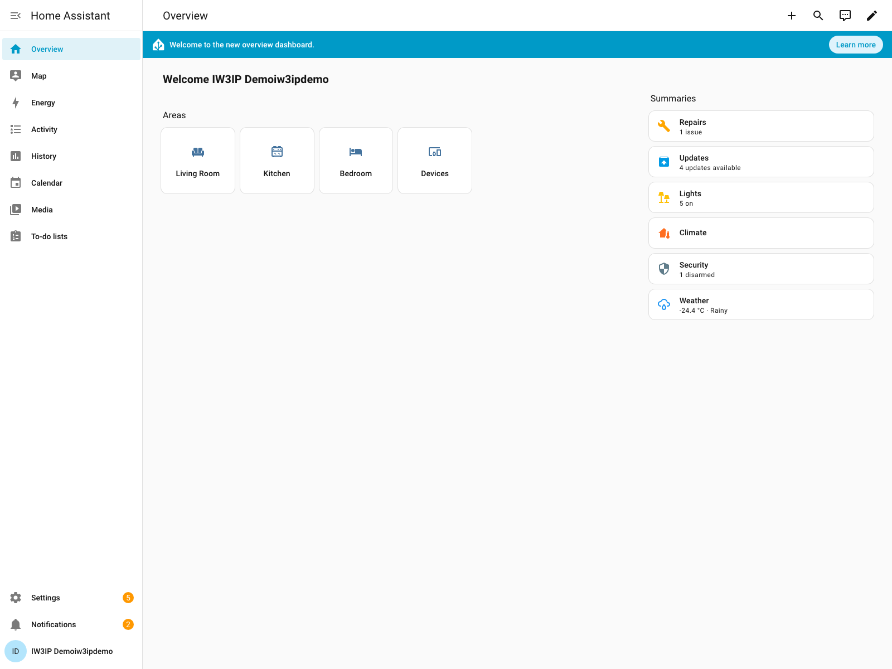
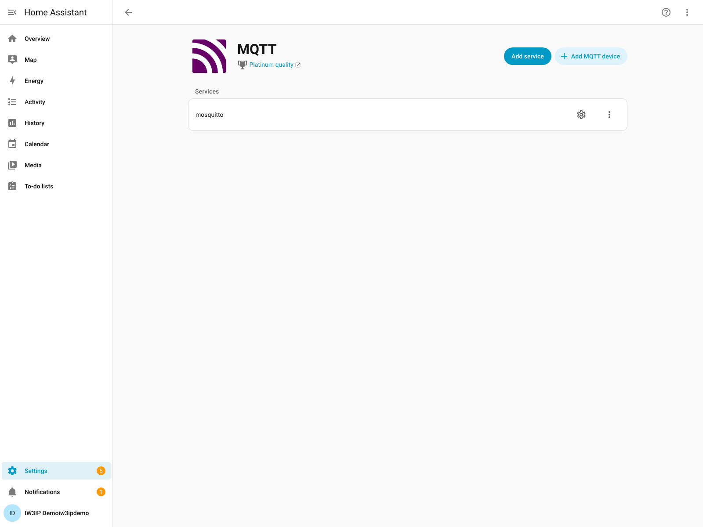
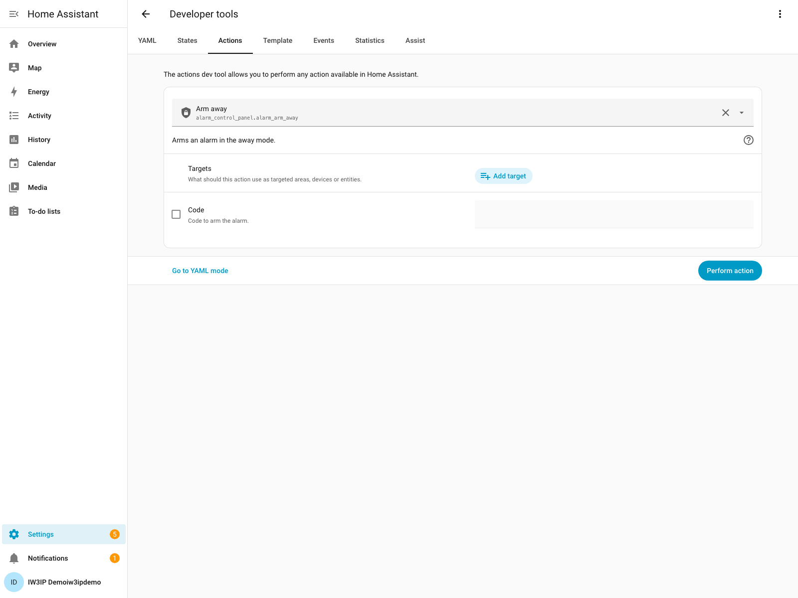
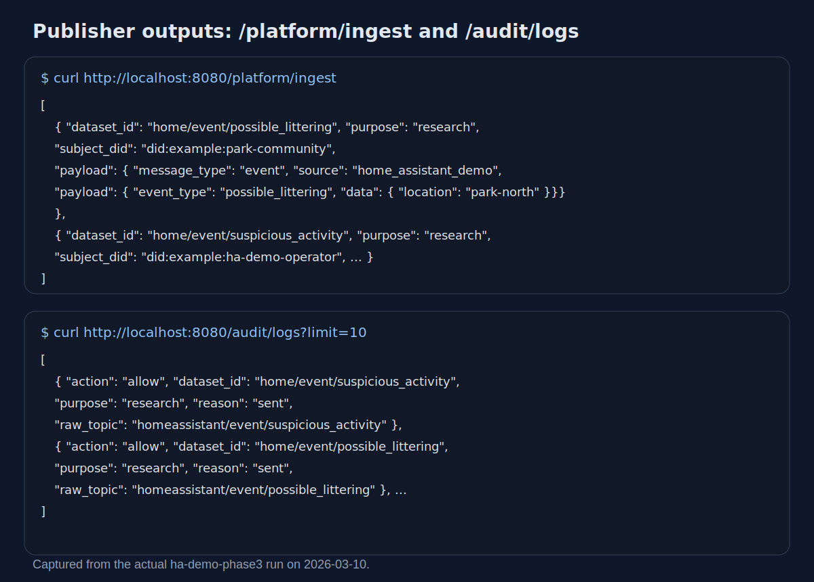
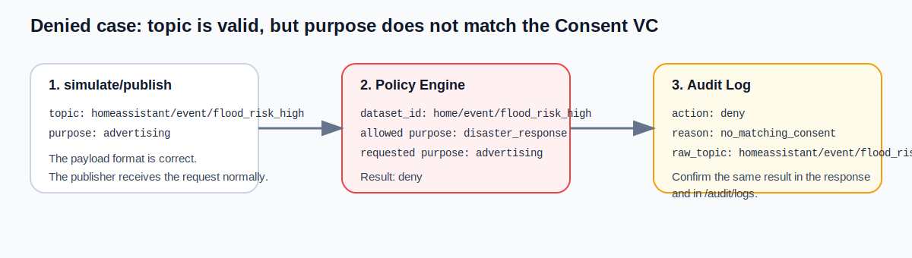
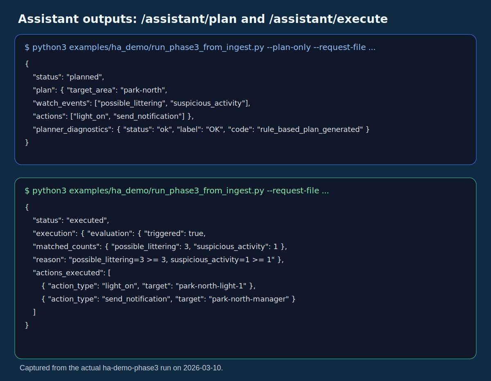

# Home Assistant Demo Simulator Sample (Phase 1 / Phase 2 / Phase 3)

## Goal

This hands-on is a **minimum simulation environment for connecting Home Assistant and IW3IP without physical sensors or cameras**.

It uses Home Assistant `demo` entities to reproduce the following local flow:

`Home Assistant demo -> MQTT -> (optional Node-RED) -> Data Publisher -> Platform API / Audit Log`

This page uses one environment to show Phase 1 state sharing, Phase 2 event sharing, and a Phase 3 assistant execution flow.

## Shortest path

For a first pass, these five steps are enough.

1. `docker compose -f infra/docker-compose.yml --profile ha-demo up --build -d`
2. Open `http://localhost:8123` and add the `MQTT` integration
3. Register the Consent VCs
4. Run `script.iw3ip_publish_demo_temperature` or `script.iw3ip_publish_demo_possible_littering` from `Developer Tools -> Actions`
5. Check the shared result with `curl http://localhost:8080/platform/ingest`

Branches:

- If you only want Phase 1: send `temperature` and `power`, then inspect `platform/ingest`
- If you want to continue to Phase 2: send `possible_littering` and inspect both `allow` and `deny`
- If you want to continue to Phase 3: start `ha-demo-phase3` and run `run_phase3_from_ingest.py --plan-only`

## Phase-based table of contents

<details class="iw3ip-toc-details" open>
  <summary>Phase 1: confirm the basic state-sharing path</summary>
  <p>This part covers environment startup, initial Home Assistant setup, Consent VC registration, basic script execution, and checking `/platform/ingest`.</p>
  <ol>
    <li><a href="#1-start-services">Start services</a></li>
    <li><a href="#2-initial-home-assistant-setup">Initial Home Assistant setup</a></li>
    <li><a href="#3-register-consent-vcs">Register Consent VCs</a></li>
    <li><a href="#4-send-demo-data-from-home-assistant">Send demo data from Home Assistant</a></li>
    <li><a href="#5-check-publisher-results">Check publisher results</a></li>
  </ol>
</details>

<details class="iw3ip-toc-details">
  <summary>Phase 2: confirm event sharing and denial</summary>
  <p>This part explains not only successful sharing but also how requests are rejected when they do not match the Consent VC.</p>
  <ol>
    <li><a href="#6-check-a-denied-case">Check a denied case</a></li>
    <li><a href="#7-test-the-mqtt-path-directly">Test the MQTT path directly</a></li>
  </ol>
</details>

<details class="iw3ip-toc-details">
  <summary>Phase 3: confirm assistant planning and execution</summary>
  <p>The last part bridges accumulated publisher events into the assistant and shows how `plan` and `execute` are separated.</p>
  <ol>
    <li><a href="#8-try-phase-3">Try Phase 3</a></li>
  </ol>
</details>

## What this page helps you understand

- how to reproduce `temperature`, `power`, `person_detected`, `flood_risk_high`, and `possible_littering` without real devices
- how IW3IP publisher receives, normalizes, and records data coming from Home Assistant through MQTT
- the difference between Phase 1 state sharing and Phase 2 event sharing
- how Consent VC changes `allowed` and `denied`
- how to bridge `/platform/ingest` records into the Phase 3 `assistant`

## Common stumbling points

- starting Home Assistant alone is not enough; you must add the `MQTT` integration before the scripts can publish
- if Consent VCs are not registered, the scripts may run but the expected sharing behavior will not appear
- Home Assistant can publish an event correctly and the publisher can still reject it if `purpose` does not match
- because there are no physical devices, the flow is easier to lose sight of, so check both `/platform/ingest` and `/audit/logs`
- in Phase 3 it is easy to mix up sharing and execution, because publisher and assistant are separate services

## Prerequisites

- Docker / Docker Compose
- a browser that can open `http://localhost:8123`
- `curl`

This hands-on assumes the source-code repository `Blockchain_IoT_Marketplace` on branch `codex/ha-demo-simulator`.

Main matching files:

- [README (English)](https://github.com/ertlnagoya/Blockchain_IoT_Marketplace/blob/codex/ha-demo-simulator/README.md)
- [README (Japanese)](https://github.com/ertlnagoya/Blockchain_IoT_Marketplace/blob/codex/ha-demo-simulator/README_ja.md)
- [examples/ha_demo/README.md](https://github.com/ertlnagoya/Blockchain_IoT_Marketplace/blob/codex/ha-demo-simulator/examples/ha_demo/README.md)
- [configuration.yaml](https://github.com/ertlnagoya/Blockchain_IoT_Marketplace/blob/codex/ha-demo-simulator/home-assistant-demo/config/configuration.yaml)
- [scripts.yaml](https://github.com/ertlnagoya/Blockchain_IoT_Marketplace/blob/codex/ha-demo-simulator/home-assistant-demo/config/scripts.yaml)
- [run_phase3_from_ingest.py](https://github.com/ertlnagoya/Blockchain_IoT_Marketplace/blob/codex/ha-demo-simulator/examples/ha_demo/run_phase3_from_ingest.py)

## How to read this page

This page is intentionally detailed. If you want the shortest confirmation path, start from `Shortest path` and the `Phase-based table of contents`, and only open the phase you need.

If you want to understand the whole flow for a workshop or self-study, reading from Phase 1 in order is more effective. In particular, the difference between `allowed` and `denied`, and later the difference between `plan` and `execute`, is easier to understand after following the earlier steps.

## Phase 1: Confirm the basic state-sharing path

In Phase 1, the goal is to confirm that the basic path from Home Assistant to the publisher is working. It is enough to send one state-oriented dataset first and confirm that it appears in `platform/ingest`.

## 1. Start services

Start the simulation environment.

```bash
docker compose -f infra/docker-compose.yml --profile ha-demo up --build -d
```

If you also want Node-RED:

```bash
docker compose -f infra/docker-compose.yml --profile ha-demo --profile nodered up --build -d
```

Check:

```bash
curl http://localhost:8080/health
```

Expected:

```json
{"status":"ok","service":"publisher"}
```

## 2. Initial Home Assistant setup

Open:

- `http://localhost:8123`

On the first run, create a local user. After logging in, first confirm that the Overview page opens correctly.

Real screen example:



What to check:

- `Settings` is visible in the lower-left navigation
- the central page is the normal `Overview` screen
- login has completed and the standard dashboard is open

Then open `Settings -> Devices & Services -> Integrations` and add the `MQTT` integration.

Settings:

- Host: `mosquitto`
- Port: `1883`

The purpose of this step is to make `mqtt.publish` available from Home Assistant scripts. After the integration is added, the setup for this hands-on is ready when the `MQTT` detail screen shows the `mosquitto` service.

Real screen example:



What to check:

- the integration name `MQTT` is visible
- the `mosquitto` service is shown
- once this screen is visible, Home Assistant is ready to use `mqtt.publish`

## 3. Register Consent VCs

Register the Consent VCs used by the demo datasets.

```bash
curl -X POST http://localhost:8080/consents -H 'Content-Type: application/json' -d @examples/ha_demo/consent_temperature.json
curl -X POST http://localhost:8080/consents -H 'Content-Type: application/json' -d @examples/ha_demo/consent_power.json
curl -X POST http://localhost:8080/consents -H 'Content-Type: application/json' -d @examples/ha_demo/consent_person_detected.json
curl -X POST http://localhost:8080/consents -H 'Content-Type: application/json' -d @examples/ha_demo/consent_flood_risk_high.json
curl -X POST http://localhost:8080/consents -H 'Content-Type: application/json' -d @examples/ha_demo/consent_possible_littering.json
curl -X POST http://localhost:8080/consents -H 'Content-Type: application/json' -d @examples/ha_demo/consent_suspicious_activity.json
```

Expected:

- each response includes `"status":"stored"`

Matching files:

- [consent_temperature.json](https://github.com/ertlnagoya/Blockchain_IoT_Marketplace/blob/codex/ha-demo-simulator/examples/ha_demo/consent_temperature.json)
- [consent_power.json](https://github.com/ertlnagoya/Blockchain_IoT_Marketplace/blob/codex/ha-demo-simulator/examples/ha_demo/consent_power.json)
- [consent_person_detected.json](https://github.com/ertlnagoya/Blockchain_IoT_Marketplace/blob/codex/ha-demo-simulator/examples/ha_demo/consent_person_detected.json)
- [consent_flood_risk_high.json](https://github.com/ertlnagoya/Blockchain_IoT_Marketplace/blob/codex/ha-demo-simulator/examples/ha_demo/consent_flood_risk_high.json)
- [consent_possible_littering.json](https://github.com/ertlnagoya/Blockchain_IoT_Marketplace/blob/codex/ha-demo-simulator/examples/ha_demo/consent_possible_littering.json)
- [consent_suspicious_activity.json](https://github.com/ertlnagoya/Blockchain_IoT_Marketplace/blob/codex/ha-demo-simulator/examples/ha_demo/consent_suspicious_activity.json)

## 4. Send demo data from Home Assistant

In Home Assistant, open `Developer Tools -> Actions` and run these scripts. In practice, it is easiest to choose `script.turn_on` in the action selector and then specify the target script entity.

Real screen example:



What to check:

- the `Actions` tab is selected
- `script.turn_on` can be chosen in the action selector
- the execution button can be used to invoke the target script

- `script.iw3ip_publish_demo_temperature`
- `script.iw3ip_publish_demo_power`
- `script.iw3ip_publish_demo_person_detected`
- `script.iw3ip_publish_demo_flood_risk_high`
- `script.iw3ip_publish_demo_possible_littering`
- `script.iw3ip_publish_demo_suspicious_activity`
- `script.iw3ip_publish_demo_phase3_safety_scenario`

These scripts call `mqtt.publish` defined in `scripts.yaml`.

Phase mapping:

- Phase 1:
  - `temperature`
  - `power`
  - `person_detected`
- Phase 2:
  - `flood_risk_high`
  - `possible_littering`
  - `suspicious_activity`

## 5. Check publisher results

After running a Home Assistant script, inspect the publisher side.

```bash
curl http://localhost:8080/platform/ingest
curl http://localhost:8080/audit/logs?limit=10
```

Checkpoints:

- `platform/ingest` contains sent records
- `audit/logs` contains `allow`
- `dataset_id`, `purpose`, `message_hash`, and `raw_topic` are visible

The important point here is not only whether data was sent, but also under which conditions it was allowed.

Example output:



Focus points:

- `/platform/ingest` contains both `home/event/possible_littering` and `home/event/suspicious_activity`
- `/audit/logs` shows `action: allow` with the expected `raw_topic`

Once this part works, the basic sharing path from Home Assistant to the publisher is in place. The next step is to confirm that the same path can also produce a rejection when Consent VC conditions do not match.

## Phase 2: Confirm event sharing and denial

## 6. Check a denied case

The Home Assistant scripts mainly exercise allowed paths, so use HTTP simulation to confirm denial.

```bash
curl -X POST http://localhost:8080/simulate/publish \
  -H 'Content-Type: application/json' \
  -d '{
    "topic":"homeassistant/event/flood_risk_high",
    "payload":{
      "event_type":"flood_risk_high",
      "data":{"zone":"river-west","severity":"high"},
      "ts":"2026-03-10T10:05:00Z",
      "source":"home_assistant_demo"
    },
    "purpose":"advertising"
  }'
```

Expected:

```json
{"status":"denied","dataset_id":"home/event/flood_risk_high","reason":"no_matching_consent"}
```

This makes it clear that generating an event and being allowed to share it are separate questions.

How to read the flow:



What to check here:

- the input topic can be correct and still be rejected when `purpose` does not match the Consent VC
- you should confirm the rejection in both the `simulate/publish` response and `audit/logs`

## 7. Test the MQTT path directly

You can also publish directly to the same topic without Home Assistant.

```bash
docker exec -i iw3ip-mosquitto mosquitto_pub \
  -h localhost -p 1883 \
  -t homeassistant/event/possible_littering \
  -m @examples/ha_demo/payload_possible_littering.json
```

Related files:

- [payload_temperature.json](https://github.com/ertlnagoya/Blockchain_IoT_Marketplace/blob/codex/ha-demo-simulator/examples/ha_demo/payload_temperature.json)
- [payload_power.json](https://github.com/ertlnagoya/Blockchain_IoT_Marketplace/blob/codex/ha-demo-simulator/examples/ha_demo/payload_power.json)
- [payload_person_detected.json](https://github.com/ertlnagoya/Blockchain_IoT_Marketplace/blob/codex/ha-demo-simulator/examples/ha_demo/payload_person_detected.json)
- [payload_flood_risk_high.json](https://github.com/ertlnagoya/Blockchain_IoT_Marketplace/blob/codex/ha-demo-simulator/examples/ha_demo/payload_flood_risk_high.json)
- [payload_possible_littering.json](https://github.com/ertlnagoya/Blockchain_IoT_Marketplace/blob/codex/ha-demo-simulator/examples/ha_demo/payload_possible_littering.json)

By the end of Phase 2, it should be clear that a valid MQTT path does not automatically mean that sharing is allowed. Phase 3 then takes the accepted events and forwards them into the assistant layer for request interpretation and execution.

## Phase 3: Confirm assistant planning and execution

## 8. Try Phase 3

In Phase 3, the events accumulated by the publisher are converted into `assistant` `observed_events`, and then you inspect `plan -> execute`.

Start:

```bash
docker compose -f infra/docker-compose.yml --profile ha-demo-phase3 up --build -d
```

Then run this Home Assistant script:

- `script.iw3ip_publish_demo_phase3_safety_scenario`

That script publishes the following sequence for `park-north`:

- three `possible_littering` events
- one `suspicious_activity` event

Next, inspect the `plan` first:

```bash
python3 examples/ha_demo/run_phase3_from_ingest.py \
  --plan-only \
  --request-file examples/ha_demo/phase3_request_park_safety.json
```

At this stage, check:

- `status` is `planned`
- `plan.watch_events` includes `possible_littering` and `suspicious_activity`
- `plan.actions` includes `light_on` and `send_notification`

Example output:

```json
{
  "status": "planned",
  "plan": {
    "target_area": "park-north",
    "watch_events": ["possible_littering", "suspicious_activity"],
    "actions": [
      {"action_type": "light_on", "target": "park-north-light-1"},
      {"action_type": "send_notification", "target": "park-north-manager"}
    ]
  }
}
```

Then bridge the publisher events into the assistant:

```bash
python3 examples/ha_demo/run_phase3_from_ingest.py \
  --request-file examples/ha_demo/phase3_request_park_safety.json
```

Expected:

- `execution.evaluation.triggered` is `true`
- `actions_executed` includes `light_on` and `send_notification`

At this stage, the important point is that request interpretation (`plan`) and execution against observed events (`execute`) are separate steps.

Example output:



Focus points in `execute`:

- `evaluation.triggered` is `true`
- `matched_counts.possible_littering = 3`
- `matched_counts.suspicious_activity = 1`
- `actions_executed` contains two actions

## 9. If you want to use Node-RED

Node-RED is useful when you want easier manual injection or time-based pseudo events.

Import flow:

- [nodered_flows.json](https://github.com/ertlnagoya/Blockchain_IoT_Marketplace/blob/codex/ha-demo-simulator/examples/ha_demo/nodered_flows.json)

Node-RED is optional in this setup.  
It is better to first understand the full path with Home Assistant demo alone, and only then add Node-RED if you want clearer event injection.

## Future extensions

This sample is the entry point for understanding the basic IW3IP path with Home Assistant. If you want to expand the scope later, the following environments are natural next steps.

### FIWARE

FIWARE is an IoT platform family centered on `Context Broker` and `IoT Agent` components for cities, facilities, and multi-organization data flows. It is heavier than Home Assistant, but it is a strong candidate when you want to study cross-system sharing and subscription-based notification.

- Official site: <https://www.fiware.org/>
- Tutorials: <https://fiware-tutorials.readthedocs.io/en/latest/>

### Eclipse Ditto

Eclipse Ditto is a digital-twin platform for device state and command handling. Combined with IW3IP Phase 3, it is useful when you want to trace not only shared events but also later state updates and control results.

- Official site: <https://eclipse.dev/ditto/>
- MQTT binding: <https://eclipse.dev/ditto/connectivity-protocol-bindings-mqtt.html>

### CARLA

CARLA is a simulator for urban spaces, vehicles, pedestrians, and virtual sensors. It is much heavier than Home Assistant, but it becomes useful when you want advanced event-generation scenarios for safety, disaster response, and mobility in Phase 2 or Phase 3.

- Official site: <https://carla.org/>
- Documentation: <https://carla.readthedocs.io/>

## 10. What is Phase 1, Phase 2, and Phase 3 here?

One important point of this sample is that one environment can show both Phase 1 and Phase 2.

- Phase 1:
  - state sharing such as `temperature` and `power`
  - basic receive, normalize, send, and record flow
- Phase 2:
  - event sharing such as `flood_risk_high` and `possible_littering`
  - conditional sharing based on `purpose` and Consent VC
- Phase 3:
  - pass publisher events to the assistant and execute the plan
  - inspect `triggered` and `actions_executed`

This page also works as a bridge between these two hands-on pages:

- [HA x SSI Publisher sample (Phase 1)](ha-ssi-publisher.md)
- [Environment and disaster event sharing sample (Phase 2)](environment-disaster.md)
- [Regional safety assistant sample (Phase 3)](regional-safety-assistant.md)

## 11. Stop services

```bash
docker compose -f infra/docker-compose.yml --profile ha-demo down
```

If Node-RED is also running:

```bash
docker compose -f infra/docker-compose.yml --profile ha-demo --profile nodered down
```

If you also started the Phase 3 path:

```bash
docker compose -f infra/docker-compose.yml --profile ha-demo-phase3 down
```
