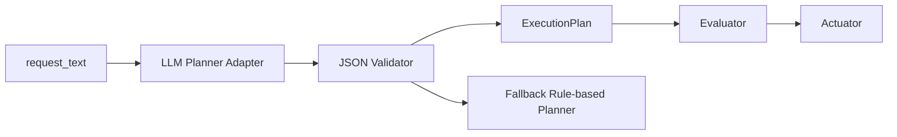

# LLM Planner Replacement Spec

This page is a design note for the next step after the Phase 3 [Regional Safety Assistant sample](regional-safety-assistant.md).  
The goal is to replace the current rule-based planner with an **LLM-based planner** while keeping the rest of the pipeline stable.

This is not yet an implementation guide. It is a specification that clarifies **what must stay fixed and what can be replaced**.

## Goal

In the current Phase 3 sample, `planner.py` is rule-based.  
That is easy to understand, but weak against natural-language variation.

The next step is to use an LLM to:

- interpret user requests more flexibly
- still map them into a fixed JSON structure
- keep `evaluator` and `actuator` unchanged

## Assumption of This Spec

Only the `planner` layer is replaced.  
The following parts remain as they are:

- `assistant/app/evaluator.py`
- `assistant/app/actuator.py`
- `assistant/app/models.py`
- `POST /assistant/plan`
- `POST /assistant/execute`

In other words, the LLM is treated as **the component that interprets requests, not the component that directly decides or executes device control**.

## Design Principles

### 1. Limit the responsibility of the LLM

The LLM is responsible only for:

- reading the request intent
- estimating the target area
- selecting relevant watch events
- proposing threshold values
- selecting candidate actions

The LLM must not be responsible for:

- counting actual observed events
- making the final trigger decision
- issuing device commands directly
- storing audit logs

### 2. Output must be structured JSON, not free text

The LLM output should be constrained to a structure compatible with `ExecutionPlan`.  
Free-form natural language would make the downstream pipeline unstable.

Minimal example:

```json
{
  "intent": "monitor_public_safety",
  "target_area": "park-north",
  "time_window_minutes": 30,
  "watch_events": ["possible_littering", "suspicious_activity"],
  "thresholds": {
    "possible_littering": 3,
    "suspicious_activity": 1
  },
  "actions": [
    {
      "action_type": "light_on",
      "target": "park-north-light-1",
      "parameters": {"brightness": 80}
    },
    {
      "action_type": "send_notification",
      "target": "park-north-manager",
      "parameters": {"channel": "mobile_push"}
    }
  ]
}
```

## Input and Output Contract

### Input

- `request_text`
- list of allowed events
- list of allowed actions
- list of allowed target areas

### Output

- JSON that can be converted into `ExecutionPlan`

### On error

If the LLM output is invalid, the system should not use it directly.  
Use one of these fallback strategies:

1. fall back to the rule-based planner
2. return `plan_error` and request clarification

For the first implementation, **falling back to the rule-based planner** is the safer option.

## Allow Lists

The LLM must not invent event names or action names.  
It must select only from predefined allow lists.

### Allowed events

- `possible_littering`
- `suspicious_activity`
- `person_detected`

### Allowed actions

- `light_on`
- `send_notification`
- `show_warning`

### Allowed areas

- `park-north`
- `park-south`
- `station-front`

If the LLM returns anything outside these sets, the planner should reject it.

## Recommended Architecture



The important point here is to avoid embedding the LLM directly into the core flow.  
Instead, use **adapter + validator + fallback**.

## Planned Additional Modules

Expected file examples:

- `assistant/app/llm_planner.py`
- `assistant/app/llm_prompt.py`
- `assistant/app/plan_validator.py`
- `assistant/app/planner_factory.py`

Roles:

- `llm_planner.py`
  - calls the LLM
- `llm_prompt.py`
  - manages prompts
- `plan_validator.py`
  - checks allow lists and pydantic validation
- `planner_factory.py`
  - switches between `rule_based` and `llm`

## Prompt Requirements

The LLM should at least be instructed that:

- it is a planner for a public-safety assistant
- it must output JSON only
- it must not emit events or actions outside the allow lists
- it should return `unknown-area` when the area is unclear
- thresholds must be integers

Bad outputs:

- long prose explanations
- invented event names
- guessed execution results

Good outputs:

- minimal JSON matching the existing schema

## Validation Requirements

### Structural validation

- the output must be valid JSON
- required keys must exist
- types must match

### Constraint validation

- `watch_events` must contain only allowed events
- `actions[].action_type` must contain only allowed actions
- `target_area` must be an allowed area or `unknown-area`

### Practical validation

- the same request should not produce wildly inconsistent plans
- both Japanese and English requests should work at a minimum level
- ambiguous requests must not cause unsafe actions to be added silently

## Evaluation Points

For student exercises, it is useful if learners can explain:

1. the difference between the rule-based planner and the LLM planner
2. both the flexibility and the risks of LLM-based planning
3. why validator and fallback are necessary
4. why the design should not "let the LLM do everything"

## Non-Goals

This stage does not yet include:

- multi-turn dialogue
- long-term memory
- autonomous replanning
- unrestricted device-control agents

The immediate scope is only **mapping natural language into the existing plan schema**.

## Recommended Minimal Implementation Steps

1. fix the `Planner` interface
2. add `LLMPlanner`
3. add a JSON validator
4. add fallback behavior
5. switch using `PLANNER_MODE=rule_based|llm`
6. add pytest coverage for validation and fallback

## Expected Learning Outcome

- learners can treat an LLM as a constrained component rather than a magic box
- learners can understand what should remain deterministic when AI is introduced
- learners can extend Phase 3 carefully without jumping directly to an unconstrained agent model
