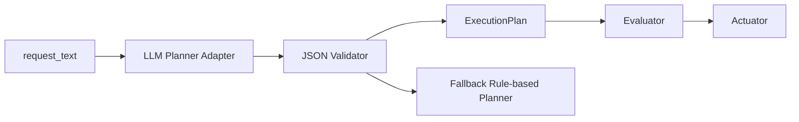

# LLM Planner Replacement Spec

This is a specification for replacing the planner in the [Regional Safety Assistant sample](regional-safety-assistant.md) with an **LLM-based planner**.  
It is not an implementation procedure but a design document that defines **what to fix and where to replace**.

## What this page covers

- the design boundary when replacing the planner with an LLM planner
- the reason for keeping the existing evaluator / actuator / API as they are
- the importance of deciding allow lists, validators, and fallback first

## Common issues

- treating \"adding an LLM\" as \"turning the whole system into AI\" breaks the design
- at the specification stage, responsibility separation comes before implementation steps
- the reason for constraining output to structured JSON instead of free text is easy to overlook

## Goal

In the current Phase 3 sample, `planner.py` is rule-based.  
For learning purposes it is easy to follow, but it is weak against variation in natural-language phrasing.

The next step uses an LLM to:

- interpret user requests more flexibly
- map them into a fixed JSON structure rather than generating free text
- reuse the existing `evaluator` and `actuator` for evaluation and control

## Assumption of This Spec

Only the `planner` layer is replaced. The following parts are reused as they are:

- `assistant/app/evaluator.py`
- `assistant/app/actuator.py`
- `assistant/app/models.py`
- `POST /assistant/plan`
- `POST /assistant/execute`

The design is that **the LLM handles planning but not the execution of control**.

## Design Principles

### 1. Limit the responsibility of the LLM

The LLM is responsible only for:

- reading the intent of the request
- estimating the target area
- selecting watch events
- proposing threshold candidates
- selecting candidate actions

The following are not left to the LLM:

- evaluating the actual count of events
- the final trigger decision
- operating the actual devices
- storing audit logs

### 2. Output must be structured JSON, not free text

The LLM output is constrained to a structure close to the existing `ExecutionPlan`, because leaving it as natural text makes the downstream pipeline unstable.

Minimal output example:

```json
{
  "intent": "monitor_public_safety",
  "target_area": "park-north",
  "time_window_minutes": 30,
  "watch_events": ["possible_littering", "suspicious_activity"],
  "thresholds": {
    "possible_littering": 3,
    "suspicious_activity": 1
  },
  "actions": [
    {
      "action_type": "light_on",
      "target": "park-north-light-1",
      "parameters": {"brightness": 80}
    },
    {
      "action_type": "send_notification",
      "target": "park-north-manager",
      "parameters": {"channel": "mobile_push"}
    }
  ]
}
```

## Input and Output Contract

### Input

- `request_text`
- list of allowed events
- list of allowed actions
- list of allowed target areas

### Output

- JSON that can be converted into `ExecutionPlan`

### On error

If the LLM output is invalid, it is not used directly; fall to one of the following:

1. fall back to the rule-based planner
2. return `plan_error` and prompt for re-entry

For the initial implementation, **falling back to the rule-based planner** is the safer option.

## Allow Lists

The LLM is not allowed to invent event names or action names. It must select only from the allow lists.

### Allowed events

- `possible_littering`
- `suspicious_activity`
- `person_detected`

### Allowed actions

- `light_on`
- `send_notification`
- `show_warning`

### Allowed areas

- `park-north`
- `park-south`
- `station-front`

If the LLM returns a value outside these sets, the planner rejects it.

## Recommended Architecture



Rather than embedding the LLM directly into the core, separate it into **adapter + validator + fallback**.

## Planned Additional Modules

Expected file examples:

- `assistant/app/llm_planner.py`
- `assistant/app/llm_prompt.py`
- `assistant/app/plan_validator.py`
- `assistant/app/planner_factory.py`

Roles:

- `llm_planner.py`
  - calls the LLM
- `llm_prompt.py`
  - manages the system prompt / developer prompt
- `plan_validator.py`
  - checks allow lists and pydantic validation
- `planner_factory.py`
  - switches between `rule_based` and `llm`

## Prompt Requirements

At minimum, the LLM is given the following:

- you are the planner for a regional-safety assistant
- output JSON only
- do not output anything outside the allowed events and actions
- return `unknown-area` when unclear
- return thresholds as integers

Bad examples:

- returning a long explanation
- inventing new event names
- guessing and returning execution results

Good example:

- returning minimal JSON that matches the existing schema

## Validation Requirements

### Structural validation

- the output must be valid JSON
- required keys must exist
- types must match

### Constraint validation

- `watch_events` must contain only allowed events
- `actions[].action_type` must contain only allowed actions
- `target_area` must be an allowed area or `unknown-area`

### Practical validation

- the same request does not vary widely
- both Japanese and English requests work at a minimum level
- ambiguous requests do not cause unsafe actions to be added on their own

## Evaluation Points

Understanding deepens if learners can confirm the following in the exercise:

1. explain the difference between the rule-based planner and the LLM planner
2. explain both the flexibility and the danger of the LLM
3. explain why a validator and fallback are necessary
4. explain the design reason for "not leaving everything to the LLM"

## Non-Goals

This stage does not yet cover:

- multi-turn dialogue
- long-term memory
- autonomous replanning
- agents that freely operate arbitrary devices

The scope for now is only **mapping natural language into the existing plan schema**.

## Recommended Minimal Implementation Steps

1. fix the `Planner` interface
2. add `LLMPlanner`
3. add a JSON validator
4. add a fallback
5. switch with the `PLANNER_MODE=rule_based|llm` environment variable
6. confirm JSON validation and fallback with pytest

## Expected Learning Outcome

- learners can treat an LLM as a constrained component rather than an all-purpose generator
- learners can understand what should stay deterministic when AI is introduced
- learners learn the mindset of extending Phase 3 steadily, without rushing it into a future Phase 4-style agent
