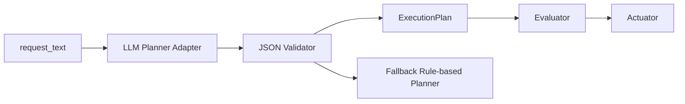

# LLM Planner置き換え仕様

[地域安全アシスタントサンプル](regional-safety-assistant.md) の planner を **LLM ベースに置き換える** ための仕様書です。  
実装手順ではなく、**何を固定し、どこを差し替えるか** を定義する設計文書です。

## このページで分かること

- LLM planner に置き換えるときの設計境界
- 既存の evaluator / actuator / API をそのまま残す理由
- allow list、validator、fallback を先に決める重要性

## つまずきやすい点

- 「LLM を入れる = 全体を AI 化する」と考えると設計が崩れやすい
- 仕様書の段階では、実装手順より先に責務分離を見る必要がある
- 自由文出力ではなく構造化 JSON に制約する理由を見落としやすい

## 目的

現在の Phase 3 サンプルでは、`planner.py` は rule-based です。  
学習には分かりやすいが、自然言語の表現ゆれに弱い。

次段階では LLM を使って以下を実現します。

- 人間の要求文を柔軟に理解する
- ただし自由生成しすぎず、決められた JSON へ落とす
- 評価と制御は既存の `evaluator` / `actuator` を再利用する

## この仕様の前提

差し替え対象は `planner` のみ。以下はそのまま再利用します。

- `assistant/app/evaluator.py`
- `assistant/app/actuator.py`
- `assistant/app/models.py`
- `POST /assistant/plan`
- `POST /assistant/execute`

**LLM は「考える役」だが、勝手に制御を実行する役ではない** という設計です。

## 設計方針

### 1. LLM の責務を限定する

LLM が担当するのは、次だけです。

- 要求文の意図を読む
- 対象場所を推定する
- 注目イベントを選ぶ
- しきい値候補を作る
- 実行候補アクションを選ぶ

次は LLM に任せません。

- 実際のイベント件数評価
- 最終的な trigger 判定
- 実際の機器操作
- 監査ログ保存

### 2. 出力は自由文ではなく構造化 JSON

LLM の出力は既存の `ExecutionPlan` に近い構造へ制約します。自然文のままだと後段が不安定になるためです。

最小の出力例:

```json
{
  "intent": "monitor_public_safety",
  "target_area": "park-north",
  "time_window_minutes": 30,
  "watch_events": ["possible_littering", "suspicious_activity"],
  "thresholds": {
    "possible_littering": 3,
    "suspicious_activity": 1
  },
  "actions": [
    {
      "action_type": "light_on",
      "target": "park-north-light-1",
      "parameters": {"brightness": 80}
    },
    {
      "action_type": "send_notification",
      "target": "park-north-manager",
      "parameters": {"channel": "mobile_push"}
    }
  ]
}
```

## 入出力仕様

### 入力

- `request_text`
- 利用可能イベント一覧
- 利用可能アクション一覧
- 利用可能エリア一覧

### 出力

- `ExecutionPlan` に変換可能な JSON

### エラー時

LLM の出力が不正な場合は、そのまま使わず、次のどちらかに落とします。

1. rule-based planner へフォールバック
2. `plan_error` を返して再入力を促す

初期実装では、**rule-based planner へフォールバック** が安全です。

## 許可リスト

LLM がイベント名やアクション名を自由に作ることは禁止です。必ず許可リストから選ばせます。

### 許可イベント

- `possible_littering`
- `suspicious_activity`
- `person_detected`

### 許可アクション

- `light_on`
- `send_notification`
- `show_warning`

### 許可エリア

- `park-north`
- `park-south`
- `station-front`

LLM が許可外の値を返した場合は、planner 側で reject します。

## 推奨アーキテクチャ



LLM を直接本体に埋め込まず、**adapter + validator + fallback** に分けます。

## 追加予定モジュール

想定する追加ファイル例:

- `assistant/app/llm_planner.py`
- `assistant/app/llm_prompt.py`
- `assistant/app/plan_validator.py`
- `assistant/app/planner_factory.py`

役割:

- `llm_planner.py`
  - LLM 呼び出し
- `llm_prompt.py`
  - system prompt / developer prompt 管理
- `plan_validator.py`
  - 許可リストと pydantic 検証
- `planner_factory.py`
  - `rule_based` / `llm` の切り替え

## プロンプト設計の要件

LLM には少なくとも次を与えます。

- あなたは地域安全 assistant の planner である
- 出力は JSON のみ
- 許可イベントと許可アクション以外は出力しない
- 不明なら `unknown-area` を返す
- しきい値は整数で返す

悪い例:

- 長い説明文を返す
- 新しいイベント名を勝手に作る
- 実行結果を推測して返す

良い例:

- 既存 schema に一致する最小 JSON を返す

## 検証項目

### 構造検証

- JSON として parse できる
- 必須キーがある
- 型が正しい

### 制約検証

- `watch_events` が許可イベントのみ
- `actions[].action_type` が許可アクションのみ
- `target_area` が許可エリアか `unknown-area`

### 実用検証

- 同じ要求に対して大きくぶれない
- 日本語と英語の両方で最低限動く
- 曖昧な要求でも危険な action を勝手に追加しない

## 評価観点

演習では、次の点を確認できると理解が深まります。

1. rule-based planner と LLM planner の違いを説明できる
2. LLM の柔軟性と危うさの両方を説明できる
3. validator と fallback がなぜ必要か説明できる
4. 「LLM に全部任せない」設計理由を説明できる

## 非目標

この段階では、次はまだ扱いません。

- 複数ターン対話
- 長期記憶
- 自律的な再計画
- 任意の機器を自由操作する agent

まずは **「自然言語を既存 plan schema に落とす」** ことだけを対象にします。

## 推奨する最小実装ステップ

1. `Planner` インタフェースを固定する
2. `LLMPlanner` を追加する
3. JSON validator を追加する
4. フォールバックを追加する
5. `PLANNER_MODE=rule_based|llm` を環境変数で切り替える
6. pytest で JSON 検証とフォールバックを確認する

## 期待される学習効果

- LLM を「自由な魔法の箱」としてではなく、制約付きコンポーネントとして扱える
- AI を入れるときに、どこを deterministic に残すべきか理解できる
- Phase 3 を、将来の Phase 4 的な agent 化へ雑に進めず、堅実に拡張する考え方を学べる
