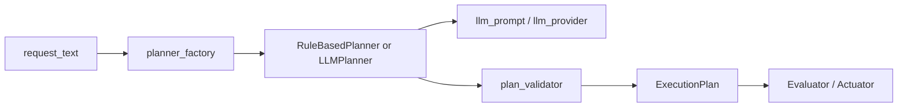

# LLM Planner Hands-on

This hands-on extends the Phase 3 [Regional Safety Assistant sample](regional-safety-assistant.md) and demonstrates the minimum path for **replacing the rule-based planner with an LLM planner**.

This page is organized in two steps:

1. reproduce the flow locally with the `stub` provider
2. switch to an actual OpenAI-compatible API if available

## Shortest path

For a first pass, these five steps are enough.

1. start the `assistant`
2. call `/assistant/plan` with the `stub` provider
3. inspect `planner_diagnostics`
4. if needed, start `assistant-demo` and inspect the same result from the UI
5. finally switch to `openai_compatible`

Branches after that:

- If you only need the API path: the `stub` provider and `curl` are enough
- If you also want the UI path: start `assistant-demo`
- If you want to connect to a real API: continue to `assistant-llm` with `.env.local.example`

## What this page helps you understand

- what must stay fixed when replacing a rule-based planner with an LLM planner
- the roles of `planner_factory`, `validator`, and `fallback`
- how to read success and failure through `planner_diagnostics`

## Common stumbling points

- adding an LLM does not mean evaluator and actuator should change as well
- the difference between `stub` and `openai_compatible` is mostly in environment settings
- when something fails, `planner_diagnostics` is often more useful than the plan body itself

## Prerequisites

- Docker / Docker Compose
- `curl`
- the `codex/phase3-frontend-demo` branch of the `Blockchain_IoT_Marketplace` repository

References:

- [Docker official site](https://docs.docker.com/get-docker/)
- [httpx documentation](https://www.python-httpx.org/)

## Matching source files

- [assistant/app/planner_interface.py](https://github.com/ertlnagoya/Blockchain_IoT_Marketplace/blob/codex/phase3-frontend-demo/assistant/app/planner_interface.py)
- [assistant/app/planner_factory.py](https://github.com/ertlnagoya/Blockchain_IoT_Marketplace/blob/codex/phase3-frontend-demo/assistant/app/planner_factory.py)
- [assistant/app/llm_planner.py](https://github.com/ertlnagoya/Blockchain_IoT_Marketplace/blob/codex/phase3-frontend-demo/assistant/app/llm_planner.py)
- [assistant/app/llm_prompt.py](https://github.com/ertlnagoya/Blockchain_IoT_Marketplace/blob/codex/phase3-frontend-demo/assistant/app/llm_prompt.py)
- [assistant/app/llm_provider.py](https://github.com/ertlnagoya/Blockchain_IoT_Marketplace/blob/codex/phase3-frontend-demo/assistant/app/llm_provider.py)
- [assistant/app/plan_validator.py](https://github.com/ertlnagoya/Blockchain_IoT_Marketplace/blob/codex/phase3-frontend-demo/assistant/app/plan_validator.py)
- [Problem program](https://github.com/ertlnagoya/Blockchain_IoT_Marketplace/blob/codex/phase3-frontend-demo/examples/hands_on/phase3_llm_planner/problem_program.py)
- [Answer program](https://github.com/ertlnagoya/Blockchain_IoT_Marketplace/blob/codex/phase3-frontend-demo/examples/hands_on/phase3_llm_planner/answer_program.py)
- [Exercise guide](https://github.com/ertlnagoya/Blockchain_IoT_Marketplace/blob/codex/phase3-frontend-demo/examples/hands_on/phase3_llm_planner/README.md)
- [React frontend demo](https://github.com/ertlnagoya/Blockchain_IoT_Marketplace/tree/codex/phase3-frontend-demo/assistant-ui)
- [.env.local.example](https://github.com/ertlnagoya/Blockchain_IoT_Marketplace/blob/codex/phase3-frontend-demo/.env.local.example)
- [examples/phase3_llm.env.example](https://github.com/ertlnagoya/Blockchain_IoT_Marketplace/blob/codex/phase3-frontend-demo/examples/phase3_llm.env.example)
- [examples/phase3_llm_mock.env.example](https://github.com/ertlnagoya/Blockchain_IoT_Marketplace/blob/codex/phase3-frontend-demo/examples/phase3_llm_mock.env.example)
- [examples/phase3_llm_expected_plan.json](https://github.com/ertlnagoya/Blockchain_IoT_Marketplace/blob/codex/phase3-frontend-demo/examples/phase3_llm_expected_plan.json)
- [examples/phase3_llm_mock_server.py](https://github.com/ertlnagoya/Blockchain_IoT_Marketplace/blob/codex/phase3-frontend-demo/examples/phase3_llm_mock_server.py)
- [examples/phase3_request_station_warning.json](https://github.com/ertlnagoya/Blockchain_IoT_Marketplace/blob/codex/phase3-frontend-demo/examples/phase3_request_station_warning.json)

The exercise programs focus on the minimum request body for `/assistant/plan` and on how to summarize the returned plan.

## Process table of contents

<details class="iw3ip-toc-details" open>
  <summary>Stage 1: understand the planner shape with the stub provider</summary>
  <p>Start without any external LLM API. In this stage, the goal is to understand the basic shape of the planner input and output, including `plan` and `planner_diagnostics`.</p>
  <ol>
    <li><a href="#1-start-with-the-stub-provider">Start with the `stub` provider</a></li>
    <li><a href="#2-inspect-a-japanese-request">Inspect a Japanese request</a></li>
    <li><a href="#3-inspect-an-english-request">Inspect an English request</a></li>
  </ol>
</details>

<details class="iw3ip-toc-details">
  <summary>Stage 2: inspect the frontend demo and diagnostics</summary>
  <p>Next, inspect the same planner result from the frontend side. This stage focuses on `assistant-demo`, badges, alert panels, and how `planner_diagnostics` should be read in the UI.</p>
  <ol>
    <li><a href="#25-start-the-react-frontend-demo">Start the React frontend demo</a></li>
    <li><a href="#4-inspect-the-real-api-environment-template">Inspect the real-API environment template</a></li>
  </ol>
</details>

<details class="iw3ip-toc-details">
  <summary>Stage 3: switch to an OpenAI-compatible API</summary>
  <p>Finally, switch to the `openai_compatible` provider while keeping the same overall structure. This is where provider-side failures become visible through `planner_diagnostics`.</p>
  <ol>
    <li><a href="#5-switch-to-an-openai-compatible-api">Switch to an OpenAI-compatible API</a></li>
  </ol>
</details>

## How to read this page

This page is a detailed explanation of the planner part of Phase 3. It is easiest to start with the `stub` provider to understand the structure, then move to the frontend view, and only after that switch to a real API. That order makes it clear what changes and what stays fixed.

## Architecture Diagram



The important point is that the LLM is not embedded directly inside `main.py`.  
The replacement is isolated behind `planner_factory`.

## Stage 1: Understand the planner shape with the stub provider

## 1. Start with the `stub` provider

Run the following in the `Blockchain_IoT_Marketplace` repository.

```bash
ASSISTANT_PLANNER_MODE=llm \
ASSISTANT_PLANNER_NAME=llm-planner-stub-v1 \
ASSISTANT_LLM_PROVIDER=stub \
uvicorn assistant.app.main:app --host 0.0.0.0 --port 8090
```

Docker Compose example:

```bash
docker compose -f infra/docker-compose.yml --profile assistant up --build -d assistant
```

Reference screenshot:


In another terminal:

```bash
curl http://localhost:8090/health
```

Expected:

```json
{"status":"ok","service":"assistant"}
```

## 2. Inspect a Japanese request

```bash
curl -X POST http://localhost:8090/assistant/plan \
  -H 'Content-Type: application/json' \
  -d @examples/phase3_request_park_safety.json
```

Example expected output:

```json
{
  "status": "planned",
  "plan": {
    "planner_name": "llm-planner-stub-v1",
    "target_area": "park-north",
    "watch_events": ["possible_littering", "suspicious_activity"]
  }
}
```

Checkpoints:

- `planner_name` is `llm-planner-stub-v1`
- `target_area` is `park-north`
- `watch_events` is returned as JSON array

At this point, the minimum path from natural-language request to `plan` is working. The next step is to inspect how the same planner output should be read from the frontend side.

## Stage 2: Inspect the frontend demo and diagnostics

## 2.5 Start the React frontend demo

There is also a minimal React screen for calling the Phase 3 assistant from a browser.

```bash
docker compose -f infra/docker-compose.yml --profile assistant up --build -d assistant
docker compose -f infra/docker-compose.yml --profile assistant-ui up --build -d assistant-ui
```

Open:

- `http://localhost:4173`

This screen lets you check:

- editing the natural-language request
- `POST /assistant/plan`
- `POST /assistant/execute`
- `GET /assistant/executions`
- badge / alert rendering for `planner_diagnostics`

Screen image:


If you want a one-command path including the local mock LLM:

```bash
docker compose -f infra/docker-compose.yml --profile assistant-demo up --build -d
```

This profile starts:

- `assistant-demo`
- `llm-mock`
- `assistant-ui`

## 3. Inspect an English request

```bash
curl -X POST http://localhost:8090/assistant/plan \
  -H 'Content-Type: application/json' \
  -d @examples/phase3_request_station_warning.json
```

Example expected output:

```json
{
  "status": "planned",
  "plan": {
    "planner_name": "llm-planner-stub-v1",
    "target_area": "station-front",
    "watch_events": ["suspicious_activity"],
    "actions": [
      {"action_type": "send_notification"},
      {"action_type": "show_warning"}
    ]
  }
}
```

This confirms that the planner can also map an English request to `station-front`.

## 4. Inspect the real-API environment template

To use an actual OpenAI-compatible API, inspect the example environment file:

```bash
cat .env.local.example
```

Main fields:

- `ASSISTANT_PLANNER_MODE=llm`
- `ASSISTANT_LLM_PROVIDER=openai_compatible`
- `ASSISTANT_LLM_API_BASE_URL`
- `ASSISTANT_LLM_API_KEY`
- `ASSISTANT_LLM_MODEL`

How to read `planner_diagnostics`:

- `status`
  - `ok` or `fallback`
- `severity`
  - `info`, `warning`, or `error`
- `label`
  - short text that can be shown directly in a badge
- `color_hint`
  - color hint such as `green`, `amber`, or `red`
- `code`
  - stable code that the frontend can branch on
- `category`
  - broad group such as `success`, `provider`, `validation`, or `planner`
- `user_message`
  - short message that can be shown directly to the end user
- `summary`
  - short explanation of what happened
- `suggestion`
  - next troubleshooting step

Example for frontend use:

```ts
type PlannerDiagnostics = {
  status: "ok" | "fallback";
  severity: "info" | "warning" | "error";
  label: string;
  color_hint: "green" | "amber" | "red";
  code: string;
  category: "success" | "provider" | "validation" | "planner";
  user_message: string;
  summary?: string | null;
  suggestion?: string | null;
};

type BadgeViewModel = {
  label: string;
  tone: "success" | "warning" | "danger" | "neutral";
  detail: string;
  code: string;
  category: string;
};

export function diagnosticsToBadge(diagnostics: PlannerDiagnostics): BadgeViewModel {
  const toneMap: Record<PlannerDiagnostics["color_hint"], BadgeViewModel["tone"]> = {
    green: "success",
    amber: "warning",
    red: "danger",
  };

  return {
    label: diagnostics.label,
    tone: toneMap[diagnostics.color_hint] ?? "neutral",
    detail: diagnostics.user_message,
    code: diagnostics.code,
    category: diagnostics.category,
  };
}
```

For example, a fallback case can be rendered like this:

```ts
const badge = diagnosticsToBadge({
  status: "fallback",
  severity: "warning",
  label: "Fallback",
  color_hint: "amber",
  code: "llm_provider_error",
  category: "provider",
  user_message: "The LLM API could not be used, so the rule-based planner was used instead.",
});
```

Minimal React example:

```tsx
type PlannerDiagnostics = {
  label: string;
  color_hint: "green" | "amber" | "red";
  code: string;
  category: string;
  user_message: string;
  summary?: string | null;
  suggestion?: string | null;
};

function DiagnosticsBadge({ diagnostics }: { diagnostics: PlannerDiagnostics }) {
  return (
    <span className={`badge badge-${diagnostics.color_hint}`}>
      {diagnostics.label}
    </span>
  );
}

function DiagnosticsAlertPanel({ diagnostics }: { diagnostics: PlannerDiagnostics }) {
  return (
    <div className={`alert alert-${diagnostics.color_hint}`}>
      <strong>{diagnostics.label}</strong>
      <p>{diagnostics.user_message}</p>
      <small>
        code={diagnostics.code} / category={diagnostics.category}
      </small>
      {diagnostics.suggestion ? <p>Next: {diagnostics.suggestion}</p> : null}
    </div>
  );
}
```

Minimal Vue example:

```vue
<script setup lang="ts">
type PlannerDiagnostics = {
  label: string;
  color_hint: "green" | "amber" | "red";
  code: string;
  category: string;
  user_message: string;
  summary?: string | null;
  suggestion?: string | null;
};

defineProps<{
  diagnostics: PlannerDiagnostics;
}>();
</script>

<template>
  <span :class="`badge badge-${diagnostics.color_hint}`">
    {{ diagnostics.label }}
  </span>

  <div :class="`alert alert-${diagnostics.color_hint}`">
    <strong>{{ diagnostics.label }}</strong>
    <p>{{ diagnostics.user_message }}</p>
    <small>code={{ diagnostics.code }} / category={{ diagnostics.category }}</small>
    <p v-if="diagnostics.suggestion">Next: {{ diagnostics.suggestion }}</p>
  </div>
</template>
```

Minimal CSS example:

```css
.badge {
  display: inline-flex;
  align-items: center;
  border-radius: 999px;
  padding: 0.2rem 0.65rem;
  font-size: 0.85rem;
  font-weight: 700;
}

.badge-green {
  background: #e8f7ee;
  color: #146c43;
}

.badge-amber {
  background: #fff3cd;
  color: #9a6700;
}

.badge-red {
  background: #fbe9e7;
  color: #b42318;
}

.alert {
  margin-top: 0.75rem;
  border-left: 4px solid currentColor;
  border-radius: 0.5rem;
  padding: 0.75rem 1rem;
  background: #f8f9fa;
}

.alert-green {
  color: #146c43;
  background: #eefbf3;
}

.alert-amber {
  color: #9a6700;
  background: #fff8e1;
}

.alert-red {
  color: #b42318;
  background: #fef3f2;
}
```

At this point, `planner_diagnostics` can be read from both the API and the UI. The last step is to replace the provider while keeping the same structure.

## Stage 3: Switch to an OpenAI-compatible API

## 5. Switch to an OpenAI-compatible API

If your API key and model are ready, start the server like this:

```bash
cp .env.local.example .env.local
docker compose -f infra/docker-compose.yml --profile assistant-llm up --build -d assistant-llm
```

Then call the same endpoint:

```bash
curl -X POST http://localhost:8090/assistant/plan \
  -H 'Content-Type: application/json' \
  -d @examples/phase3_request_park_safety.json
```

The expected JSON shape is documented here:

- [examples/phase3_llm_expected_plan.json](https://github.com/ertlnagoya/Blockchain_IoT_Marketplace/blob/codex/phase3-frontend-demo/examples/phase3_llm_expected_plan.json)

Reference screenshot:


## 5.2 Try the HTTP path with the local mock server

If you do not want to call a real API yet, you can exercise the OpenAI-compatible HTTP path with the local mock server.

Start the mock server:

```bash
uvicorn examples.phase3_llm_mock_server:app --host 127.0.0.1 --port 18000
```

Docker Compose example:

```bash
docker compose -f infra/docker-compose.yml --profile llm-mock up --build -d llm-mock
```

In another terminal, start the assistant:

```bash
source examples/phase3_llm_mock.env.example
uvicorn assistant.app.main:app --host 0.0.0.0 --port 8090
```

Then call the same endpoint:

```bash
curl -X POST http://localhost:8090/assistant/plan \
  -H 'Content-Type: application/json' \
  -d @examples/phase3_request_park_safety.json
```

Checkpoints:

- `planner_name` is `llm-planner-mock-http-v1`
- `planner_diagnostics.provider_name` is `openai_compatible`
- `planner_diagnostics.severity` is `info`
- `planner_diagnostics.label` is `OK`
- `planner_diagnostics.color_hint` is `green`
- `planner_diagnostics.code` is `llm_plan_generated`
- `planner_diagnostics.category` is `success`
- `planner_diagnostics.user_message` is readable enough to show in the UI
- `planner_diagnostics.used_fallback` is `false`

## 5.5 Use the exercise pytest

This hands-on also includes a reusable pytest file for both the problem and answer programs.

First, validate the answer program:

```bash
pytest -q tests/test_phase3_llm_hands_on_program.py
```

After the TODOs in the problem program are implemented, switch the target module like this:

```bash
PHASE3_LLM_HANDS_ON_MODULE=examples.hands_on.phase3_llm_planner.problem_program \
pytest -q tests/test_phase3_llm_hands_on_program.py
```

## 6. Check validator and fallback behavior

This implementation does not trust raw LLM output directly.  
It always checks:

- whether events are allowed
- whether actions are allowed
- whether the area is allowed
- whether the response can be parsed as JSON

If validation fails, it falls back to the rule-based planner.

What to watch:

- if `planner_name` is different from the expected LLM planner name, fallback may have happened
- unsupported actions must not pass directly into execution
- `/assistant/executions` now keeps `planner_diagnostics.error_type` and `planner_diagnostics.error_message`

## Success criteria

This hands-on is successful if you can confirm:

- `llm` mode works with the `stub` provider
- both Japanese and English requests return plans
- you can explain the environment variables for an OpenAI-compatible API
- you can explain the role of validator and fallback

## Common issues

### `source .env.local` leaves placeholder values

- a real API call will not work while `REPLACE_WITH_YOUR_API_KEY` is still present

### `401 Unauthorized`

- check `ASSISTANT_LLM_API_KEY`

### `404` or `405`

- check whether `ASSISTANT_LLM_API_BASE_URL` points to an OpenAI-compatible `/chat/completions` endpoint

### `docker compose --profile assistant-llm up` fails

- make sure `.env.local` exists
- make sure `ASSISTANT_LLM_API_KEY` is not empty in `.env.local`

### A real API always falls back instead of returning the LLM plan

Check:

- API key
- base URL
- model name
- whether the returned content is valid JSON

### `station-front` does not appear

- make sure you are on the `codex/phase3-frontend-demo` branch

## Next steps

- For the design rationale: [LLM Planner replacement spec](llm-planner-spec.md)
- To go back to the original Phase 3 sample: [Regional Safety Assistant sample (Phase 3)](regional-safety-assistant.md)
