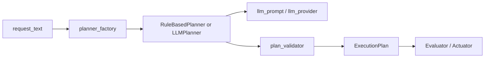

# LLM Planner Hands-on

This hands-on extends the Phase 3 [Regional Safety Assistant sample](regional-safety-assistant.md) and demonstrates the minimum path for **replacing the rule-based planner with an LLM planner**.

This page is organized in two steps:

1. reproduce the flow locally with the `stub` provider
2. switch to an actual OpenAI-compatible API if available

## What you will learn

- why a planner interface and planner factory are needed
- why LLM output should go through a validator instead of being used directly
- which environment variables are needed when switching from `stub` to a real API
- why both `rule_based` and `llm` should share the same `ExecutionPlan` contract

## Prerequisites

- Docker / Docker Compose
- `curl`
- the `codex/llm-planner-minimal` branch of the `Blockchain_IoT_Marketplace` repository

References:

- [Docker official site](https://docs.docker.com/get-docker/)
- [httpx documentation](https://www.python-httpx.org/)

## Matching source files

- [assistant/app/planner_interface.py](https://github.com/ertlnagoya/Blockchain_IoT_Marketplace/blob/codex/llm-planner-minimal/assistant/app/planner_interface.py)
- [assistant/app/planner_factory.py](https://github.com/ertlnagoya/Blockchain_IoT_Marketplace/blob/codex/llm-planner-minimal/assistant/app/planner_factory.py)
- [assistant/app/llm_planner.py](https://github.com/ertlnagoya/Blockchain_IoT_Marketplace/blob/codex/llm-planner-minimal/assistant/app/llm_planner.py)
- [assistant/app/llm_prompt.py](https://github.com/ertlnagoya/Blockchain_IoT_Marketplace/blob/codex/llm-planner-minimal/assistant/app/llm_prompt.py)
- [assistant/app/llm_provider.py](https://github.com/ertlnagoya/Blockchain_IoT_Marketplace/blob/codex/llm-planner-minimal/assistant/app/llm_provider.py)
- [assistant/app/plan_validator.py](https://github.com/ertlnagoya/Blockchain_IoT_Marketplace/blob/codex/llm-planner-minimal/assistant/app/plan_validator.py)
- [Problem program](https://github.com/ertlnagoya/Blockchain_IoT_Marketplace/blob/codex/llm-planner-minimal/examples/hands_on/phase3_llm_planner/problem_program.py)
- [Answer program](https://github.com/ertlnagoya/Blockchain_IoT_Marketplace/blob/codex/llm-planner-minimal/examples/hands_on/phase3_llm_planner/answer_program.py)
- [Exercise guide](https://github.com/ertlnagoya/Blockchain_IoT_Marketplace/blob/codex/llm-planner-minimal/examples/hands_on/phase3_llm_planner/README.md)
- [.env.local.example](https://github.com/ertlnagoya/Blockchain_IoT_Marketplace/blob/codex/llm-planner-minimal/.env.local.example)
- [examples/phase3_llm.env.example](https://github.com/ertlnagoya/Blockchain_IoT_Marketplace/blob/codex/llm-planner-minimal/examples/phase3_llm.env.example)
- [examples/phase3_llm_expected_plan.json](https://github.com/ertlnagoya/Blockchain_IoT_Marketplace/blob/codex/llm-planner-minimal/examples/phase3_llm_expected_plan.json)
- [examples/phase3_request_station_warning.json](https://github.com/ertlnagoya/Blockchain_IoT_Marketplace/blob/codex/llm-planner-minimal/examples/phase3_request_station_warning.json)

The exercise programs focus on the minimum request body for `/assistant/plan` and on how to summarize the returned plan.

## Architecture Diagram



The important point is that the LLM is not embedded directly inside `main.py`.  
The replacement is isolated behind `planner_factory`.

## 1. Start with the `stub` provider

Run the following in the `Blockchain_IoT_Marketplace` repository.

```bash
ASSISTANT_PLANNER_MODE=llm \
ASSISTANT_PLANNER_NAME=llm-planner-stub-v1 \
ASSISTANT_LLM_PROVIDER=stub \
uvicorn assistant.app.main:app --host 0.0.0.0 --port 8090
```

Docker Compose example:

```bash
docker compose -f infra/docker-compose.yml --profile assistant up --build -d assistant
```

Reference screenshot:


In another terminal:

```bash
curl http://localhost:8090/health
```

Expected:

```json
{"status":"ok","service":"assistant"}
```

## 2. Inspect a Japanese request

```bash
curl -X POST http://localhost:8090/assistant/plan \
  -H 'Content-Type: application/json' \
  -d @examples/phase3_request_park_safety.json
```

Example expected output:

```json
{
  "status": "planned",
  "plan": {
    "planner_name": "llm-planner-stub-v1",
    "target_area": "park-north",
    "watch_events": ["possible_littering", "suspicious_activity"]
  }
}
```

Checkpoints:

- `planner_name` is `llm-planner-stub-v1`
- `target_area` is `park-north`
- `watch_events` is returned as JSON array

## 3. Inspect an English request

```bash
curl -X POST http://localhost:8090/assistant/plan \
  -H 'Content-Type: application/json' \
  -d @examples/phase3_request_station_warning.json
```

Example expected output:

```json
{
  "status": "planned",
  "plan": {
    "planner_name": "llm-planner-stub-v1",
    "target_area": "station-front",
    "watch_events": ["suspicious_activity"],
    "actions": [
      {"action_type": "send_notification"},
      {"action_type": "show_warning"}
    ]
  }
}
```

This confirms that the planner can also map an English request to `station-front`.

## 4. Inspect the real-API environment template

To use an actual OpenAI-compatible API, inspect the example environment file:

```bash
cat .env.local.example
```

Main fields:

- `ASSISTANT_PLANNER_MODE=llm`
- `ASSISTANT_LLM_PROVIDER=openai_compatible`
- `ASSISTANT_LLM_API_BASE_URL`
- `ASSISTANT_LLM_API_KEY`
- `ASSISTANT_LLM_MODEL`

## 5. Switch to an OpenAI-compatible API

If your API key and model are ready, start the server like this:

```bash
cp .env.local.example .env.local
docker compose -f infra/docker-compose.yml --profile assistant-llm up --build -d assistant-llm
```

Then call the same endpoint:

```bash
curl -X POST http://localhost:8090/assistant/plan \
  -H 'Content-Type: application/json' \
  -d @examples/phase3_request_park_safety.json
```

The expected JSON shape is documented here:

- [examples/phase3_llm_expected_plan.json](https://github.com/ertlnagoya/Blockchain_IoT_Marketplace/blob/codex/llm-planner-minimal/examples/phase3_llm_expected_plan.json)

Reference screenshot:


## 5.5 Use the exercise pytest

This hands-on also includes a reusable pytest file for both the problem and answer programs.

First, validate the answer program:

```bash
pytest -q tests/test_phase3_llm_hands_on_program.py
```

After the TODOs in the problem program are implemented, switch the target module like this:

```bash
PHASE3_LLM_HANDS_ON_MODULE=examples.hands_on.phase3_llm_planner.problem_program \
pytest -q tests/test_phase3_llm_hands_on_program.py
```

## 6. Check validator and fallback behavior

This implementation does not trust raw LLM output directly.  
It always checks:

- whether events are allowed
- whether actions are allowed
- whether the area is allowed
- whether the response can be parsed as JSON

If validation fails, it falls back to the rule-based planner.

What to watch:

- if `planner_name` is different from the expected LLM planner name, fallback may have happened
- unsupported actions must not pass directly into execution
- `/assistant/executions` now keeps `planner_diagnostics.error_type` and `planner_diagnostics.error_message`

## Success criteria

This hands-on is successful if you can confirm:

- `llm` mode works with the `stub` provider
- both Japanese and English requests return plans
- you can explain the environment variables for an OpenAI-compatible API
- you can explain the role of validator and fallback

## Common issues

### `source .env.local` leaves placeholder values

- a real API call will not work while `REPLACE_WITH_YOUR_API_KEY` is still present

### `401 Unauthorized`

- check `ASSISTANT_LLM_API_KEY`

### `404` or `405`

- check whether `ASSISTANT_LLM_API_BASE_URL` points to an OpenAI-compatible `/chat/completions` endpoint

### `docker compose --profile assistant-llm up` fails

- make sure `.env.local` exists
- make sure `ASSISTANT_LLM_API_KEY` is not empty in `.env.local`

### A real API always falls back instead of returning the LLM plan

Check:

- API key
- base URL
- model name
- whether the returned content is valid JSON

### `station-front` does not appear

- make sure you are on the `codex/llm-planner-minimal` branch

## Next steps

- For the design rationale: [LLM Planner replacement spec](llm-planner-spec.md)
- To go back to the original Phase 3 sample: [Regional Safety Assistant sample (Phase 3)](regional-safety-assistant.md)
