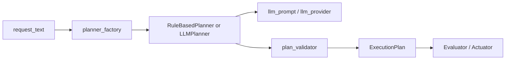
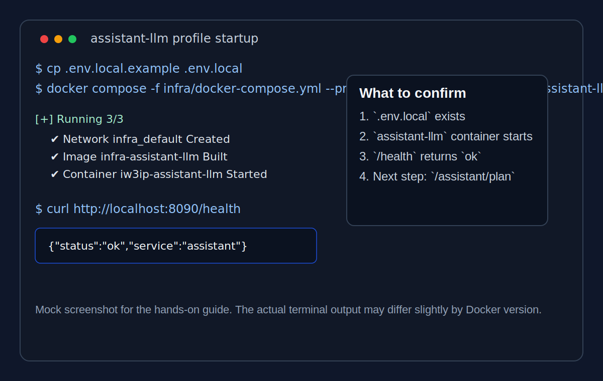
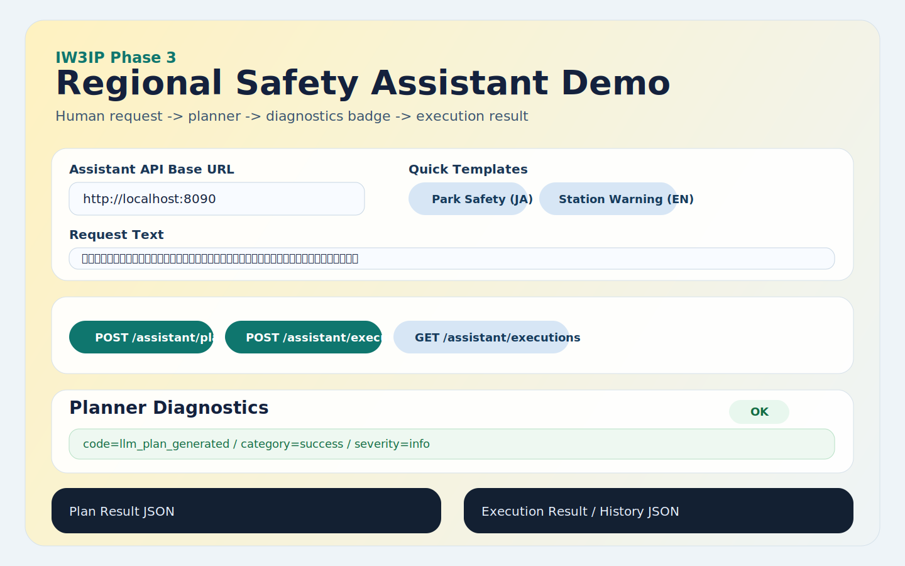
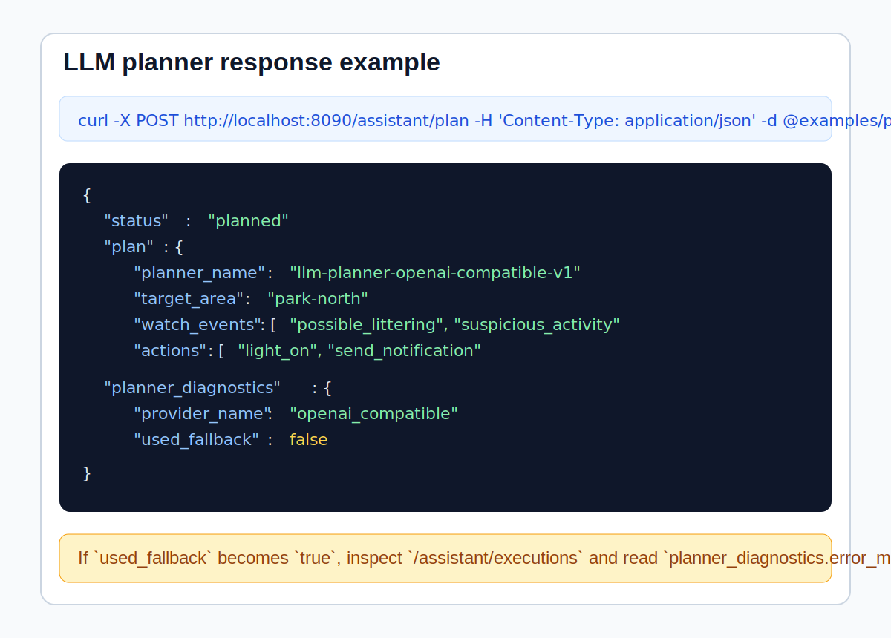

# LLM Plannerハンズオン

この Hands-on は、Phase 3 の [地域安全アシスタントサンプル](regional-safety-assistant.md) を発展させ、**rule-based planner を LLM planner に差し替える最小構成**を体験するためのものです。

このページでは 2 段階で進めます。

1. `stub` provider でローカルに再現する
2. 必要なら OpenAI 互換 API に接続する

## この Hands-on で学べること

- planner interface / factory がなぜ必要か
- LLM の出力をそのまま使わず validator を通す理由
- `stub` から実 API へ切り替えるときに、何を環境変数で設定するか
- `rule_based` と `llm` が同じ `ExecutionPlan` 契約を共有する重要性

## 前提

- Docker / Docker Compose が使える
- `curl` が使える
- ソースコードリポジトリ `Blockchain_IoT_Marketplace` の `codex/llm-planner-minimal` ブランチを使う

参考:

- [Docker 公式サイト](https://docs.docker.com/get-docker/)
- [httpx 公式ドキュメント](https://www.python-httpx.org/)

## 対応するソースコード

- [assistant/app/planner_interface.py](https://github.com/ertlnagoya/Blockchain_IoT_Marketplace/blob/codex/llm-planner-minimal/assistant/app/planner_interface.py)
- [assistant/app/planner_factory.py](https://github.com/ertlnagoya/Blockchain_IoT_Marketplace/blob/codex/llm-planner-minimal/assistant/app/planner_factory.py)
- [assistant/app/llm_planner.py](https://github.com/ertlnagoya/Blockchain_IoT_Marketplace/blob/codex/llm-planner-minimal/assistant/app/llm_planner.py)
- [assistant/app/llm_prompt.py](https://github.com/ertlnagoya/Blockchain_IoT_Marketplace/blob/codex/llm-planner-minimal/assistant/app/llm_prompt.py)
- [assistant/app/llm_provider.py](https://github.com/ertlnagoya/Blockchain_IoT_Marketplace/blob/codex/llm-planner-minimal/assistant/app/llm_provider.py)
- [assistant/app/plan_validator.py](https://github.com/ertlnagoya/Blockchain_IoT_Marketplace/blob/codex/llm-planner-minimal/assistant/app/plan_validator.py)
- [問題用プログラム](https://github.com/ertlnagoya/Blockchain_IoT_Marketplace/blob/codex/llm-planner-minimal/examples/hands_on/phase3_llm_planner/problem_program.py)
- [解答用プログラム](https://github.com/ertlnagoya/Blockchain_IoT_Marketplace/blob/codex/llm-planner-minimal/examples/hands_on/phase3_llm_planner/answer_program.py)
- [演習説明](https://github.com/ertlnagoya/Blockchain_IoT_Marketplace/blob/codex/llm-planner-minimal/examples/hands_on/phase3_llm_planner/README.md)
- [React フロントデモ](https://github.com/ertlnagoya/Blockchain_IoT_Marketplace/tree/codex/phase3-frontend-demo/assistant-ui)
- [.env.local.example](https://github.com/ertlnagoya/Blockchain_IoT_Marketplace/blob/codex/llm-planner-minimal/.env.local.example)
- [examples/phase3_llm.env.example](https://github.com/ertlnagoya/Blockchain_IoT_Marketplace/blob/codex/llm-planner-minimal/examples/phase3_llm.env.example)
- [examples/phase3_llm_mock.env.example](https://github.com/ertlnagoya/Blockchain_IoT_Marketplace/blob/codex/llm-planner-minimal/examples/phase3_llm_mock.env.example)
- [examples/phase3_llm_expected_plan.json](https://github.com/ertlnagoya/Blockchain_IoT_Marketplace/blob/codex/llm-planner-minimal/examples/phase3_llm_expected_plan.json)
- [examples/phase3_llm_mock_server.py](https://github.com/ertlnagoya/Blockchain_IoT_Marketplace/blob/codex/llm-planner-minimal/examples/phase3_llm_mock_server.py)
- [examples/phase3_request_station_warning.json](https://github.com/ertlnagoya/Blockchain_IoT_Marketplace/blob/codex/llm-planner-minimal/examples/phase3_request_station_warning.json)

演習プログラムでは、`/assistant/plan` に送る最小 JSON と、返ってきた `plan` の要約のしかたを確認できます。

## アーキテクチャ図



この構成では、LLM を直接 `main.py` に埋め込まないことが重要です。  
差し替えは `planner_factory` に閉じ込めます。

## 1. `stub` provider で起動

`Blockchain_IoT_Marketplace` リポジトリで次を実行します。

```bash
ASSISTANT_PLANNER_MODE=llm \
ASSISTANT_PLANNER_NAME=llm-planner-stub-v1 \
ASSISTANT_LLM_PROVIDER=stub \
uvicorn assistant.app.main:app --host 0.0.0.0 --port 8090
```

Docker Compose 例:

```bash
docker compose -f infra/docker-compose.yml --profile assistant up --build -d assistant
```

参考スクリーンショット:



別ターミナルで確認:

```bash
curl http://localhost:8090/health
```

期待結果:

```json
{"status":"ok","service":"assistant"}
```

## 2. 日本語要求で `plan` を確認

```bash
curl -X POST http://localhost:8090/assistant/plan \
  -H 'Content-Type: application/json' \
  -d @examples/phase3_request_park_safety.json
```

期待結果の例:

```json
{
  "status": "planned",
  "plan": {
    "planner_name": "llm-planner-stub-v1",
    "target_area": "park-north",
    "watch_events": ["possible_littering", "suspicious_activity"]
  }
}
```

確認ポイント:

- `planner_name` が `llm-planner-stub-v1`
- `target_area` が `park-north`
- `watch_events` が JSON 配列で返る

## 2.5 React フロントデモを起動

Phase 3 assistant の API をブラウザから触る最小 React 画面もあります。

```bash
docker compose -f infra/docker-compose.yml --profile assistant up --build -d assistant
docker compose -f infra/docker-compose.yml --profile assistant-ui up --build -d assistant-ui
```

開く URL:

- `http://localhost:4173`

この画面で確認できること:

- 自然言語要求の編集
- `POST /assistant/plan`
- `POST /assistant/execute`
- `GET /assistant/executions`
- `planner_diagnostics` の badge / alert 表示

画面イメージ:



local mock LLM まで含めて 1 コマンドで起動する場合:

```bash
docker compose -f infra/docker-compose.yml --profile assistant-demo up --build -d
```

この profile で起動されるもの:

- `assistant-demo`
- `llm-mock`
- `assistant-ui`

## 3. 英語要求で `plan` を確認

```bash
curl -X POST http://localhost:8090/assistant/plan \
  -H 'Content-Type: application/json' \
  -d @examples/phase3_request_station_warning.json
```

期待結果の例:

```json
{
  "status": "planned",
  "plan": {
    "planner_name": "llm-planner-stub-v1",
    "target_area": "station-front",
    "watch_events": ["suspicious_activity"],
    "actions": [
      {"action_type": "send_notification"},
      {"action_type": "show_warning"}
    ]
  }
}
```

ここでは、英語要求でも `station-front` を読めることを確認します。

## 4. 実 API 用の環境変数を確認

実際の OpenAI 互換 API を使う場合は、次の example を参照します。

```bash
cat .env.local.example
```

主な項目:

- `ASSISTANT_PLANNER_MODE=llm`
- `ASSISTANT_LLM_PROVIDER=openai_compatible`
- `ASSISTANT_LLM_API_BASE_URL`
- `ASSISTANT_LLM_API_KEY`
- `ASSISTANT_LLM_MODEL`

`planner_diagnostics` の見方:

- `status`
  - `ok` か `fallback`
- `severity`
  - `info`, `warning`, `error`
- `label`
  - バッジにそのまま載せる短い表示名
- `color_hint`
  - `green`, `amber`, `red` のような色分けヒント
- `code`
  - UI やフロントの分岐に使いやすい固定コード
- `category`
  - `success`, `provider`, `validation`, `planner` のような大分類
- `user_message`
  - 利用者向けにそのまま表示しやすい短い説明文
- `summary`
  - 何が起きたかの短い説明
- `suggestion`
  - 次に確認すべき内容

フロント側でそのまま使う例:

```ts
type PlannerDiagnostics = {
  status: "ok" | "fallback";
  severity: "info" | "warning" | "error";
  label: string;
  color_hint: "green" | "amber" | "red";
  code: string;
  category: "success" | "provider" | "validation" | "planner";
  user_message: string;
  summary?: string | null;
  suggestion?: string | null;
};

type BadgeViewModel = {
  label: string;
  tone: "success" | "warning" | "danger" | "neutral";
  detail: string;
  code: string;
  category: string;
};

export function diagnosticsToBadge(diagnostics: PlannerDiagnostics): BadgeViewModel {
  const toneMap: Record<PlannerDiagnostics["color_hint"], BadgeViewModel["tone"]> = {
    green: "success",
    amber: "warning",
    red: "danger",
  };

  return {
    label: diagnostics.label,
    tone: toneMap[diagnostics.color_hint] ?? "neutral",
    detail: diagnostics.user_message,
    code: diagnostics.code,
    category: diagnostics.category,
  };
}
```

たとえば fallback 時は、次のように表示できます。

```ts
const badge = diagnosticsToBadge({
  status: "fallback",
  severity: "warning",
  label: "Fallback",
  color_hint: "amber",
  code: "llm_provider_error",
  category: "provider",
  user_message: "The LLM API could not be used, so the rule-based planner was used instead.",
});
```

React での最小例:

```tsx
type PlannerDiagnostics = {
  label: string;
  color_hint: "green" | "amber" | "red";
  code: string;
  category: string;
  user_message: string;
  summary?: string | null;
  suggestion?: string | null;
};

function DiagnosticsBadge({ diagnostics }: { diagnostics: PlannerDiagnostics }) {
  return (
    <span className={`badge badge-${diagnostics.color_hint}`}>
      {diagnostics.label}
    </span>
  );
}

function DiagnosticsAlertPanel({ diagnostics }: { diagnostics: PlannerDiagnostics }) {
  return (
    <div className={`alert alert-${diagnostics.color_hint}`}>
      <strong>{diagnostics.label}</strong>
      <p>{diagnostics.user_message}</p>
      <small>
        code={diagnostics.code} / category={diagnostics.category}
      </small>
      {diagnostics.suggestion ? <p>Next: {diagnostics.suggestion}</p> : null}
    </div>
  );
}
```

Vue での最小例:

```vue
<script setup lang="ts">
type PlannerDiagnostics = {
  label: string;
  color_hint: "green" | "amber" | "red";
  code: string;
  category: string;
  user_message: string;
  summary?: string | null;
  suggestion?: string | null;
};

defineProps<{
  diagnostics: PlannerDiagnostics;
}>();
</script>

<template>
  <span :class="`badge badge-${diagnostics.color_hint}`">
    {{ diagnostics.label }}
  </span>

  <div :class="`alert alert-${diagnostics.color_hint}`">
    <strong>{{ diagnostics.label }}</strong>
    <p>{{ diagnostics.user_message }}</p>
    <small>code={{ diagnostics.code }} / category={{ diagnostics.category }}</small>
    <p v-if="diagnostics.suggestion">Next: {{ diagnostics.suggestion }}</p>
  </div>
</template>
```

最小 CSS 例:

```css
.badge {
  display: inline-flex;
  align-items: center;
  border-radius: 999px;
  padding: 0.2rem 0.65rem;
  font-size: 0.85rem;
  font-weight: 700;
}

.badge-green {
  background: #e8f7ee;
  color: #146c43;
}

.badge-amber {
  background: #fff3cd;
  color: #9a6700;
}

.badge-red {
  background: #fbe9e7;
  color: #b42318;
}

.alert {
  margin-top: 0.75rem;
  border-left: 4px solid currentColor;
  border-radius: 0.5rem;
  padding: 0.75rem 1rem;
  background: #f8f9fa;
}

.alert-green {
  color: #146c43;
  background: #eefbf3;
}

.alert-amber {
  color: #9a6700;
  background: #fff8e1;
}

.alert-red {
  color: #b42318;
  background: #fef3f2;
}
```

## 5. OpenAI 互換 API に切り替える

API キーや model を設定済みなら、次のように起動できます。

```bash
cp .env.local.example .env.local
docker compose -f infra/docker-compose.yml --profile assistant-llm up --build -d assistant-llm
```

その後は同じ `curl` を使えます。

```bash
curl -X POST http://localhost:8090/assistant/plan \
  -H 'Content-Type: application/json' \
  -d @examples/phase3_request_park_safety.json
```

期待する JSON の形は、次の example で確認できます。

- [examples/phase3_llm_expected_plan.json](https://github.com/ertlnagoya/Blockchain_IoT_Marketplace/blob/codex/llm-planner-minimal/examples/phase3_llm_expected_plan.json)

参考スクリーンショット:



## 5.2 local mock server で HTTP 経路を試す

実 API をまだ使いたくない場合は、OpenAI 互換のモックサーバで HTTP 経路だけ確認できます。

まず mock server を起動します。

```bash
uvicorn examples.phase3_llm_mock_server:app --host 127.0.0.1 --port 18000
```

Docker Compose 例:

```bash
docker compose -f infra/docker-compose.yml --profile llm-mock up --build -d llm-mock
```

別ターミナルで assistant を起動します。

```bash
source examples/phase3_llm_mock.env.example
uvicorn assistant.app.main:app --host 0.0.0.0 --port 8090
```

その後は同じ `curl` を使います。

```bash
curl -X POST http://localhost:8090/assistant/plan \
  -H 'Content-Type: application/json' \
  -d @examples/phase3_request_park_safety.json
```

確認ポイント:

- `planner_name` が `llm-planner-mock-http-v1`
- `planner_diagnostics.provider_name` が `openai_compatible`
- `planner_diagnostics.severity` が `info`
- `planner_diagnostics.label` が `OK`
- `planner_diagnostics.color_hint` が `green`
- `planner_diagnostics.code` が `llm_plan_generated`
- `planner_diagnostics.category` が `success`
- `planner_diagnostics.user_message` が画面表示用に読める
- `planner_diagnostics.used_fallback` が `false`

## 5.5 演習用 pytest を使う

この Hands-on には、problem / answer 共通で使える pytest もあります。

まず解答用の確認:

```bash
pytest -q tests/test_phase3_llm_hands_on_program.py
```

問題用プログラムの TODO を埋めた後は、次のように切り替えられます。

```bash
PHASE3_LLM_HANDS_ON_MODULE=examples.hands_on.phase3_llm_planner.problem_program \
pytest -q tests/test_phase3_llm_hands_on_program.py
```

## 6. validator と fallback を確認

この実装では、LLM の出力をそのまま採用しません。  
次を必ず確認します。

- 許可イベントか
- 許可アクションか
- 許可エリアか
- JSON として parse できるか

不正なら rule-based planner にフォールバックします。

確認の観点:

- `planner_name` が期待値と違う場合、フォールバックの可能性がある
- 許可外の action がそのまま実行されない
- `/assistant/executions` に `planner_diagnostics.error_type` と `planner_diagnostics.error_message` が残る

## 成功判定

この Hands-on では、次を確認できれば成功です。

- `stub` provider で `llm` モードが動く
- 日本語要求と英語要求の両方で `plan` を返せる
- OpenAI 互換 API 用の環境変数を説明できる
- validator と fallback の役割を説明できる

## よくあるつまずき

### `source examples/phase3_llm.env.example` で値がそのまま残っている

- `REPLACE_WITH_YOUR_API_KEY` のままでは実 API は使えません

### `401 Unauthorized`

- `ASSISTANT_LLM_API_KEY` を確認してください

### `404` または `405`

- `ASSISTANT_LLM_API_BASE_URL` が OpenAI 互換の `/chat/completions` を提供しているか確認してください

### `docker compose --profile assistant-llm up` が失敗する

- `.env.local` を作成したか確認してください
- `.env.local` の `ASSISTANT_LLM_API_KEY` が空でないか確認してください

### 実 API で `planned` が返らず、いつも fallback になる

- API key
- base URL
- model 名
- 返ってきた content が JSON か

を確認してください。

### `station-front` にならない

- 実行しているブランチが `codex/llm-planner-minimal` か確認してください

## 次の学習

- 実装方針を整理したい場合: [LLM Planner置き換え仕様](llm-planner-spec.md)
- Phase 3 の元サンプルに戻る場合: [地域安全アシスタントサンプル（Phase 3）](regional-safety-assistant.md)
