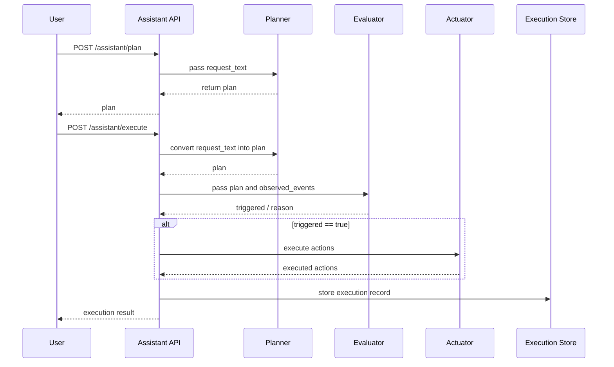

# Regional Safety Assistant Sample (Phase 3)

This hands-on extends the existing [USB webcam event sharing sample (Phase 2)](webcam-event-sharing.md) and demonstrates how **a human request can be interpreted, decomposed into tasks, evaluated against observed events, and connected to device actions**.

In Phase 2, the focus was on sharing events such as `possible_littering`.  
In Phase 3, the flow becomes:

`human request -> planner -> execution plan -> event evaluation -> device actions`

## What this page helps you understand

- how Phase 2 event sharing expands into Phase 3 decision and control
- why `plan` and `execute` are separated
- why planner, evaluator, and actuator are kept as separate modules

## Common stumbling points

- generating a `plan` is different from satisfying the conditions for `execute`
- event evaluation and device control are easy to collapse mentally into one step, but they are separate
- this page points to the minimum implementation itself, so the module boundaries matter

## What you will learn

- how a natural-language request can be converted into a structured execution plan
- how to extend Phase 2 event sharing into Phase 3 decision and control
- why `plan` and `execute` are separated
- why execution history should remain inspectable after the action

## Prerequisites

- Docker / Docker Compose
- `curl`
- the `codex/phase3-safety-assistant-sample` branch of the `Blockchain_IoT_Marketplace` repository

References:

- [Docker official site](https://docs.docker.com/get-docker/)
- [FastAPI official site](https://fastapi.tiangolo.com/)

## Matching source files

This hands-on uses the following files.

- [assistant/app/main.py](https://github.com/ertlnagoya/Blockchain_IoT_Marketplace/blob/codex/phase3-safety-assistant-sample/assistant/app/main.py)
- [assistant/app/planner.py](https://github.com/ertlnagoya/Blockchain_IoT_Marketplace/blob/codex/phase3-safety-assistant-sample/assistant/app/planner.py)
- [assistant/app/evaluator.py](https://github.com/ertlnagoya/Blockchain_IoT_Marketplace/blob/codex/phase3-safety-assistant-sample/assistant/app/evaluator.py)
- [assistant/app/actuator.py](https://github.com/ertlnagoya/Blockchain_IoT_Marketplace/blob/codex/phase3-safety-assistant-sample/assistant/app/actuator.py)
- [examples/phase3_request_park_safety.json](https://github.com/ertlnagoya/Blockchain_IoT_Marketplace/blob/codex/phase3-safety-assistant-sample/examples/phase3_request_park_safety.json)
- [examples/phase3_events_park_safety.json](https://github.com/ertlnagoya/Blockchain_IoT_Marketplace/blob/codex/phase3-safety-assistant-sample/examples/phase3_events_park_safety.json)

Unlike the earlier workshop samples, this page points directly to the **minimum implementation itself** rather than a separate problem/answer pair.  
That is intentional, because in Phase 3 the module boundaries between planner, evaluator, and actuator are part of what learners should understand.

## Scenario

The user asks:

> If littering or risky behavior is increasing on the north side of the park, tell me. If needed, turn on the lights and notify the manager.

The assistant then interprets the request as:

1. target area: `park-north`
2. events of interest: `possible_littering` and `suspicious_activity`
3. actions to run when the threshold is exceeded: `light_on` and `send_notification`

## Sequence Diagram



This diagram makes two points explicit: `plan` and `execute` are intentionally separated, and the system evaluates relevant events before it issues any device action.

## 1. Start the assistant service

Run the following in the `Blockchain_IoT_Marketplace` repository.

```bash
docker compose -f infra/docker-compose.yml --profile assistant up --build -d assistant
```

Check:

```bash
curl http://localhost:8090/health
```

Expected:

```json
{"status":"ok","service":"assistant"}
```

If you see `Connection refused`:

- the container may still be starting
- check whether the assistant service is `Up` with `docker ps`
- inspect logs with `docker compose -f infra/docker-compose.yml --profile assistant logs assistant`

## 2. Inspect the generated plan

First, inspect how the natural-language request is turned into a plan.

```bash
curl -X POST http://localhost:8090/assistant/plan \
  -H 'Content-Type: application/json' \
  -d @examples/phase3_request_park_safety.json
```

Example expected output:

```json
{
  "status": "planned",
  "plan": {
    "intent": "monitor_public_safety",
    "target_area": "park-north",
    "watch_events": ["possible_littering", "suspicious_activity"],
    "actions": ["light_on", "send_notification"]
  }
}
```

Checkpoints:

- `target_area` is `park-north`
- `watch_events` includes `possible_littering`
- `actions` includes `light_on` and `send_notification`

## 3. Execute the plan

Now execute the request against the sample event file.

```bash
curl -X POST http://localhost:8090/assistant/execute \
  -H 'Content-Type: application/json' \
  -d @examples/phase3_request_park_safety.json
```

Example expected output:

```json
{
  "status": "executed",
  "execution": {
    "request_text": "If littering or risky behavior is increasing on the north side of the park, tell me. If needed, turn on the lights and notify the manager.",
    "evaluation": {
      "triggered": true
    },
    "actions_executed": [
      {"action": "light_on", "status": "executed"},
      {"action": "send_notification", "status": "executed"}
    ]
  }
}
```

This is triggered because the sample event file contains three `possible_littering` events, which is enough to cross the built-in threshold.

How to read this result:

- the `possible_littering` count crosses the threshold
- the target location matches `park-north`
- therefore `triggered` becomes `true`
- as a result, `light_on` and `send_notification` are executed

## 4. Inspect execution history

```bash
curl http://localhost:8090/assistant/executions
```

Checkpoints:

- original `request_text`
- generated `plan`
- evaluation result in `evaluation`
- executed actions in `actions_executed`

are all kept together as one execution record.

## 5. Difference between Phase 2 and Phase 3

In Phase 2, the focus was mainly on:

- sharing events
- deciding `allow` / `deny` by consent or policy

Phase 3 adds:

- interpreting a human request
- selecting relevant events
- assembling evaluation conditions
- issuing device actions when conditions are met

In other words, Phase 3 moves from **"share events" to "interpret requests, decide, and act."**

## 6. Success criteria

This hands-on is successful if you can confirm the following:

- `/assistant/plan` converts the human request into a plan
- `/assistant/execute` returns `triggered: true`
- `light_on` and `send_notification` appear as `executed`
- `/assistant/executions` shows the recorded history

## 7. Common issues

### `examples/phase3_request_park_safety.json` cannot be found

- make sure your current directory is the root of `Blockchain_IoT_Marketplace`

### Expected actions do not run

- the event count in `examples/phase3_events_park_safety.json` may be below threshold
- check both the `possible_littering` count and the `location`

### It is unclear where the AI part is

In this minimum implementation, the planner is still rule-based.  
However, the key architectural point is that **the system already has a clear boundary that converts natural language into a structured plan**, so it can later be replaced with an LLM-based or external planner.

## 8. Stop services

```bash
docker compose -f infra/docker-compose.yml --profile assistant down
```

## Next steps

- To connect this back to Phase 2: [USB webcam event sharing sample (Phase 2)](webcam-event-sharing.md)
- To review the Phase 1 foundation: [HA x SSI Publisher sample (Phase 1)](ha-ssi-publisher.md)
