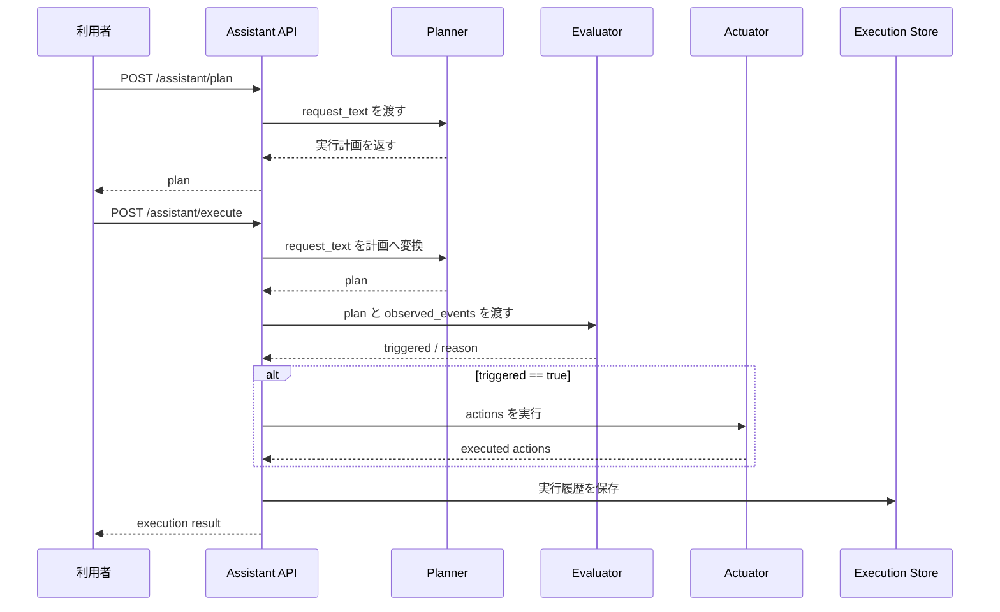

# 地域安全アシスタントサンプル（Phase 3）

この Hands-on は、既存の [USBウェブカメライベント共有サンプル（Phase 2）](webcam-event-sharing.md) をさらに発展させ、**人間の要求を AI が解釈し、必要なイベント収集・条件判定・機器操作へ分解する**流れを体験するためのものです。

Phase 2 では `possible_littering` のようなイベントを共有しました。  
Phase 3 では、その先として、次の流れを扱います。

`人間の要求 -> planner -> 実行計画 -> イベント評価 -> 機器操作`

## 最短ルート

最初は次の 4 手順で十分です。

1. `assistant` サービスを起動する
2. `/assistant/plan` を呼んで `park-north` の plan を確認する
3. `/assistant/execute` を呼んで `triggered: true` を確認する
4. `/assistant/executions` を見て、要求・計画・実行結果が 1 つにつながっていることを確認する

その後の分岐:

- `plan` だけ見たい場合: `/assistant/plan` の確認まででよいです
- 実行まで確認したい場合: `execute` と `executions` まで続けます
- LLM まで広げたい場合: 次に `LLM Planner` Hands-on へ進みます

## このページで分かること

- Phase 2 のイベント共有が、Phase 3 でどのように判断と制御へ広がるか
- `plan` と `execute` を分ける理由
- planner、evaluator、actuator を分けて設計する意味

## つまずきやすい点

- `plan` が作れたことと、`execute` で条件成立したことは別
- イベント件数の評価と機器操作を 1 つの処理だと思うと流れが見えにくい
- Phase 3 では問題用プログラムではなく最小実装そのものを読むため、モジュール境界に注目する必要がある

## 前提

- Docker / Docker Compose が使える
- `curl` が使える
- ソースコードリポジトリ `Blockchain_IoT_Marketplace` の `codex/phase3-safety-assistant-sample` ブランチを使う

参考:

- [Docker 公式サイト](https://docs.docker.com/get-docker/)
- [FastAPI 公式サイト](https://fastapi.tiangolo.com/)

## 対応するソースコード

この Hands-on では、次のファイルを使います。

- [assistant/app/main.py](https://github.com/ertlnagoya/Blockchain_IoT_Marketplace/blob/codex/phase3-safety-assistant-sample/assistant/app/main.py)
- [assistant/app/planner.py](https://github.com/ertlnagoya/Blockchain_IoT_Marketplace/blob/codex/phase3-safety-assistant-sample/assistant/app/planner.py)
- [assistant/app/evaluator.py](https://github.com/ertlnagoya/Blockchain_IoT_Marketplace/blob/codex/phase3-safety-assistant-sample/assistant/app/evaluator.py)
- [assistant/app/actuator.py](https://github.com/ertlnagoya/Blockchain_IoT_Marketplace/blob/codex/phase3-safety-assistant-sample/assistant/app/actuator.py)
- [examples/phase3_request_park_safety.json](https://github.com/ertlnagoya/Blockchain_IoT_Marketplace/blob/codex/phase3-safety-assistant-sample/examples/phase3_request_park_safety.json)
- [examples/phase3_events_park_safety.json](https://github.com/ertlnagoya/Blockchain_IoT_Marketplace/blob/codex/phase3-safety-assistant-sample/examples/phase3_events_park_safety.json)

今回は Phase 3 用の `問題用プログラム / 解答用プログラム` ではなく、**最小実装そのもの**を読む形にしています。  
理由は、Phase 3 では「planner」「evaluator」「actuator」のモジュール境界自体が学習対象だからです。

## 工程別の目次

<details class="iw3ip-toc-details" open>
  <summary>段階 1: planner が要求をどう解釈するかを見る</summary>
  <p>最初に、人間の要求がどのように `plan` へ変換されるかを見ます。この段階では、まだ実行結果よりも、対象場所・注目イベント・action の組み立て方に注目します。</p>
  <ol>
    <li><a href="#1-assistant-サービスを起動">assistant サービスを起動</a></li>
    <li><a href="#2-計画生成を確認">計画生成を確認</a></li>
  </ol>
</details>

<details class="iw3ip-toc-details">
  <summary>段階 2: evaluate と actuator がどう動くかを見る</summary>
  <p>次に、既存イベントを使って `execute` を確認します。ここでは `triggered` がどう決まり、その結果としてどの action が実行されるかを見るのが中心です。</p>
  <ol>
    <li><a href="#3-実行を確認">実行を確認</a></li>
    <li><a href="#4-実行履歴を確認">実行履歴を確認</a></li>
  </ol>
</details>

<details class="iw3ip-toc-details">
  <summary>段階 3: Phase 2 との違いを整理する</summary>
  <p>最後に、Phase 2 のイベント共有と Phase 3 の要求解釈・判定・制御の違いを整理します。ここまで読むと、なぜ planner、evaluator、actuator を分離するのかが見えやすくなります。</p>
  <ol>
    <li><a href="#5-phase-2-と-phase-3-の違いを整理">Phase 2 と Phase 3 の違いを整理</a></li>
    <li><a href="#6-成功判定">成功判定</a></li>
    <li><a href="#7-よくあるつまずき">よくあるつまずき</a></li>
    <li><a href="#8-停止">停止</a></li>
  </ol>
</details>

## 読み進め方

このページは、Phase 3 の考え方を理解するための代表ページです。短時間で確認したい場合は `plan` と `execute` の 2 つだけを見れば十分ですが、Phase 2 との違いやモジュール境界まで理解したい場合は、最後の整理と `よくあるつまずき` まで読む方が効果的です。

## 想定シナリオ

利用者は次のように依頼します。

> 公園北側でポイ捨てや危険行動が増えていたら教えて。必要なら照明をつけて管理者に通知して。

この要求に対して、assistant は次のように考えます。

1. 対象場所は `park-north`
2. 注目するイベントは `possible_littering` と `suspicious_activity`
3. しきい値を超えたら `light_on` と `send_notification` を実行する

## シーケンス図



この図では、`plan` と `execute` が分かれていること、そして **判定の前に必要なイベントをまとめて見る**ことが重要です。

## Phase 3: planner が要求をどう解釈するかを見る

## 1. assistant サービスを起動

`Blockchain_IoT_Marketplace` リポジトリで次を実行します。

```bash
docker compose -f infra/docker-compose.yml --profile assistant up --build -d assistant
```

確認:

```bash
curl http://localhost:8090/health
```

期待結果:

```json
{"status":"ok","service":"assistant"}
```

もし `Connection refused` が出る場合:

- コンテナ起動に時間がかかっている可能性があります
- `docker ps` で `assistant` が `Up` か確認してください
- `docker compose -f infra/docker-compose.yml --profile assistant logs assistant` でログも確認できます

## 2. 計画生成を確認

まず、自然言語要求がどのような計画に変換されるかを見ます。

```bash
curl -X POST http://localhost:8090/assistant/plan \
  -H 'Content-Type: application/json' \
  -d @examples/phase3_request_park_safety.json
```

期待結果の例:

```json
{
  "status": "planned",
  "plan": {
    "intent": "monitor_public_safety",
    "target_area": "park-north",
    "watch_events": ["possible_littering", "suspicious_activity"],
    "actions": ["light_on", "send_notification"]
  }
}
```

確認ポイント:

- `target_area` が `park-north` になっている
- `watch_events` に `possible_littering` が入っている
- `actions` に `light_on` と `send_notification` が入っている

ここまでで、自然言語要求から構造化された `plan` が作られることを確認できました。次は、その `plan` をもとに実際のイベント評価と機器操作がどう進むかを見ます。

## Phase 3: evaluate と actuator がどう動くかを見る

## 3. 実行を確認

次に、サンプルイベントを使って実際に判定と制御を走らせます。

```bash
curl -X POST http://localhost:8090/assistant/execute \
  -H 'Content-Type: application/json' \
  -d @examples/phase3_request_park_safety.json
```

期待結果の例:

```json
{
  "status": "executed",
  "execution": {
    "request_text": "公園北側でポイ捨てや危険行動が増えていたら教えて。必要なら照明をつけて管理者に通知して。",
    "evaluation": {
      "triggered": true
    },
    "actions_executed": [
      {"action": "light_on", "status": "executed"},
      {"action": "send_notification", "status": "executed"}
    ]
  }
}
```

この結果は、サンプルイベントファイルに `possible_littering` が 3 件含まれているため、しきい値を満たしていることを意味します。

判定の見方:

- `possible_littering` の件数がしきい値以上
- 場所が `park-north`
- その結果 `triggered: true`
- そのため `light_on` と `send_notification` を実行

## 4. 実行履歴を確認

```bash
curl http://localhost:8090/assistant/executions
```

確認ポイント:

- 元の `request_text`
- 生成された `plan`
- 評価結果 `evaluation`
- 実行された `actions_executed`

が 1 つの履歴として残ります。

ここまでで、Phase 3 は単にイベントを共有する段階ではなく、要求に応じて計画・判定・実行をまとめて扱う段階だと見えてきます。最後に、Phase 2 との違いを明示的に整理します。

## Phase 3: Phase 2 との違いを整理する

## 5. Phase 2 と Phase 3 の違いを整理

Phase 2 では、主に次を扱いました。

- イベントを共有する
- Consent や policy で `allow` / `deny` を判定する

Phase 3 では、その上に次が追加されます。

- 人間の要求を解釈する
- 必要なイベントを選ぶ
- 判定条件をまとめる
- 条件成立時に機器操作を行う

つまり、Phase 3 は **「イベントを共有する」から「要求に応じて判断し、行動する」へ進む段階**です。

## 6. 成功判定

この Hands-on では、次を確認できれば成功です。

- `/assistant/plan` が自然言語要求を計画へ変換する
- `/assistant/execute` が `triggered: true` を返す
- `light_on` と `send_notification` が `executed` になる
- `/assistant/executions` で履歴を確認できる

## 7. よくあるつまずき

### `examples/phase3_request_park_safety.json` が見つからない

- 実行ディレクトリが `Blockchain_IoT_Marketplace` のルートか確認してください

### 期待した action が実行されない

- `examples/phase3_events_park_safety.json` のイベント件数がしきい値未満の可能性があります
- `possible_littering` の件数と `location` を確認してください

### どこが AI なのか分かりにくい

この最小実装では、planner はまだルールベースです。  
ただし、**自然言語要求を構造化計画へ変換するモジュール境界**を先に作っているため、将来的に LLM や外部 planner に差し替えやすくしています。

## 8. 停止

```bash
docker compose -f infra/docker-compose.yml --profile assistant down
```

## 次の学習

- Phase 2 からつなげて理解したい場合: [USBウェブカメライベント共有サンプル（Phase 2）](webcam-event-sharing.md)
- Phase 1 の基礎から見直したい場合: [HA x SSI Publisherサンプル（Phase 1）](ha-ssi-publisher.md)
