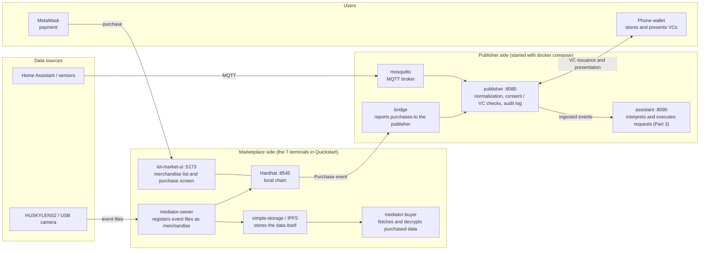
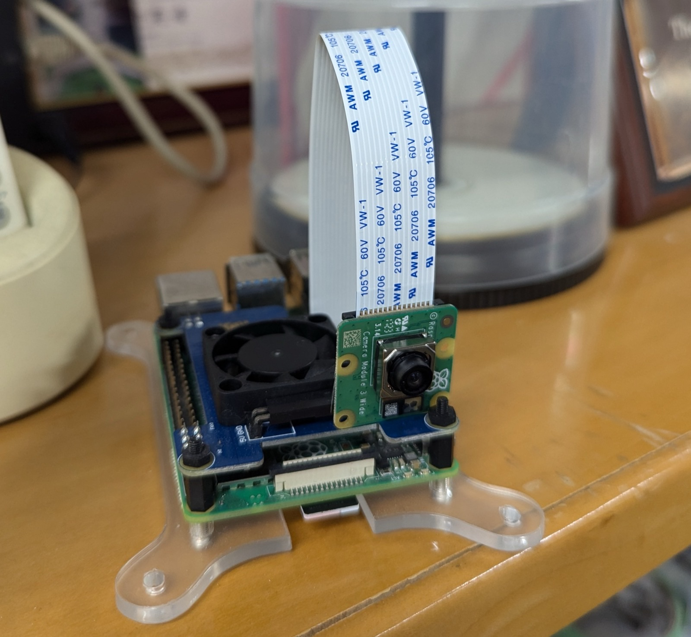

# IoTxWeb3 Intelligence Platform (IW3IP) Documentation

This documentation site brings together the IW3IP overview, implementation examples, and hands-on instructions.

## Main Use Cases

- Undergraduate students studying computing or information systems
- Instructors and TAs running practical sessions

For the overall picture, we recommend starting from the [Learning Foundations / Course Guide](foundations/course-guide.md).

## What This Site Covers

You can work through the material in order, from foundational understanding to the basic hands-on.

- Foundations:
  - blockchain
  - Hardhat
  - SSI / DID / VC
- Practice:
  - quickstart
  - hands-on samples
  - troubleshooting

External websites and papers are positioned as follow-up material for standards, deeper technical detail, and research background.

## Site structure

- **Learning Foundations**: basics of blockchain, Hardhat, and SSI / DID / VC, plus how to use the material in a course
- **Environment Setup**: installing the tools and starting the hands-on environment
- **Hands-on**: participant steps (commands, expected results, checkpoints)
- **Design**: the overall picture of VCs and tokens, and design specs
- **Operations**: troubleshooting, FAQ, and the facilitator guide

## System overview



Two groups of processes are started.

- **Marketplace side**: the blockchain (Hardhat), the merchandise UI, data storage, and the mediators. Start them in 7 terminals by following [Quickstart](setup/quickstart.md). Used for listing and purchasing data (the second half of Part 1 and the marketplace integration in Part 2).
- **Publisher side**: the MQTT broker and the publisher. Start them with `docker compose -f infra/docker-compose.yml up` in the course repository. Used for ingesting data, deciding whether sharing is allowed by consent or VC, and the audit log (the first half of Part 1, Part 2, and Part 3).

The two groups run independently. In the Part 2 marketplace integration, the bridge reports purchase events to the publisher and connects them. The [tech stack table in the Hands-on overview](hands-on/index.md#tech-stack-at-a-glance) shows which hands-on uses which.

Small devices such as a Raspberry Pi with a camera can also serve as data sources.

{ width="360" }

## If You Want To Run One Demo First

If you want the simplest Phase 1 / Phase 2 entry without physical devices, `ha-demo-simulator` is the best starting point.

- Matching page: [Home Assistant Demo Simulator sample](hands-on/ha-demo-simulator.md)
- What you can confirm:
  - `Home Assistant demo -> MQTT -> publisher`
  - state sharing for `temperature` and `power`
  - event sharing for `flood_risk_high` and `possible_littering`
  - `allowed`, `denied`, and the `audit log`

Start command:

```bash
PLATFORM_INGEST_READ_ENABLED=true docker compose -f infra/docker-compose.yml --profile ha-demo up --build -d
```

Open:

- `http://localhost:8123`
- `http://localhost:8080/health`

As the shortest Phase 3 demo, `assistant-demo` starts the following in one command:

- `assistant-demo`
- `llm-mock`
- `assistant-ui`

Matching page:

- [LLM Planner Hands-on](hands-on/llm-planner.md)

Start command:

```bash
docker compose -f infra/docker-compose.yml --profile assistant-demo up --build -d
```

Open:

- `http://localhost:4173`

## Recommended Learning Order

1. [Course Guide](foundations/course-guide.md)
2. [Learning Roadmap](foundations/roadmap.md)
3. [Blockchain Basics](foundations/blockchain-basics.md)
4. [Hardhat Basics](foundations/hardhat-basics.md)
5. [SSI/DID/VC Basics](foundations/ssi-did-vc-basics.md)
6. [Prerequisites](setup/prerequisites.md)
7. [HA Demo Simulator](hands-on/ha-demo-simulator.md) (run the whole flow without hardware)
8. [Quickstart](setup/quickstart.md)
9. [Hands-on](hands-on/index.md)
10. [References](foundations/references.md)

If you get stuck, see [Troubleshooting](operations/troubleshooting.md).

## Run docs locally

```bash
pip install -r docs/requirements.txt
mkdocs serve
```

Open: `http://127.0.0.1:8000`
