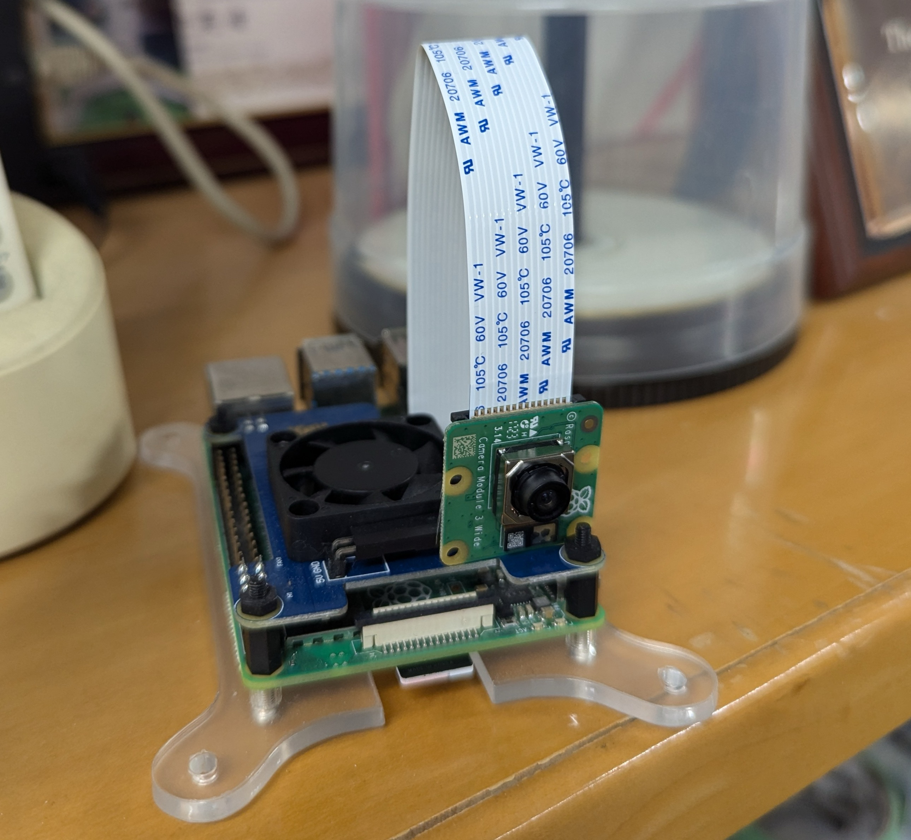

# IoTxWeb3 Intelligence Platform (IW3IP) ドキュメント

IW3IP の全体像、実装例、ハンズオン手順をまとめたドキュメントサイトです。

## 主な利用場面

- コンピュータや情報システムを学ぶ学部学生
- 演習を担当する講師・TA

全体像は [学習基礎 / 授業ガイド](foundations/course-guide.md) から読むのがおすすめです。

## 扱う内容

基礎理解から基本ハンズオンまでを順に確認できます。

- 基礎学習:
  - ブロックチェーン
  - Hardhat
  - SSI / DID / VC
- 実践:
  - 最短起動
  - 各 Hands-on サンプル
  - トラブルシュート

外部サイトや論文は、標準仕様や研究背景を深掘りしたいときの参考資料です。

## ドキュメント構成

- **Workshop**: 講師・TA 向けの進行設計（目的、時間配分、運営）
- **Hands-on**: 受講者向けの実作業手順（コマンド、期待結果、確認ポイント）

**Workshop の中で Hands-on を実施する** という関係です。

## 全体フロー



## はじめに読むページ

1. [Workshop / 事前準備](workshop/prerequisites.md)
2. [Learning Foundations / 学習ロードマップ](foundations/roadmap.md)
3. [Workshop / 最短起動](workshop/quickstart.md)
4. [Hands-on](hands-on/index.md)
5. [Operations / トラブルシュート](operations/troubleshooting.md)

## まず 1 つ動かしたい場合

実機なしで Phase 1 / Phase 2 の基本経路を確認したい場合は、`ha-demo-simulator` が最も始めやすい入口です。

- 対応ページ: [Home Assistant Demo Simulator サンプル](hands-on/ha-demo-simulator.md)
- 確認できること:
  - `Home Assistant demo -> MQTT -> publisher`
  - `temperature` / `power` の状態共有
  - `flood_risk_high` / `possible_littering` のイベント共有
  - `allowed` / `denied` / `audit log`

起動コマンド:

```bash
docker compose -f infra/docker-compose.yml --profile ha-demo up --build -d
```

開く URL:

- `http://localhost:8123`
- `http://localhost:8080/health`

Phase 3 の最短デモとして `assistant-demo` を使うと、1 コマンドで次をまとめて起動できます。

- `assistant-demo`
- `llm-mock`
- `assistant-ui`

対応ページ:

- [LLM Plannerハンズオン](hands-on/llm-planner.md)

起動コマンド:

```bash
docker compose -f infra/docker-compose.yml --profile assistant-demo up --build -d
```

開く URL:

- `http://localhost:4173`

## 推奨学習順

1. [授業ガイド](foundations/course-guide.md)
2. [学習ロードマップ](foundations/roadmap.md)
3. [ブロックチェーン基礎](foundations/blockchain-basics.md)
4. [Hardhat基礎](foundations/hardhat-basics.md)
5. [SSI/DID/VC基礎](foundations/ssi-did-vc-basics.md)
6. [Home Assistant Demo Simulator サンプル](hands-on/ha-demo-simulator.md)
7. [最短起動](workshop/quickstart.md)
8. [Hands-on](hands-on/index.md)
9. [参考文献](foundations/references.md)

## ローカルでDocsを起動

```bash
pip install mkdocs-material mkdocs-static-i18n
mkdocs serve
```

- URL: `http://127.0.0.1:8000`
