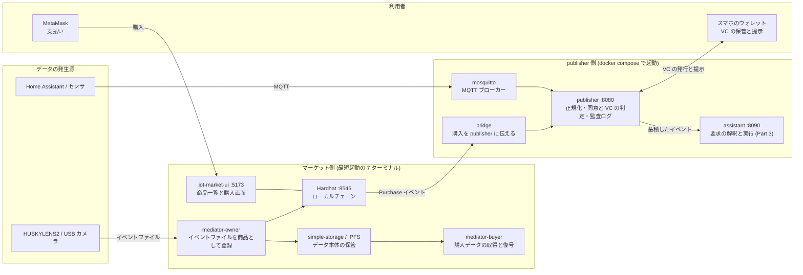

# IoTxWeb3 Intelligence Platform (IW3IP) ドキュメント

IW3IP の全体像、実装例、ハンズオン手順をまとめたドキュメントサイトです。

## 想定読者

- コンピュータや情報システムを学ぶ学部学生
- 演習を担当する講師・TA

全体像は [学習基礎 / 授業ガイド](foundations/course-guide.md) から読むことを推奨します。

## 扱う内容

基礎理解から基本ハンズオンまでを順に確認できます。

- 基礎学習:
  - ブロックチェーン
  - Hardhat
  - SSI / DID / VC
- 実践:
  - 最短起動
  - 各 Hands-on サンプル
  - トラブルシュート

外部サイトや論文は、標準仕様や研究背景を詳しく調べたいときの参考資料です。

## サイトの構成

- **学習基礎**: ブロックチェーン、Hardhat、SSI / DID / VC の基礎と、授業での使い方
- **環境構築**: ツールのインストールと、ハンズオン環境の起動
- **ハンズオン**: 受講者が手を動かす手順（コマンド、期待結果、確認ポイント）
- **設計**: VC とトークンの全体像、設計仕様
- **運用**: トラブルシュート、FAQ、講師向けの進行ガイド

## 全体構成


```mermaid
flowchart LR
  subgraph DEV["データの発生源"]
    HA["Home Assistant / センサ"]
    CAM["HUSKYLENS2 / USB カメラ"]
  end
  subgraph PUB["publisher 側 (docker compose で起動)"]
    MQ["mosquitto<br/>MQTT ブローカー"]
    P["publisher :8080<br/>正規化・同意と VC の判定・監査ログ"]
    BR["bridge<br/>購入を publisher に伝える"]
    AS["assistant :8090<br/>要求の解釈と実行 (Part 3)"]
  end
  subgraph MKT["マーケット側 (最短起動の 7 ターミナル)"]
    MO["mediator-owner<br/>イベントファイルを商品として登録"]
    HH["Hardhat :8545<br/>ローカルチェーン"]
    ST["simple-storage / IPFS<br/>データ本体の保管"]
    UI["iot-market-ui :5173<br/>商品一覧と購入画面"]
    MB["mediator-buyer<br/>購入データの取得と復号"]
  end
  subgraph USER["利用者"]
    MM["MetaMask<br/>支払い"]
    W["スマホのウォレット<br/>VC の保管と提示"]
  end
  HA -->|MQTT| MQ --> P
  CAM -->|イベントファイル| MO
  MO --> HH
  MO --> ST
  UI --- HH
  MM -->|購入| UI
  ST --> MB
  HH -->|Purchase イベント| BR --> P
  P <-->|VC の発行と提示| W
  P -->|蓄積したイベント| AS
```

起動するものは 2 系統あります。

- **マーケット側**: ブロックチェーン (Hardhat)、商品一覧の画面、データ保管、仲介プロセスです。[最短起動](setup/quickstart.md) の手順で、ターミナルを 7 つ使って起動します。データの出品と購入 (Part 1 の後半、Part 2 のマーケット連携) で使います。
- **publisher 側**: MQTT ブローカーと publisher です。教材リポジトリで `docker compose -f infra/docker-compose.yml up` を実行して起動します。データの取り込み、同意や VC による共有可否の判定、監査ログ (Part 1 の前半、Part 2、Part 3) で使います。

2 つの系統は独立して動きます。Part 2 のマーケット連携では、bridge が購入のイベントを publisher に伝えて両者をつなぎます。各ハンズオンがどちらを使うかは、[ハンズオンの概要の早見表](hands-on/index.md#使う技術要素の早見表) にまとめています。

データの発生源には、Raspberry Pi とカメラのような小型の機器も使えます。

{ width="360" }

## まず 1 つ動かしたい場合

実機なしで Phase 1 / Phase 2 の基本経路を確認したい場合は、`ha-demo-simulator` から始めてください。Phase 1〜3 は基盤の発展段階を表す区分で、[プロジェクト概要のフェーズ構成](platform-overview.md#フェーズ構成) で説明しています。

- 対応ページ: [Home Assistant Demo Simulator サンプル](hands-on/ha-demo-simulator.md)
- 確認できること:
  - `Home Assistant demo -> MQTT -> publisher`
  - `temperature` / `power` の状態共有
  - `flood_risk_high` / `possible_littering` のイベント共有
  - `allowed` / `denied` / `audit log`

起動コマンド:

```bash
PLATFORM_INGEST_READ_ENABLED=true docker compose -f infra/docker-compose.yml --profile ha-demo up --build -d
```

開く URL:

- `http://localhost:8123`
- `http://localhost:8080/health`

Phase 3 の最短デモとして `assistant-demo` を使うと、1 コマンドで次をまとめて起動できます。

- `assistant-demo`
- `llm-mock`
- `assistant-ui`

対応ページ:

- [LLM Plannerハンズオン](hands-on/llm-planner.md)

起動コマンド:

```bash
docker compose -f infra/docker-compose.yml --profile assistant-demo up --build -d
```

開く URL:

- `http://localhost:4173`

## 推奨学習順

1. [授業ガイド](foundations/course-guide.md)
2. [学習ロードマップ](foundations/roadmap.md)
3. [ブロックチェーン基礎](foundations/blockchain-basics.md)
4. [Hardhat基礎](foundations/hardhat-basics.md)
5. [SSI/DID/VC基礎](foundations/ssi-did-vc-basics.md)
6. [事前準備](setup/prerequisites.md)
7. [HA Demo Simulator](hands-on/ha-demo-simulator.md)（実機なしで一通り動かす）
8. [最短起動](setup/quickstart.md)
9. [ハンズオン](hands-on/index.md)
10. [参考文献](foundations/references.md)

途中で詰まったら [トラブルシュート](operations/troubleshooting.md) を参照してください。

## ローカルでDocsを起動

```bash
pip install -r docs/requirements.txt
mkdocs serve
```

- URL: `http://127.0.0.1:8000`
