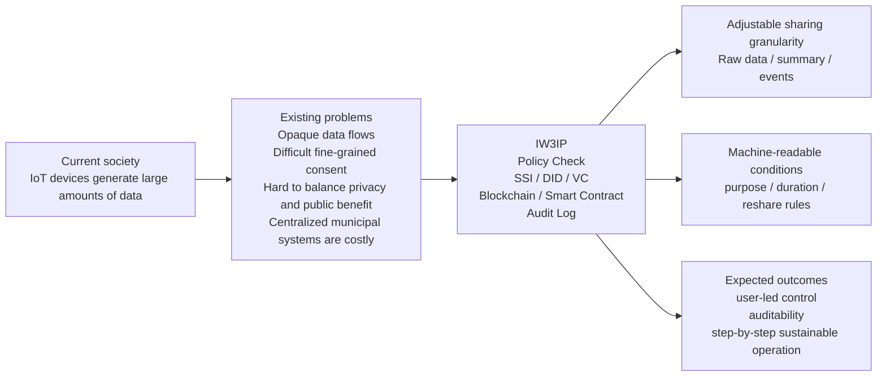
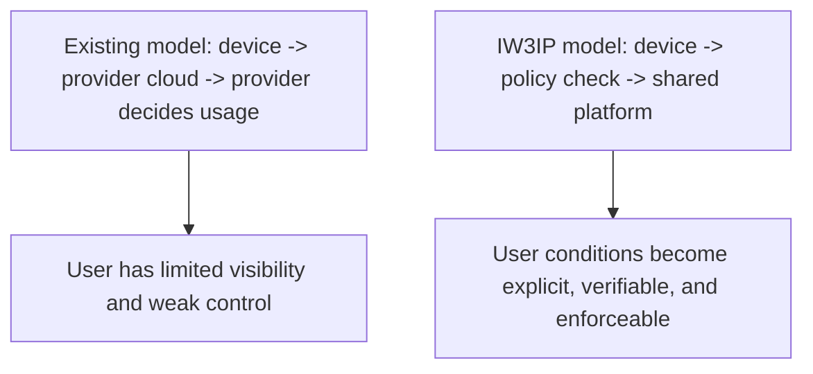
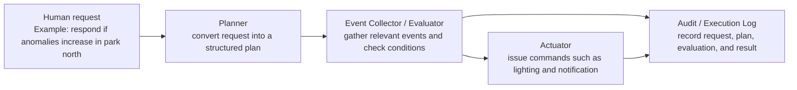

# Platform Overview

This page explains what IW3IP is trying to build by starting from familiar social systems and their limitations.  
It is written so that high school students and university students can first understand the problem, and then see why this project matters as a research platform.

## Overview Figure

The point of this figure is that IW3IP is not just adding new technology. It is redesigning data sharing around **granularity control, consent conditions, and auditability** in response to concrete social problems.

## What is happening in society today

Many devices around us are already connected to the Internet.

- smartwatches
- smart locks
- home monitoring cameras
- household energy devices
- sensors in factories and vehicles

These devices generate many kinds of data, such as temperature, location, images, operation history, and anomaly detection results.  
That data can be useful for providing services, predicting failures, improving AI models, and supporting decision-making.

## How existing systems usually work

In many current services, the overall flow looks like this:

1. A user buys or installs a device.
2. The device sends data to a cloud service.
3. A provider stores and analyzes the data.
4. The user receives results through an app or web service.

This model is convenient, but it also tends to centralize control of data flow on the provider side.

## Where the problems are

### 1. Users cannot easily see how their data flows

In many cases, users do not clearly know **which data**, **who uses it**, and **for what purpose**.  
Even if consent is included in a terms-of-service document, it is often difficult to understand the actual conditions in detail.

### 2. Users cannot easily define fine-grained usage conditions

For example, a user may want to say:

- Temperature data may be shared for research.
- Raw video should not be shared as-is.
- AI training may be allowed, but redistribution to third parties should not be allowed.

Most existing systems do not make it easy for users to define such conditions in a precise, machine-readable, enforceable way.

### 3. It is difficult to verify later what actually happened

If usage history and policy conditions remain only inside one provider's internal database, it becomes hard for an external party to verify whether data was really used under the promised conditions.

### 4. It is hard to use socially important information while still protecting privacy

Consider familiar situations such as:

- providing clues that may help resolve crime or trouble
- sharing information that may help find lost items
- sending useful information for missing-person searches
- detecting littering or risky behavior in a neighborhood

These are socially important cases. However, that does not mean people want to share continuous raw video or other highly identifying data at all times.  
What many people actually want is a way to **provide only necessary information at the necessary time while still protecting privacy**.

Existing systems often lean too far in one of two directions:

- privacy is prioritized so strongly that useful information sharing becomes difficult
- problem-solving is prioritized so strongly that data collection and retention become excessive

IW3IP addresses this tension directly.

### 5. Municipality-wide or centrally managed security systems can be hard to sustain

Municipalities and local communities already deploy centralized safety and surveillance systems in some cases.  
Such systems can be effective, but they also come with recurring problems:

- large initial installation costs
- continuous communication, maintenance, and operation costs
- expensive renewal cycles
- dependence on public budgets or subsidies
- one-size-fits-all designs that may not match local needs

In other words, simply installing many cameras does not automatically create a sustainable system.  
A practical design needs to support lower-cost deployment, step-by-step growth, and shared responsibility across communities and users.

## The research question behind IW3IP

The central research question of IW3IP can be stated as follows:

**Can we keep the practical value of IoT data sharing while giving users stronger control over devices and data?**

This is not only about secure storage.  
It is about representing and enforcing who can use which data, for what purpose, for how long, and under what user-defined conditions.

## What IW3IP aims to provide

IW3IP stands for **IoTxWeb3 Intelligence Platform**.  
It aims to become a platform that connects IoT, Web3, and future intelligence-oriented processing in a single architecture.

The core idea is to move **sovereignty over IoT devices and their data closer to the user side**.

To do that, IW3IP combines the following elements:

- blockchain
  - to manage verification and traceability in a tamper-evident way
- smart contracts
  - to automate processing based on explicit conditions
- SSI (Self-Sovereign Identity)
  - to represent users, devices, and services without depending only on a centralized identity provider
- DID / VC
  - to make permissions, roles, and consent conditions easier to evaluate programmatically

An important idea in IW3IP is that the system should **not assume that raw data must always be collected and shared**.  
Depending on the situation, the platform should be able to share:

- raw data
- extracted features or summaries
- detected events only

For example, in safety or community monitoring scenarios, it may be better to share:

- `person_detected`
- `possible_littering`
- `suspicious_activity`
- `lost_item_detected`

plus minimal metadata such as time, place, and confidence, instead of sharing continuous recorded video.

It is also important that the system not depend entirely on a municipality or a single large operator.  
IW3IP is designed so that people can gradually combine:

- devices already deployed in homes or shops
- small distributed sensors in a community
- optional modules added for specific use cases

This staged and modular model is meant to improve long-term sustainability.

## What changes with IW3IP

Compared with the conventional model, the idea changes as follows:

In IW3IP, there is a layer that checks whether data should be sent before the data is shared.  
At that point, user consent conditions and purpose restrictions need to be represented in a form that software can evaluate automatically.

This design is intended to respond to practical concerns such as:

- "I do not want to share the full video, but I do want to share that an abnormal event happened."
- "Research use is acceptable, but advertising use is not."
- "I want to contribute to local safety, but I do not want constant surveillance."
- "I want to reuse existing devices instead of depending only on large centralized infrastructure."

## What the samples on this site actually demonstrate

The beginner-level samples on this site intentionally simplify the hardest parts first, so that learners can understand the following pipeline:

1. Receive data from Home Assistant or sensors.
2. Normalize the data into a common schema.
3. Decide `allow` or `deny` based on a Consent VC.
4. Record an audit log.

In other words, the site first demonstrates the minimum foundation for:

**checking whether data may be sent before sending it, and recording the result**

## Phase structure

IW3IP is designed to expand in stages rather than implementing everything at once.

### Phase 1: Data Exchange

- data sharing
- consent-based decisions
- audit logging

### Phase 2: Event / Intelligence Sharing

- sharing not only raw data but also detected events and inference outputs
- examples: `person_detected`, `possible_littering`

### Phase 3: Decision / Control Integration

- AI-based decisions
- control commands
- stricter access control through a PEP (Policy Enforcement Point)

In Phase 3, the goal is no longer only to share events. The system should also **interpret a human request, identify the relevant events, evaluate conditions, and trigger device actions when needed**.

For example, the Phase 3 sample on this site handles a request such as:

> If littering or risky behavior is increasing on the north side of the park, tell me. If needed, turn on the lights and notify the manager.

The system then separates the work into the following steps:

1. extract the target area and watch events from the request
2. evaluate event counts such as `possible_littering`
3. execute actions such as `light_on` and `send_notification` when conditions are satisfied

In other words, Phase 3 is the stage where the platform evolves from **data sharing infrastructure into decision and control infrastructure**.

#### Phase 3 Role Diagram

The key point is that Phase 3 should not be treated as one black-box "AI" component.  
Instead, it is better to separate **request interpretation, evaluation, control, and auditability** so that, for example, the planner can later be replaced by an LLM while the evaluator remains rule-based.

## A simpler summary for high school and university students

IW3IP is a research project that tries to answer questions like these:

- Can people decide more directly how their own data is used?
- Can systems automatically enforce those conditions?
- Can we later verify whether the rules were actually followed?

To explore these questions, this site teaches blockchain, Hardhat, SSI, DID, and VC not as isolated technologies, but as **components of one data-sharing platform**.

## Background visible in public information

The issues discussed on this page are not purely hypothetical. Publicly available sources show related real-world problems.

- The National Police Agency of Japan reported 82,563 missing-person reports received in 2024.
- The National Police Agency also provides online procedures for lost-property reporting and search, showing that everyday "lost and found" problems remain important at scale.
- Materials from the Personal Information Protection Commission discuss the usefulness of facial-recognition-enabled cameras for crime prevention while also pointing out privacy risks due to remote identification.
- Research on municipal surveillance-camera deployment has identified recurring issues such as installation cost, communication and maintenance cost, accountability, and public acceptance.

Taken together, these sources indicate a three-way challenge:

- information sharing is often socially necessary
- privacy still has to be protected
- operational and maintenance cost cannot be ignored

IW3IP is a research platform that aims to address all three at once.

## Examples of Social Problems That Fit IW3IP Well

The IW3IP approach is not limited to crime prevention or community monitoring.  
It is especially well suited to situations where people want to share useful information, but do not want to share raw data continuously.

| Social problem | Information worth sharing | Sharing to avoid | Why IW3IP fits well |
|---|---|---|---|
| Disaster-time community information sharing | flooding, fallen trees, blocked roads, places needing evacuation support | detailed video of private homes, continuous location tracking | Event-oriented sharing works well, and emergency-only purpose-limited sharing is easier to express |
| Elderly care and monitoring | falls, unusually long inactivity, abnormal behavior patterns | continuous indoor video, full-life surveillance | "Share only when abnormal" is easier to implement while preserving privacy |
| School routes and neighborhood safety | risky behavior, suspicious movement, signs of accidents | continuous tracking of children or residents | It matches the need to share only safety-relevant events |
| Infrastructure maintenance | cracks, failure signs, unusual vibration, abnormal temperature | complete inspection video or full raw equipment data | The model fits summary-based or anomaly-event-based sharing rather than full raw-data transfer |
| Shopping streets and local revitalization | crowd level, changes in pedestrian flow, stay patterns, event-time activity | person-level behavioral history or long-term tracking | It works well for aggregated values and privacy-preserving event sharing |

The common point across all of these cases is that "collect everything all the time" is usually not the right answer.  
IW3IP is intended to improve the balance among **utility, privacy, and sustainability** by adjusting the granularity and conditions of sharing.

## Non-Camera Use Cases

IW3IP is not only a platform for camera-based information.  
The same ideas of controlled sharing and event-oriented processing also work well for non-camera data such as temperature, vibration, power usage, human presence, and location.

| Use case | Example input data | Role of AI / analysis | Examples of shareable events |
|---|---|---|---|
| Environment and disaster response | temperature, humidity, CO2, rainfall, water level, vibration | anomaly detection, flood-risk estimation, evacuation support | `high_co2`, `flood_risk_high`, `abnormal_vibration` |
| Elderly care and daily-life monitoring | human presence, door open/close, power consumption, room temperature | daily-routine deviation detection, long inactivity detection, fall estimation support | `no_activity_long`, `possible_fall`, `daily_pattern_changed` |
| Community infrastructure maintenance | vibration, strain, temperature, current | deterioration-sign detection, predictive maintenance, anomaly classification | `bridge_vibration_anomaly`, `equipment_overheat`, `maintenance_recommended` |
| Energy optimization | power consumption, generation, battery level | demand forecasting, peak control, abnormal usage detection | `peak_warning`, `battery_low`, `abnormal_power_use` |
| Agriculture and environmental control | soil moisture, light level, air temperature, humidity | irrigation timing estimation, disease-risk estimation, growth-state analysis | `watering_needed`, `disease_risk_high`, `growth_delay` |
| Mobility and logistics | GPS, acceleration, cargo-space temperature, open/close history | delay prediction, unsafe-driving detection, temperature-excursion detection | `delivery_delay_risk`, `unsafe_driving`, `temperature_excursion` |
| Commercial facilities and building management | human presence, CO2, light level, HVAC status, power use | crowd estimation, HVAC optimization, failure prediction | `crowded_area`, `hvac_fault_risk`, `energy_waste_detected` |
| Healthcare-adjacent monitoring | heart rate, activity level, sleep, room temperature | health-change detection, monitoring alerts, abnormal-trend classification | `health_risk_change`, `sleep_pattern_abnormal`, `urgent_check_recommended` |

In these use cases, sharing all raw data is often less important than sharing:

- analysis results
- anomaly events
- summary values
- purpose-limited data

This is why they connect naturally to IW3IP features such as **Consent VC-based conditions**, **audit logging**, and future support for **event sharing** and **AI decision sharing**.

## What to read next

1. To learn the technical foundations: [Blockchain Basics](foundations/blockchain-basics.md), [Hardhat Basics](foundations/hardhat-basics.md), [SSI/DID/VC Basics](foundations/ssi-did-vc-basics.md)
2. To boot the environment first: [Quickstart](workshop/quickstart.md)
3. To observe actual behavior: [Hands-on](hands-on/index.md)
4. To study the research in more depth: [Publications](publications.md), [References and Further Reading](foundations/references.md)

## Public sources referenced on this page

- National Police Agency of Japan, "Status of Missing Person Reports in 2024"  
  <https://www.npa.go.jp/publications/statistics/safetylife/R6_yukuefumeishakouhoushiryou2.pdf>
- National Police Agency of Japan, "Guidance for Online Applications"  
  <https://www.npa.go.jp/policies/application/shinseisys/>
- National Police Agency of Japan, "Lost Property Report and Search"  
  <https://www.npa.go.jp/bureau/soumu/ishitsubutsu/ishitsu-todokedekensaku.html>
- Personal Information Protection Commission, materials on legal and policy issues for surveillance cameras with facial recognition  
  <https://www.ppc.go.jp/files/pdf/20220128_shiryou-2_kentoukadai.pdf>
- Hisamichi Chiba, Kimihiro Hino, "A Study on the Ideal Way of Installing Security Cameras in Urban Space Harmonized with Privacy", 2017  
  <https://www.jstage.jst.go.jp/article/reportscpij/16/2/16_124/_article/-char/ja/>
- A case-study paper on municipal surveillance camera deployment process and operational issues, 2016  
  <https://www.jstage.jst.go.jp/article/journalcpij/51/3/51_357/_pdf>
