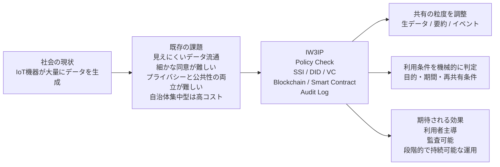
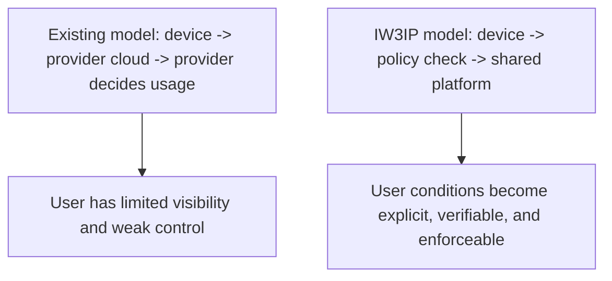
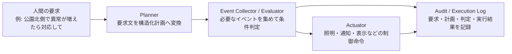

# プロジェクト概要

このページでは、IW3IP が何を目指すプロジェクトなのかを説明します。  
まず社会的な背景と課題を整理し、それに対して IW3IP がどういう技術的アプローチを取るかを示します。

## 概要図

IW3IP は単に新しい技術を足すのではなく、**共有の粒度・同意条件・監査可能性をまとめて設計し直す**ことを狙っています。

## いまの社会では何が起きているか

スマートウォッチ、見守りカメラ、家庭用エネルギー機器、工場や車両のセンサなど、ネットワークに接続された IoT 機器はすでに身近に多数存在します。

これらの機器は温度、位置、映像、操作履歴、異常検知結果など多様なデータを生成し、サービス提供、故障予測、AI の学習データ等に利用されています。

## 既存の仕組み

現在の多くのサービスでは、利用者が機器を購入し、機器がクラウドへデータを送り、事業者がそれを保存・分析し、利用者はアプリ等で結果を受け取る、という流れになっています。

便利ではあるものの、データの流れが事業者側に集中する構造です。

## どこに課題があるか

### 1. 利用者がデータの流れを把握しにくい

利用者は「どのデータが」「誰に」「何の目的で」使われているか把握しにくい。  
利用規約に同意条件が書かれていても、実際にその内容を細かく理解している利用者は少ないです。

### 2. 利用者がデータの利用条件を細かく指定できない

たとえば「温度データは研究目的なら出してよい」「映像はそのまま渡したくない」「AI 学習には使ってよいが再配布は不可」のように、利用者ごとに希望は異なります。

しかし既存の仕組みの多くでは、こうした細かい条件を利用者側から指定し、システムに強制させる手段がありません。

### 3. 後から検証しにくい

データ利用の履歴や契約条件が一事業者のデータベースに閉じていると、「本当にその条件どおりに使われたのか」を第三者が検証する手段がありません。

### 4. プライバシーを守りながら、社会的に重要な情報だけを活用しにくい

たとえば犯罪の手がかり提供、落とし物の発見、行方不明者の捜索、ポイ捨てや危険行動の地域把握など、公共性の高い場面でデータ共有は求められています。

ただし、常時撮影の映像や個人を特定できる生データをそのまま広く共有するのは望ましくありません。必要なのは **プライバシーを守りつつ、必要なときに必要な情報だけを出せる仕組み** です。

現状では、プライバシー重視で情報共有が進まないか、問題解決優先で過剰な情報収集になるか、どちらかに偏りがちです。IW3IP はこの両立に取り組みます。

### 5. 自治体一括導入モデルの持続性

防犯カメラや地域見守りの一括導入は実績がありますが、初期費用・通信費・保守費が大きく、更新時の再投資負担も重い。予算や補助金に依存すると長期継続が困難になります。また、地域ごとに必要な粒度や運用方針が異なるのに、一律設計になりがちです。

「カメラを大量に設置する」だけでは持続しません。低コストで段階的に導入でき、地域や利用者が役割分担しながら運用を続けられる設計が求められます。

## 研究としての問い

IW3IP の中心的な問いはこうです。

**IoT データの利便性を保ちつつ、利用者がデータと機器に対する主導権を持てる仕組みは作れるか。**

単なるデータ保護の話ではなく、誰が・どの条件で・どの期間・どの目的でデータを使えるかを、利用者の意思に基づいて制御する仕組みの構築が焦点です。

## IW3IP が目指す解決

IW3IP（IoTxWeb3 Intelligence Platform）は、IoT・Web3・知能処理を統合する基盤です。

核となる方針は **IoT デバイスとデータの主権を利用者側へ移す** こと。そのために次の要素を組み合わせます。

- ブロックチェーン
  - 利用条件や検証情報を、追跡しやすい形で扱う
- スマートコントラクト
  - 条件に従った処理を自動化する
- SSI（Self-Sovereign Identity）
  - 利用者・機器・サービスの関係を中央集権的な認証だけに頼らず扱う
- DID / VC
  - 誰にどの権限があり、どの同意条件があるのかを機械的に判定しやすくする

IW3IP では **常に生データを集めることを前提にしません**。  
共有内容の粒度を用途に応じて調整できる設計を採ります。

- 生データを共有する
- 特徴量や要約だけを共有する
- 検出イベントだけを共有する

たとえば防犯や見守りでは、常時録画映像をそのまま共有する代わりに、

- `person_detected`
- `possible_littering`
- `suspicious_activity`
- `lost_item_detected`

のようなイベントと最小限のメタデータ（時刻・場所・信頼度）だけを共有する方が、プライバシーと有用性を両立できます。

また、自治体や大規模事業者が全てを抱えるのではなく、家庭・店舗の既存機器、地域の小規模センサ、用途ごとのモジュールを組み合わせて **必要な機能だけを段階的に追加する構成** を取れるようにします。

## IW3IP で何が変わるか

従来型と IW3IP 型の違いを図示します。

IW3IP では、データを送る前に「そのデータは送ってよいか」を確認する層を挟みます。利用者の同意条件や目的制約を機械可読な形で表現し、自動判定します。

この設計は、たとえば次のような現場の要望に応えるものです。

- 「映像そのものは見せたくないが、異常の発生だけは共有したい」
- 「研究目的には使ってよいが、広告目的には使ってほしくない」
- 「地域の安全のために協力したいが、常時監視にはしたくない」
- 「自治体主導の大規模設備だけに頼らず、既存の機器を活かしたい」

## 本サイトのサンプルで確認できること

本サイトのサンプルでは、次の一連の流れを確認できます。

1. Home Assistant やセンサからデータを受け取る
2. データを共通スキーマに正規化する
3. Consent VC に基づいて `allow` / `deny` を判定する
4. 監査ログを残す

**「データを送る前に利用条件を確認し、その結果を記録する」** という基盤の最小構成です。

## フェーズ構成

IW3IP は段階的に拡張する前提で設計しています。

### Phase 1: Data Exchange

- データ共有
- 同意条件にもとづく判定
- 監査ログ

### Phase 2: Event / Intelligence Sharing

- 生データだけでなく、検出結果やイベント共有を扱う
- 例: `person_detected`, `possible_littering`

### Phase 3: Decision / Control Integration

- AI による判断
- 制御命令
- PEP（Policy Enforcement Point）による厳密なアクセス制御

Phase 3 では「イベントを共有する」だけでなく、**人間の要求を解釈し、イベント確認と機器操作までつなぐ** ことを目指します。

本サイトの Phase 3 サンプルでは、たとえば次のような要求を扱います。

> 公園北側でポイ捨てや危険行動が増えていたら教えて。必要なら照明をつけて管理者に通知して。

システムはこれを次のように分解します。

1. 要求文から対象場所と注目イベントを読み取る
2. `possible_littering` 等のイベント件数を評価する
3. 条件成立時に `light_on` や `send_notification` を実行する

Phase 3 は **データ共有基盤を判断・制御の基盤へ発展させる段階** です。

#### Phase 3 の役割分担図

Phase 3 を 1 つの「AI の箱」にせず、**要求解釈・判定・制御・監査を分離して設計する** 点が重要です。こうすれば planner だけを LLM に差し替えたり、evaluator だけを厳密なルールエンジンにしたりできます。

## 要するに

IW3IP が答えようとしている問いは単純です。

- 自分のデータの使われ方を、自分で決められないか
- その条件を、システムが自動で守れないか
- あとから「ルール通りだったか」を検証できないか

ブロックチェーン、Hardhat、SSI、DID、VC はそれぞれ独立した技術ですが、IW3IP ではこれらを **1 つのデータ共有基盤の部品** として組み合わせます。

## 公開情報に見る背景

ここで扱う課題は仮想の設定ではなく、公開データに裏付けがあります。

- 令和6年の行方不明者届受理数は 82,563 人（警察庁公表資料）
- 落とし物の届出・検索のオンライン手続が整備されており、「物をなくす・見つける」問題は日常的に発生している
- 顔識別カメラは犯罪予防に有効だがプライバシー侵害リスクもある（個人情報保護委員会の検討資料）
- 自治体の防犯カメラ導入では設置費・運用費・市民受容が継続的な課題（都市計画学会の事例研究）

現実には「情報共有の必要性」「プライバシー配慮」「維持管理コスト」の三者が同時に存在します。IW3IP はこの三者をまとめて扱う基盤を目指しています。

## IW3IP と相性の良い社会課題の例

IW3IP の適用先は防犯・見守りに限りません。「必要な情報は共有したいが、生データの常時共有は避けたい」場面全般に向いています。

| 社会課題 | 共有したい情報 | 避けたい共有 | IW3IP と相性が良い理由 |
|---|---|---|---|
| 災害時の地域情報共有 | 浸水、倒木、通行不能、避難支援が必要な場所 | 個人宅の詳細映像、常時位置追跡 | イベント単位で共有でき、緊急時だけ目的限定の共有もしやすい |
| 高齢者見守り | 転倒、長時間の無動作、異常な行動パターン | 室内の常時映像、生活全体の監視 | 「異常時のみ共有」という設計がしやすく、プライバシー配慮と両立しやすい |
| 通学路・地域安全 | 危険行動、不審な動き、事故につながる兆候 | 子どもや住民の継続的な追跡 | 地域安全に必要なイベントだけを共有しやすい |
| インフラ保守 | ひび割れ、故障兆候、異常振動、温度異常 | 点検映像や設備データの全量共有 | 生データではなく、要約や異常イベント中心の共有に向いている |
| 商店街・地域活性 | 混雑度、人流の変化、滞在傾向、イベント時の状況 | 個人ごとの行動履歴や追跡 | 集計値や匿名化イベント共有の説明に使いやすい |

どの課題でも「全データを常時収集する」のが正解とは限りません。共有の粒度と条件を調整することで **有用性・プライバシー・持続可能性のバランス** を取るのが IW3IP の方針です。

## 非カメラ系ユースケース

IW3IP はカメラ映像専用の基盤ではありません。温度・振動・電力・人感・位置情報など非カメラ系データでも、共有条件の制御やイベント化は同様に有効です。

| ユースケース | 入力データの例 | AI / 分析の役割 | 共有しやすいイベント例 |
|---|---|---|---|
| 環境・防災 | 温度、湿度、CO2、雨量、水位、振動 | 異常値検知、浸水リスク推定、避難判断支援 | `high_co2`, `flood_risk_high`, `abnormal_vibration` |
| 高齢者・生活見守り | 人感、ドア開閉、消費電力、室温 | 生活リズム逸脱検知、長時間無活動検知、転倒推定補助 | `no_activity_long`, `possible_fall`, `daily_pattern_changed` |
| 地域インフラ保守 | 振動、ひずみ、温度、電流 | 劣化兆候検知、予防保全、異常パターン分類 | `bridge_vibration_anomaly`, `equipment_overheat`, `maintenance_recommended` |
| エネルギー最適化 | 電力使用量、発電量、蓄電池残量 | 需要予測、ピーク制御、異常消費検知 | `peak_warning`, `battery_low`, `abnormal_power_use` |
| 農業・環境制御 | 土壌水分、照度、気温、湿度 | 潅水タイミング推定、病害リスク推定、成長状態把握 | `watering_needed`, `disease_risk_high`, `growth_delay` |
| モビリティ・配送 | GPS、加速度、荷室温度、開閉履歴 | 遅延予測、危険運転検知、温度逸脱検知 | `delivery_delay_risk`, `unsafe_driving`, `temperature_excursion` |
| 商業施設・ビル管理 | 人感、CO2、照度、空調状態、電力 | 混雑推定、空調最適化、設備故障予兆 | `crowded_area`, `hvac_fault_risk`, `energy_waste_detected` |
| 医療・ヘルスケア周辺 | 心拍、活動量、睡眠、室温 | 体調変化兆候検知、見守り通知、異常傾向分類 | `health_risk_change`, `sleep_pattern_abnormal`, `urgent_check_recommended` |

いずれも生データ全量の共有より、分析結果・異常イベント・要約値・目的限定の共有が重要です。IW3IP の **Consent VC による条件付け** と **監査ログ**、将来の **イベント共有・AI 判断共有** はこれらの要件と直接つながります。

## 次に読むページ

1. 技術の基礎: [ブロックチェーン基礎](foundations/blockchain-basics.md), [Hardhat基礎](foundations/hardhat-basics.md), [SSI/DID/VC基礎](foundations/ssi-did-vc-basics.md)
2. まず動かす: [最短起動](workshop/quickstart.md)
3. 挙動を確認: [Hands-on](hands-on/index.md)
4. 研究の深掘り: [論文](publications.md), [参考文献](foundations/references.md)

## 参考にした公開情報

- 警察庁, 「令和6年における行方不明者届受理等の状況」: 令和6年の行方不明者数 82,563 人  
  <https://www.npa.go.jp/publications/statistics/safetylife/R6_yukuefumeishakouhoushiryou2.pdf>
- 警察庁, 「オンラインでの申請等の案内」: 遺失物関係のオンライン手続  
  <https://www.npa.go.jp/policies/application/shinseisys/>
- 警察庁, 「落とし物の届出・検索」  
  <https://www.npa.go.jp/bureau/soumu/ishitsubutsu/ishitsu-todokedekensaku.html>
- 個人情報保護委員会, 「顔識別機能付き防犯カメラの利用に関する法的整理と検討課題」  
  <https://www.ppc.go.jp/files/pdf/20220128_shiryou-2_kentoukadai.pdf>
- 千葉尚路, 樋野公宏, 「プライバシーと調和する都市空間の防犯カメラ設置のあり方に関する研究」, 都市計画報告集, 2017  
  <https://www.jstage.jst.go.jp/article/reportscpij/16/2/16_124/_article/-char/ja/>
- 都市計画学会論文, 自治体の防犯カメラ設置過程と運用課題を扱う事例研究, 2016  
  <https://www.jstage.jst.go.jp/article/journalcpij/51/3/51_357/_pdf>
