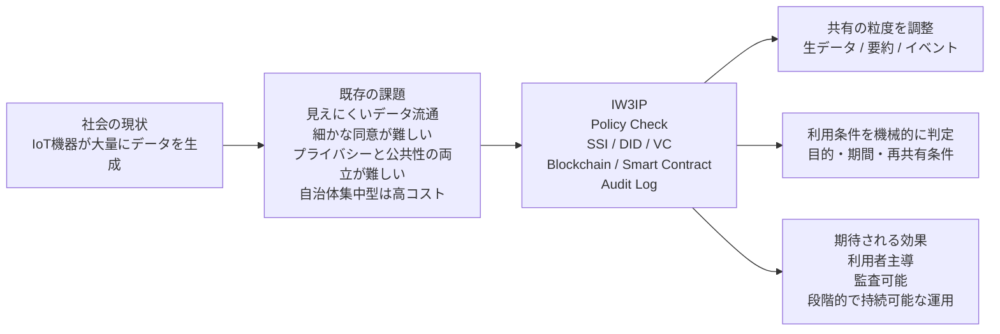
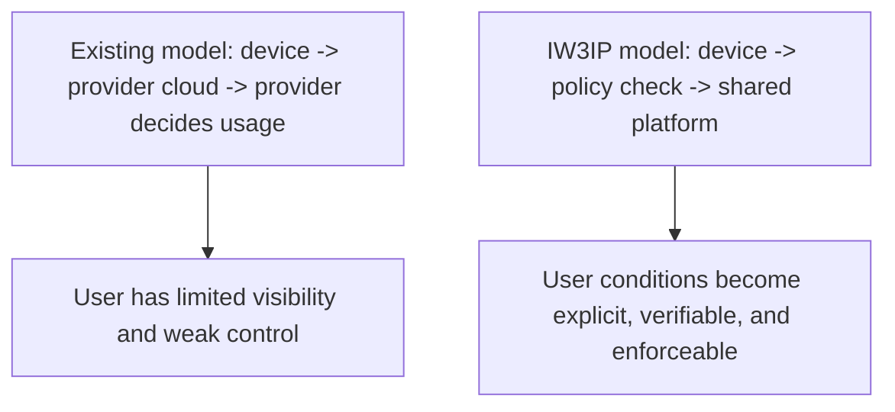
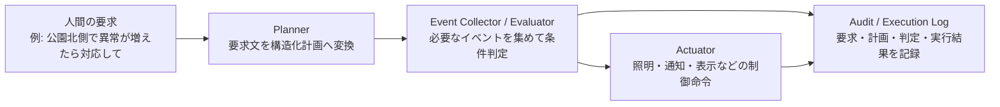

# プロジェクト概要

このページでは、IW3IP が何を目指すプロジェクトなのかを、社会の仕組みと課題から順に説明します。  
高校生や大学生でも読めるように、まず日常的な例から入り、その後に研究としての位置付けを示します。

## 概要図

この図のポイントは、IW3IP が単に新しい技術を追加するのではなく、**既存社会の課題に対して、共有の粒度・同意条件・監査可能性をまとめて設計し直す**ことにあります。

## いまの社会では何が起きているか

私たちの周りには、すでに多くの「ネットにつながる機械」があります。

- スマートウォッチ
- スマートロック
- 見守りカメラ
- 家庭用エネルギー機器
- 工場や車両のセンサ

これらの機器は、温度、位置、映像、操作履歴、異常検知結果など、さまざまなデータを作ります。  
そのデータは、便利なサービスを提供したり、故障を予測したり、AI を改善したりするために利用されます。

## 既存の仕組み

現在の多くのサービスでは、次のような流れでデータが使われています。

1. 利用者が機器を買う
2. 機器がクラウドへデータを送る
3. 事業者がデータを保存・分析する
4. 利用者はアプリやWebサービスとして結果を受け取る

この仕組みは、便利である一方で、データの流れが事業者側に集中しやすいという特徴があります。

## どこに課題があるか

### 1. 利用者がデータの流れを把握しにくい

多くの場合、利用者は「どのデータが」「誰に」「何の目的で」使われているかを十分に把握できません。  
長い利用規約の中に同意が含まれていても、実際には細かい条件まで理解するのは難しいことが多いです。

### 2. 利用者が自分のデータ利用条件を細かく決めにくい

たとえば、利用者は次のように思うかもしれません。

- 温度データは研究目的なら提供してよい
- 映像データはそのまま渡したくない
- AI の学習には使ってよいが、第三者への再配布は認めたくない

しかし、既存の多くの仕組みでは、このような細かい条件を利用者が主体的に指定し、機械的に守らせることが難しいです。

### 3. 後から検証しにくい

データ利用の履歴や契約条件が、1つの事業者のデータベースの中だけに閉じていると、
あとから「本当にその条件で使われたのか」を第三者が確認しにくくなります。

### 4. プライバシーを守りながら、社会的に重要な情報だけを活用しにくい

身近な例として、次のような場面があります。

- 犯罪やトラブルの手がかりを提供したい
- 落とし物の発見につながる情報を共有したい
- 行方不明者の捜索に役立つ情報を届けたい
- ポイ捨てや危険行動の発生を地域で把握したい

これらは公共性の高い問題ですが、だからといって常時撮影した映像や個人を特定しやすい生データを、そのまま広く共有したいわけではありません。  
多くの人が望んでいるのは、**プライバシーに配慮しながら、必要なときに必要な情報だけを安全に提供できる仕組み**です。

しかし既存の仕組みでは、次のどちらかに偏りやすいことがあります。

- プライバシーを重視するあまり、有用な情報共有そのものが難しくなる
- 問題解決を優先するあまり、収集・保存される情報が過剰になる

IW3IP が扱うのは、この両立の難しさです。

### 5. 自治体や地域が一括で管理する仕組みは、導入後の継続が難しいことがある

防犯カメラや地域見守りの仕組みを、自治体や地域全体で一括導入する例はすでに存在します。  
こうした仕組みは一定の効果を持ちうる一方で、次のような課題もあります。

- 初期導入費が大きい
- 通信費や保守費などの運用費が継続的にかかる
- 更新時期が来ると、再投資の負担が重い
- 予算や補助金に依存すると、長期継続が難しい
- 地域ごとに必要な粒度や運用方針が違っても、一律設計になりやすい

つまり、単に「多くのカメラを置く」だけでは、持続可能な仕組みにならないことがあります。  
低コストで、段階的に導入でき、地域や利用者が役割分担しながら続けられる設計が必要です。

## 研究としての問い

ここで IW3IP が扱う研究上の問いは次のように整理できます。

**IoT データの便利な利用を維持しつつ、利用者がデータと機器に対する主導権を持てる仕組みを作れないか。**

これは単に「データを安全に保存する」という話ではありません。  
誰が、どの条件で、どの期間、どの目的でデータを使えるのかを、利用者側の意思に基づいて扱えるようにすることが重要です。

## IW3IP が目指す解決

IW3IP は **IoTxWeb3 Intelligence Platform** の略で、IoT、Web3、そして将来の知能処理を統合するための基盤を目指しています。

中心となる考え方は、**IoT デバイスとデータの主権を利用者側へ近づける**ことです。

そのために、IW3IP では次の要素を組み合わせます。

- ブロックチェーン
  - 利用条件や検証情報を、追跡しやすい形で扱う
- スマートコントラクト
  - 条件に従った処理を自動化する
- SSI（Self-Sovereign Identity）
  - 利用者・機器・サービスの関係を中央集権的な認証だけに頼らず扱う
- DID / VC
  - 誰にどの権限があり、どの同意条件があるのかを機械的に判定しやすくする

IW3IP の重要な考え方は、**常に生データを集めることを前提にしない**ことです。  
必要に応じて、次のような粒度で共有内容を調整できる設計を目指します。

- 生データを共有する
- 特徴量や要約だけを共有する
- 検出イベントだけを共有する

たとえば、防犯や地域見守りの場面では、常時録画映像をそのまま共有する代わりに、

- `person_detected`
- `possible_littering`
- `suspicious_activity`
- `lost_item_detected`

のようなイベントや、時間・場所・信頼度などの最小限の情報だけを共有できる方が、プライバシーと有用性の両立に近づきます。

また、自治体や大規模事業者がすべてを一括で抱えるのではなく、

- 家庭や店舗にある既存機器
- 地域に分散した小規模なセンサ
- 用途ごとに追加できるモジュール

を組み合わせながら、**必要な機能だけを増やしていく段階的な構成**を取りやすくすることも重要です。

## IW3IP では何が変わるか

従来型と IW3IP 型を比べると、考え方は次のように変わります。

IW3IP では、データを送る前に「そのデータは送ってよいのか」を確認する層を置きます。  
このとき、利用者の同意条件や目的制約を、機械的に読める形で扱うのが重要です。

この考え方は、次のような実社会の悩みに対応するためのものです。

- 「映像そのものは見せたくないが、異常の発生だけは共有したい」
- 「研究目的には使ってよいが、広告目的には使ってほしくない」
- 「地域の安全のために協力したいが、常時監視にはしたくない」
- 「自治体主導の大規模設備だけに頼らず、既存の機器を活かしたい」

## 本サイトのサンプルで実際に見せていること

このサイトで扱う初級者向けサンプルでは、まず難しすぎる部分を削って、次の流れを理解できるようにしています。

1. Home Assistant やセンサからデータを受け取る
2. データを共通スキーマに正規化する
3. Consent VC に基づいて `allow` / `deny` を判定する
4. 監査ログを残す

つまり、**「データを送る前に、利用条件を確認し、その結果を記録する」** という基盤の最小構成です。

## フェーズ構成

IW3IP は一度にすべてを実装するのではなく、段階的に拡張することを前提にしています。

### Phase 1: Data Exchange

- データ共有
- 同意条件にもとづく判定
- 監査ログ

### Phase 2: Event / Intelligence Sharing

- 生データだけでなく、検出結果やイベント共有を扱う
- 例: `person_detected`, `possible_littering`

### Phase 3: Decision / Control Integration

- AI による判断
- 制御命令
- PEP（Policy Enforcement Point）による厳密なアクセス制御

Phase 3 では、単に「イベントを共有する」だけでなく、**人間の要求を解釈して、必要なイベント確認と機器操作までつなぐ**ことを目指します。

たとえば、本サイトの Phase 3 サンプルでは、次のような要求を扱います。

> 公園北側でポイ捨てや危険行動が増えていたら教えて。必要なら照明をつけて管理者に通知して。

このときシステムは、次のように処理を分けます。

1. 要求文から対象場所と注目イベントを読み取る
2. `possible_littering` などのイベント件数を評価する
3. 条件成立時に `light_on` や `send_notification` を実行する

つまり Phase 3 は、**データ共有基盤を、判断と制御の基盤へ発展させる段階**です。

#### Phase 3 の役割分担図

この図で重要なのは、Phase 3 を 1 つの「AI箱」として扱わず、**要求解釈・判定・制御・監査を分離して設計する**ことです。  
こうしておくと、planner だけを LLM に置き換える、evaluator だけを厳密なルールエンジンにする、といった拡張がしやすくなります。

## 高校生・大学生向けに言い換えると

IW3IP は、次のような問いに答えようとする研究です。

- 自分のデータがどう使われるかを、もっと自分で決められないか
- その条件を、システムが自動で守るようにできないか
- あとから「本当にそのルール通りだったか」を確認できないか

このために、ブロックチェーン、Hardhat、SSI、DID、VC といった技術を、単体ではなく **1つのデータ共有基盤の部品** として組み合わせて学びます。

## 公開情報から見える背景

このページで扱っている課題は、単なる仮想的な設定ではありません。公開情報からも、関連する現実の問題が見えてきます。

- 警察庁の公表資料では、令和6年の行方不明者届受理数は 82,563 人であり、依然として高い水準です。
- 警察庁は、落とし物の届出や検索のためのオンライン手続も案内しており、日常的な「物をなくす」「見つける」問題が継続的に存在しています。
- 個人情報保護委員会の検討資料では、顔識別機能付きカメラは犯罪予防に有効である一方、遠隔で個人を識別できるため、プライバシー侵害のリスクがあると整理されています。
- 自治体の防犯カメラ導入事例を分析した研究では、設置費や通信費・運用費、説明責任、市民受容などが継続的な論点として示されています。

つまり、現実の社会ではすでに、

- 情報共有が必要な場面は多い
- しかしプライバシーへの配慮も必要
- しかも維持管理コストや運用負担も無視できない

という三つ巴の課題があります。  
IW3IP は、この三つを同時に扱える基盤を目指す研究です。

## IW3IP と相性の良い社会課題の例

IW3IP の考え方は、防犯や見守りだけに限りません。  
特に、「必要な情報は共有したいが、生データの常時共有は避けたい」という場面と相性が良いです。

| 社会課題 | 共有したい情報 | 避けたい共有 | IW3IP と相性が良い理由 |
|---|---|---|---|
| 災害時の地域情報共有 | 浸水、倒木、通行不能、避難支援が必要な場所 | 個人宅の詳細映像、常時位置追跡 | イベント単位で共有でき、緊急時だけ目的限定の共有もしやすい |
| 高齢者見守り | 転倒、長時間の無動作、異常な行動パターン | 室内の常時映像、生活全体の監視 | 「異常時のみ共有」という設計がしやすく、プライバシー配慮と両立しやすい |
| 通学路・地域安全 | 危険行動、不審な動き、事故につながる兆候 | 子どもや住民の継続的な追跡 | 地域安全に必要なイベントだけを共有しやすい |
| インフラ保守 | ひび割れ、故障兆候、異常振動、温度異常 | 点検映像や設備データの全量共有 | 生データではなく、要約や異常イベント中心の共有に向いている |
| 商店街・地域活性 | 混雑度、人流の変化、滞在傾向、イベント時の状況 | 個人ごとの行動履歴や追跡 | 集計値や匿名化イベント共有の説明に使いやすい |

この表に共通するのは、どの課題でも「全部のデータを常に集める」ことが正解とは限らない点です。  
IW3IP は、共有の粒度と条件を調整することで、**有用性・プライバシー・継続可能性のバランス**を取りやすくすることを目指します。

## 非カメラ系ユースケース

IW3IP はカメラ情報だけを扱う基盤ではありません。  
むしろ、温度、振動、電力、人感、位置情報のような非カメラ系データでも、共有条件の制御やイベント化の考え方は有効です。

| ユースケース | 入力データの例 | AI / 分析の役割 | 共有しやすいイベント例 |
|---|---|---|---|
| 環境・防災 | 温度、湿度、CO2、雨量、水位、振動 | 異常値検知、浸水リスク推定、避難判断支援 | `high_co2`, `flood_risk_high`, `abnormal_vibration` |
| 高齢者・生活見守り | 人感、ドア開閉、消費電力、室温 | 生活リズム逸脱検知、長時間無活動検知、転倒推定補助 | `no_activity_long`, `possible_fall`, `daily_pattern_changed` |
| 地域インフラ保守 | 振動、ひずみ、温度、電流 | 劣化兆候検知、予防保全、異常パターン分類 | `bridge_vibration_anomaly`, `equipment_overheat`, `maintenance_recommended` |
| エネルギー最適化 | 電力使用量、発電量、蓄電池残量 | 需要予測、ピーク制御、異常消費検知 | `peak_warning`, `battery_low`, `abnormal_power_use` |
| 農業・環境制御 | 土壌水分、照度、気温、湿度 | 潅水タイミング推定、病害リスク推定、成長状態把握 | `watering_needed`, `disease_risk_high`, `growth_delay` |
| モビリティ・配送 | GPS、加速度、荷室温度、開閉履歴 | 遅延予測、危険運転検知、温度逸脱検知 | `delivery_delay_risk`, `unsafe_driving`, `temperature_excursion` |
| 商業施設・ビル管理 | 人感、CO2、照度、空調状態、電力 | 混雑推定、空調最適化、設備故障予兆 | `crowded_area`, `hvac_fault_risk`, `energy_waste_detected` |
| 医療・ヘルスケア周辺 | 心拍、活動量、睡眠、室温 | 体調変化兆候検知、見守り通知、異常傾向分類 | `health_risk_change`, `sleep_pattern_abnormal`, `urgent_check_recommended` |

これらのユースケースでは、生データ全量の共有よりも、

- 分析結果
- 異常イベント
- 要約値
- 目的限定の共有

が重要になることが多いです。  
そのため、IW3IP の **Consent VC による条件付け** や **監査ログ**、そして将来的な **イベント共有・AI 判断共有** と自然につながります。

## このページの次に読むとよいページ

1. 技術の基礎を知りたい: [ブロックチェーン基礎](foundations/blockchain-basics.md), [Hardhat基礎](foundations/hardhat-basics.md), [SSI/DID/VC基礎](foundations/ssi-did-vc-basics.md)
2. まず環境を動かしたい: [最短起動](workshop/quickstart.md)
3. 実際に挙動を確かめたい: [Hands-on](hands-on/index.md)
4. 研究として深掘りしたい: [論文](publications.md), [参考文献・発展学習資料](foundations/references.md)

## 参考にした公開情報

- 警察庁, 「令和6年における行方不明者届受理等の状況」: 令和6年の行方不明者数 82,563 人  
  <https://www.npa.go.jp/publications/statistics/safetylife/R6_yukuefumeishakouhoushiryou2.pdf>
- 警察庁, 「オンラインでの申請等の案内」: 遺失物関係のオンライン手続  
  <https://www.npa.go.jp/policies/application/shinseisys/>
- 警察庁, 「落とし物の届出・検索」  
  <https://www.npa.go.jp/bureau/soumu/ishitsubutsu/ishitsu-todokedekensaku.html>
- 個人情報保護委員会, 「顔識別機能付き防犯カメラの利用に関する法的整理と検討課題」  
  <https://www.ppc.go.jp/files/pdf/20220128_shiryou-2_kentoukadai.pdf>
- 千葉尚路, 樋野公宏, 「プライバシーと調和する都市空間の防犯カメラ設置のあり方に関する研究」, 都市計画報告集, 2017  
  <https://www.jstage.jst.go.jp/article/reportscpij/16/2/16_124/_article/-char/ja/>
- 都市計画学会論文, 自治体の防犯カメラ設置過程と運用課題を扱う事例研究, 2016  
  <https://www.jstage.jst.go.jp/article/journalcpij/51/3/51_357/_pdf>
