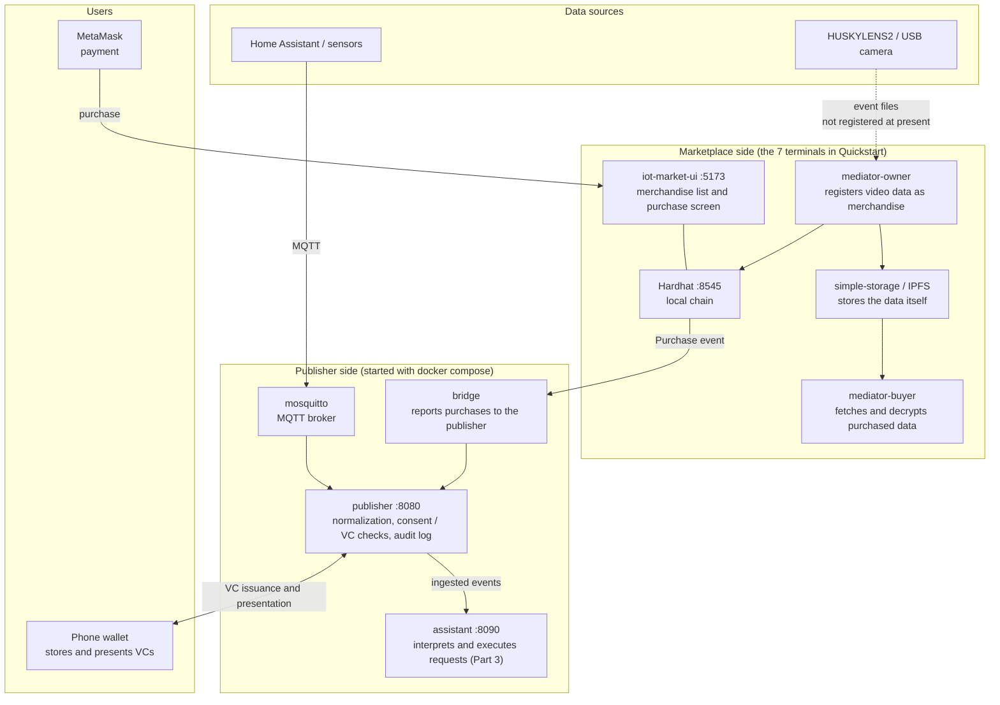

# Environment Setup

This section covers what you need before starting the hands-on.
It assumes a high school or undergraduate student is encountering this for the first time, so terms and steps are explained in plain language.

## What you are building

In the IW3IP hands-on you will run the following on your own laptop:

- collect data from IoT devices (cameras, sensors, phones)
- share that data with other people **conditionally**
- purchase the shared data or have an AI evaluate it

You build this on your own PC as a local development environment for sharing data safely and conditionally with others. No real cloud or money is involved — everything runs locally.

## System overview



Two groups of processes are started.

- **Marketplace side**: the blockchain (Hardhat), the merchandise UI, data storage, and the mediators. Start them in 7 terminals by following [Quickstart](quickstart.md). Used for listing and purchasing data (the second half of Part 1 and the marketplace integration in Part 2).
- **Publisher side**: the MQTT broker and the publisher. Start them with `docker compose -f infra/docker-compose.yml up` in the course repository. Used for ingesting data, deciding whether sharing is allowed by consent or VC, and the audit log (the first half of Part 1, Part 2, and Part 3).

The two groups run independently. In the Part 2 marketplace integration, the bridge reports purchase events to the publisher and connects them. The [tech stack table in the Hands-on overview](../hands-on/index.md#tech-stack-at-a-glance) shows which hands-on uses which.

## Overall structure

The hands-on is split into three Parts: **Basic**, **Feature Extensions**, and **Intelligence Integration**.

```
 ┌──────────────────────────────────────────────────────────┐
 │  Environment Setup (these pages)                         │
 │   - install tools                                        │
 │   - start the stack                                      │
 │   - sanity-check                                         │
 └──────────────────────────────────────────────────────────┘
          ↓ if this works, you're ready
 ┌──────────────────────────────────────────────────────────┐
 │  Hands-on Part 1: Basic                                  │
 │   capture, view, and trade IoT data                      │
 └──────────────────────────────────────────────────────────┘
          ↓ go deeper if you want
 ┌──────────────────────────────────────────────────────────┐
 │  Hands-on Part 2: Feature Extensions                     │
 │   consent, conditional sharing, wallet, tiered access    │
 └──────────────────────────────────────────────────────────┘
          ↓ advanced
 ┌──────────────────────────────────────────────────────────┐
 │  Hands-on Part 3: Intelligence Integration               │
 │   let an AI interpret human requests and act on them     │
 └──────────────────────────────────────────────────────────┘
```

## Pick your track

| Goal | Path |
|---|---|
| Just see something running | [Quickstart](quickstart.md) → first section of Part 1 |
| Walk through the basic flow | Setup → all of Part 1 |
| Reach safe / conditional sharing | Setup → Part 1 → Part 2 |
| Full intelligence-integrated demo | Setup → Part 1 → Part 2 → Part 3 |

It is fine to stop partway. Each Part builds on the knowledge of the previous one step by step.

## Setup steps

Follow these in order. Each page ends with a "you can move on if…" checklist.

1. [Prerequisites (install tools)](prerequisites.md)
2. [Quickstart (run the stack)](quickstart.md)
3. If something breaks → [Troubleshooting](../operations/troubleshooting.md)

## Mini-glossary

One-liner definitions of acronyms you'll meet in the hands-on. Each chapter expands the terms it uses.

| Term | Short meaning |
|---|---|
| **IoT** | "Things on the network" — cameras, sensors, etc. |
| **VC** (Verifiable Credential) | A digital certificate, e.g. "this person works for the police" |
| **DID** | A unique ID for the holder of a VC |
| **SSI** (Self-Sovereign Identity) | You hold and present your own credentials |
| **wallet** | App (usually on your phone) that stores and presents VCs |
| **publisher** | The server that emits data |
| **viewer** | The party that consumes data |
| **purpose** | Why the data will be used (research, crime_search, …) — used to decide allow/deny |
| **Consent VC** | A VC that says "I allow this kind of sharing" |
| **DataUserVC** | A VC that describes how trustworthy the data user is |
| **PurchaseViewerVC** | A VC issued after a purchase, granting view access |
| **bridge** | A go-between that connects the marketplace to the wallet |
| **audit log** | A record of who looked at what, when |
| **MQTT** | A lightweight protocol for devices to exchange messages. The destination is named by a **topic**; the content is the **payload** |
| **Home Assistant** | Open-source software that manages home devices and sensors. Used here as a data source |
| **Node-RED** | A tool for wiring processing flows on screen. Used to inject test events (optional) |
| **edge** | A computer next to the camera or sensor, where detection and similar processing run |
| **normalization** | Converting data that differs per device into one common format |
| **dataset_id** | The name of a kind of data (e.g. `home/env/temperature`). Consent and VCs are granted per dataset |
| **Hardhat** | A development tool for running a blockchain on your own PC |
| **MetaMask** | The wallet used for payments on the blockchain (browser extension / phone app). Different from the wallet that holds VCs |
| **RPC** | The endpoint for sending commands to a blockchain node, given as a URL (e.g. `http://localhost:8545`) |
| **tx** (transaction) | One operation recorded on the blockchain (a purchase, etc.). A cancelled operation is said to **revert** |
| **IoTMarket / Merchandise / PubKey** | The marketplace smart contracts: IoTMarket lists merchandise, Merchandise is one item, PubKey registers buyers' public keys |
| **mediator-owner / mediator-buyer** | Programs on the seller / buyer side. The former registers data as merchandise; the latter fetches and decrypts purchased data |
| **IPFS** | A system that stores files distributed across multiple computers |
| **Issuer / Holder / Verifier** | The party that issues / holds / verifies a VC. On this site the publisher is Issuer and Verifier, and the wallet is the Holder |
| **OID4VCI / OID4VP** | Standard protocols for issuing a VC into a wallet / presenting a VC from a wallet |
| **claim** | A field written in a VC (e.g. `dataset_id`). The API `/marketplace/claim` uses the word differently: it reports a purchase to the publisher |
| **token** | A short string the publisher issues after a VC presentation is verified. Sent with API calls as `Authorization: Bearer <token>` |
| **TTL** | Time to live. A token stops working after its TTL |
| **deeplink** | A link that opens an app when tapped. A QR code carries one |

## What you need

Bare minimum:

- **A PC** (macOS / Windows / Linux, 8 GB RAM or more recommended)
- **Internet** (for the initial docker pull / npm install)

Extra for feature-extension part:

- **A smartphone** (Android / iPhone) — to install the SSI wallet
- **MetaMask** browser extension — to buy data from the marketplace

Optional hardware (everything works without it):

- **HUSKYLENS2** or **USB webcam** — for the camera-based Phase 1 lessons
- **Raspberry Pi** — to run Home Assistant on real hardware

If you have none of the above, the **Home Assistant Demo Simulator** lets you do the entire walkthrough virtually.
