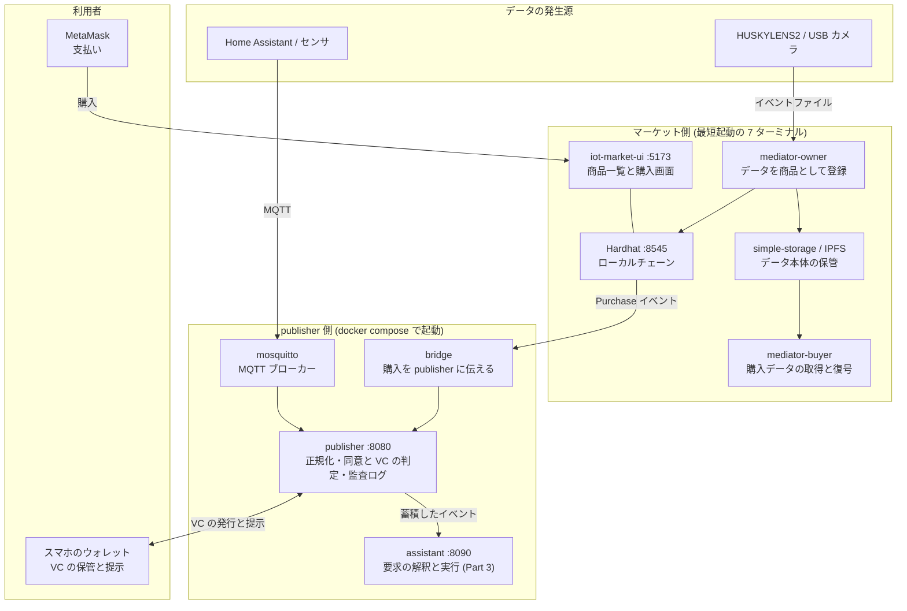

# 環境構築

このページは、ハンズオンを始める前の準備をまとめたものです。
高校生・大学学部生がはじめて触れることを想定し、用語や手順をできるだけ平易に説明します。

## ここで作る環境とは

IW3IP のハンズオンでは、次のような仕組みを実際に動かします。

- IoT デバイス (カメラ、センサ、スマホ) からデータを集める
- 集めたデータを「条件付きで」 別の人と共有する
- 共有したデータを購入したり、AI に判断させたりする

これらを、データを安全かつ条件付きで他者と共有するためのローカル開発環境として、自分の PC 上に構築します。
実際のクラウドや金銭は使いません。すべてローカル PC で完結します。

## 全体構成



起動するものは 2 系統あります。

- **マーケット側**: ブロックチェーン (Hardhat)、商品一覧の画面、データ保管、仲介プロセスです。[最短起動](quickstart.md) の手順で、ターミナルを 7 つ使って起動します。データの出品と購入 (Part 1 の後半、Part 2 のマーケット連携) で使います。
- **publisher 側**: MQTT ブローカーと publisher です。教材リポジトリで `docker compose -f infra/docker-compose.yml up` を実行して起動します。データの取り込み、同意や VC による共有可否の判定、監査ログ (Part 1 の前半、Part 2、Part 3) で使います。

2 つの系統は独立して動きます。Part 2 のマーケット連携では、bridge が購入のイベントを publisher に伝えて両者をつなぎます。各ハンズオンがどちらを使うかは、[ハンズオンの概要の早見表](../hands-on/index.md#使う技術要素の早見表) にまとめています。

## 全体の流れ

ハンズオンは **基本**、**機能拡張**、**知能統合** の 3 つの Part に分かれています。

```
 ┌──────────────────────────────────────────────────────────┐
 │  環境構築 (このページ群)                                  │
 │   - ツールを入れる                                         │
 │   - スタックを起動する                                     │
 │   - 動作確認する                                           │
 └──────────────────────────────────────────────────────────┘
          ↓ ここまでできれば本編に進めます
 ┌──────────────────────────────────────────────────────────┐
 │  ハンズオン Part 1: 基本                                  │
 │   IoT データを取って、見て、売買する基本の流れ             │
 └──────────────────────────────────────────────────────────┘
          ↓ もっと深く知りたい人は次へ
 ┌──────────────────────────────────────────────────────────┐
 │  ハンズオン Part 2: 機能拡張                              │
 │   同意・条件付き共有、ウォレット、段階アクセス             │
 └──────────────────────────────────────────────────────────┘
          ↓ 上級・発展
 ┌──────────────────────────────────────────────────────────┐
 │  ハンズオン Part 3: 知能統合                              │
 │   人の要求を AI に解釈させて自動で処理する                 │
 └──────────────────────────────────────────────────────────┘
```

## どこまでやるか — 自分のコースを選ぶ

| やってみたいこと | 進む順 |
|---|---|
| まず動くものを見たい | [最短起動](quickstart.md) → ハンズオン Part 1 の最初の節 |
| 基本の流れを一通り | 環境構築 → ハンズオン Part 1 すべて |
| 安全な共有まで試したい | 環境構築 → Part 1 → Part 2 |
| AI との統合まで試したい | 環境構築 → Part 1 → Part 2 → Part 3 |

途中で止めても問題ありません。各 Part は前の Part の知識を段階的に積み上げる構成です。

## 環境構築の手順

下の順に進めてください。各ページに「ここまでできていれば次に進める」のチェック欄があります。

1. [事前準備 (ツールのインストール)](prerequisites.md)
2. [最短起動 (スタックを動かす)](quickstart.md)
3. うまく動かないとき → [トラブルシュート](../operations/troubleshooting.md)

## このハンズオンで使う用語のミニ辞書

ハンズオン本編で登場する略語を一行で説明します。詳しい意味は、登場する章で補足します。

| 用語 | 短い説明 |
|---|---|
| **IoT** | カメラやセンサなど「ネットにつながる物」のこと |
| **VC** (Verifiable Credential) | デジタルの証明書。例:「この人は警察関係者」 |
| **DID** | VC の持ち主を一意に指す ID |
| **SSI** (Self-Sovereign Identity) | 自分の証明書を自分で持って提示できる仕組み |
| **wallet** (ウォレット) | VC を保管・提示するアプリ。スマホに入れる |
| **publisher** | データを発信する側のサーバ |
| **viewer** | データを受け取って見る側 |
| **purpose** (目的) | データを使う目的 (例: research, crime_search)。共有可否の判定に使う |
| **Consent VC** | データ共有の同意を表す VC |
| **DataUserVC** | データ利用者の信頼度を表す VC |
| **PurchaseViewerVC** | データ購入後に発行される閲覧用 VC |
| **bridge** | マーケットプレイスとウォレットをつなぐ仲介サービス |
| **audit log** | 誰が・いつ・何を見たかを残す監査ログ |
| **MQTT** | 機器どうしがメッセージを送り合うための軽量な通信方式。送り先を **topic** という名前で指定し、中身を **payload** と呼ぶ |
| **Home Assistant** | 家庭内の機器やセンサをまとめて管理するオープンソースのソフトウェア。本サイトではデータの発生源として使う |
| **Node-RED** | 処理の流れを画面上でつないで作るツール。疑似イベントを流すのに使う (任意) |
| **エッジ** | カメラやセンサのすぐそばにある計算機。ここで検知などの処理を行う |
| **正規化** | 機器ごとに異なる形式のデータを、共通の形式にそろえること |
| **dataset_id** | データの種類を表す名前 (例: `home/env/temperature`)。同意や VC はこの単位で与える |
| **Hardhat** | 手元の PC でブロックチェーンを動かすための開発ツール |
| **MetaMask** | ブロックチェーン上の支払いに使うウォレット (ブラウザ拡張 / スマホアプリ)。VC を入れるウォレットとは別物 |
| **RPC** | ブロックチェーンのノードに命令を送るための接続口。URL (例: `http://localhost:8545`) で指定する |
| **tx** (トランザクション) | ブロックチェーンに記録される 1 回の操作 (購入など)。処理が取り消されることを **revert** と呼ぶ |
| **IoTMarket / Merchandise / PubKey** | マーケットのスマートコントラクト。IoTMarket は商品の一覧、Merchandise は商品 1 件、PubKey は購入者の公開鍵の登録簿 |
| **mediator-owner / mediator-buyer** | 出品者側 / 購入者側で動く仲介プログラム。前者はデータを商品として登録し、後者は購入したデータを取得して復号する |
| **IPFS** | ファイルを複数の計算機に分散して保管する仕組み |
| **Issuer / Holder / Verifier** | VC を発行する側 / 持つ側 / 検証する側。本サイトでは publisher が Issuer と Verifier、ウォレットが Holder |
| **OID4VCI / OID4VP** | VC をウォレットに発行する手順 / ウォレットが VC を提示する手順の標準仕様 |
| **claim** | VC に書かれた項目 (例: `dataset_id`)。API の `/marketplace/claim` は「購入を publisher に申告する」という別の意味 |
| **トークン** | VC の提示が検証された後に publisher が発行する短い文字列。API を呼ぶときに `Authorization: Bearer <トークン>` として付ける |
| **TTL** | 有効期間。トークンは TTL を過ぎると使えなくなる |
| **deeplink** | タップするとアプリが開くリンク。QR コードの中身もこれ |

## 必要な機材

最低限:

- **PC** (macOS / Windows / Linux、メモリ 8 GB 以上推奨)
- **インターネット接続** (初回の docker pull / npm install で必要)

機能拡張パートで追加で必要:

- **スマートフォン** (Android / iPhone) — SSI ウォレットアプリのインストール
- **MetaMask** ブラウザ拡張機能 — マーケットプレイスでの購入操作

実機オプション (なくても可):

- **HUSKYLENS2** または **USB ウェブカメラ** — Part 1 でカメラを使う場合
- **Raspberry Pi** — Home Assistant を実機で動かす場合

実機なしで一通り試す場合は **Home Assistant Demo Simulator** を使います。
