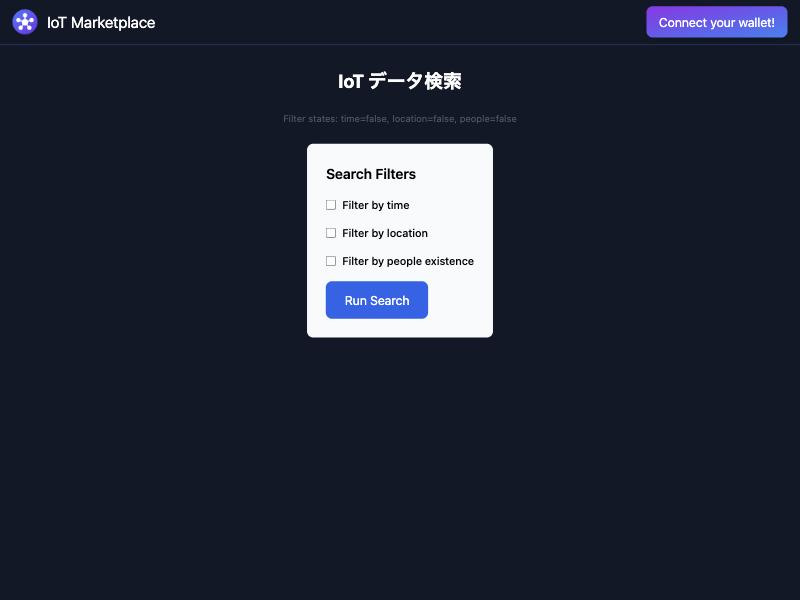
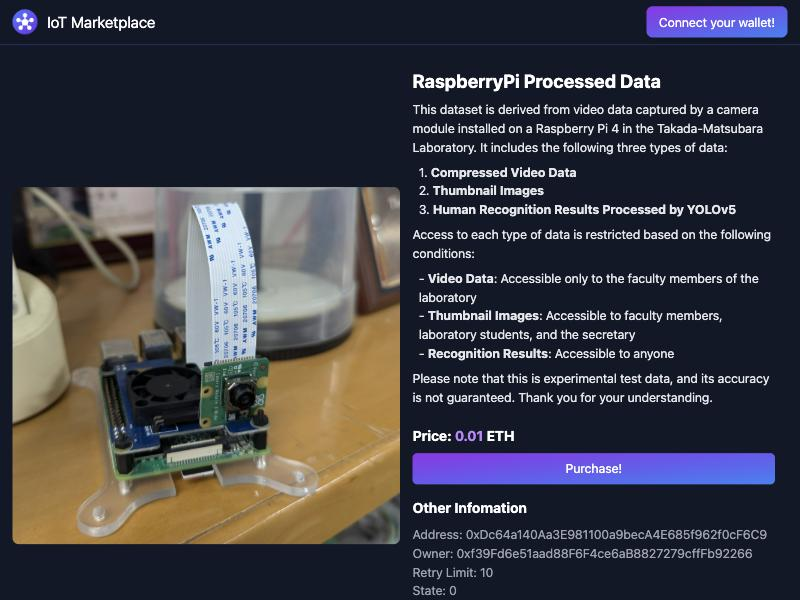
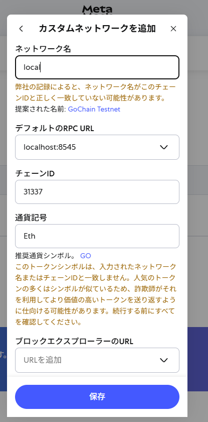

# 最短起動 (スタックを動かす)

[事前準備](prerequisites.md) でインストールしたツールを使って、ハンズオン環境一式をまとめて起動します。
所要時間の目安は **15〜30 分** です (初回は docker pull / npm install に時間がかかります)。

> ここでは 6 種類のプロセスを起動します。コントラクトのデプロイと、2 つある仲介プロセスにもそれぞれターミナルを使うため、ターミナルは全部で 7 つ開きます。
> 手順どおりに進めてください。

## ここで動かすもの — 全体像

```
┌─────────────────────────────────────────────────────────────┐
│  ブラウザ (Chrome 等) — http://localhost:5173                │
│  └─ MetaMask で購入操作                                      │
└──────────────────────────┬──────────────────────────────────┘
                           │
            ┌──────────────▼──────────────┐
            │  iot-market-ui (1)           │ ← Svelte/Vite フロント
            │  Node.js                     │
            └──────┬───────────────┬───────┘
                   │               │
       ┌───────────▼─────┐   ┌────▼──────────────┐
       │ iot-market (2)  │   │ simple-storage (3)│
       │ Hardhat ノード  │   │ Rust              │
       │ + コントラクト  │   │ データ本体        │
       └─────────────────┘   └──────┬────────────┘
                                    │
                            ┌───────▼───────┐
                            │ ipfs (4)      │
                            │ + PostgreSQL  │
                            │ Docker        │
                            └───┬───────┬───┘
                                │       │
                  ┌─────────────▼──┐ ┌─▼─────────────────┐
                  │ mediator-owner │ │ mediator-buyer    │
                  │ (5) Rust       │ │ (6) Rust          │
                  └────────────────┘ └───────────────────┘
```

(1) フロントエンド、(2) ブロックチェーン、(3) データ保管、(4) ファイル分散、(5)(6) 仲介プロセス、の 6 つです。

## 起動順 — 上から順に

> **ターミナルを 7 つ用意してください**。デプロイ (ターミナル 2) を除き、各プロセスは起動したまま動作し続けます。
> macOS Terminal なら ⌘+T、VS Code なら "Split Terminal" が利用できます。

### 0. 教材リポジトリに移動

すべての作業は教材リポジトリのトップ (`Blockchain_IoT_Marketplace/`) で行います。

```bash
cd Blockchain_IoT_Marketplace
```

### 0.5 ホスト名 `host.docker.internal` を確認

仲介プロセスとフロントエンドは、接続先として `host.docker.internal` という名前を使います。この名前が PC 上で引けるかを確認します。

```bash
ping -c 1 host.docker.internal
```

`cannot resolve` や `Unknown host` と表示される場合は、hosts ファイルに次の 1 行を追加します (管理者権限が必要です)。

```
127.0.0.1 host.docker.internal
```

- macOS / Linux: `/etc/hosts` (例: `sudo sh -c 'echo "127.0.0.1 host.docker.internal" >> /etc/hosts'`)
- Windows: `C:\Windows\System32\drivers\etc\hosts` (WSL2 の中で作業する場合は WSL2 側の `/etc/hosts`)

追加したら、もう一度 `ping` で応答があることを確認します。

### 1. ローカルブロックチェーンを起動

ターミナル 1:

```bash
cd iot-market
npx hardhat node
```

期待する出力 (抜粋):

```
Started HTTP and WebSocket JSON-RPC server at http://127.0.0.1:8545/

Accounts
========
WARNING: These accounts ... use only for testing.

Account #0: 0xf39F... (10000 ETH)
Private Key: 0xac09...
...
Account #2: 0x3C44... (10000 ETH)
Private Key: 0x5de4...
...
```

> **このターミナルは閉じないでください**。ブロックチェーンが動き続けます。
>
> 表示された **Account #2 と Private Key** は、後で MetaMask に取り込むので画面に残しておきます (購入者側の仲介プロセスが Account #2 を使うためです)。
> この Private Key は Hardhat が公開しているテスト用の鍵で、誰でも知ることができます。実際のネットワークでは使わないでください。

### 2. コントラクトをデプロイ

ターミナル 2 (別の窓):

```bash
cd iot-market
npx hardhat run scripts/deployMerchandiseWithIoTMarket.ts --network localhost
```

成功すると、デプロイされたコントラクトのアドレスが表示されます。

### 3. フロントエンドを起動

ターミナル 3:

```bash
cd iot-market-ui
npm install   # 初回のみ
npm run dev
```

期待する出力:

```
  VITE v4.x  ready in 500 ms
  ➜  Local:   http://localhost:5173/
```

ブラウザで <http://localhost:5173> を開いて、マーケットプレイスの画面が表示されれば成功です。

### 4. データ保管庫を起動

ターミナル 4:

```bash
cd simple-storage
cargo run
```

初回は Rust ライブラリのコンパイルで数分かかります。
`listening on 0.0.0.0:3000` が出れば起動完了です。

### 5. IPFS と PostgreSQL を起動 (Docker)

ターミナル 5:

```bash
cd ipfs
docker compose up -d
```

`-d` (detached) を付けているため、バックグラウンドで起動します。
状態を確認します。

```bash
docker compose ps
```

`ipfs` と `postgres` の State が **Up** であれば成功です。

### 6. 仲介プロセス (オーナー側 + 購入者側) を起動

ターミナル 6 (オーナー側)。監視するフォルダ `raw_data/output` を先に作ります (無いと、起動時に `Failed to read raw data dir` と表示されてデータを読み込めません)。

```bash
cd mediator-owner
mkdir -p raw_data/output
cargo run -- settings/owner_1.yaml
```

ターミナル 7 (購入者側):

```bash
cd mediator-buyer
cargo run --bin mediator-b
```

両方とも、次の表示が出れば成功です (初回はコンパイルに数分かかります)。

```
Pubkey uploaded successfully
====================
Initialization complete!
====================
...
====================
Starting blockchain watch
====================
```

`Pubkey uploaded successfully` は、仲介プロセスが自分の公開鍵を PubKey コントラクトに登録したことを示します。購入には、購入者の公開鍵が登録されている必要があります。購入者側の仲介プロセスは Account #2 として動くので、MetaMask にも Account #2 を取り込みます。

## 動作確認

1. ブラウザで <http://localhost:5173> を開きます。「IoT データ検索」という検索画面が表示されます。

    { width="480" }

2. 手順 2 でデプロイした商品のページを開きます。商品の説明、価格、「Purchase!」ボタンが表示されれば成功です。

    ```
    http://localhost:5173/merchandise/0xDc64a140Aa3E981100a9becA4E685f962f0cF6C9
    ```

    { width="480" }

3. **MetaMask** をセットアップします (次節)。

検索画面の「Run Search」で一覧に出るのは、`mediator-owner` がデータとあわせて登録した商品です。手順 2 のデプロイで登録される 5 件は検索の対象にならないので、商品ページの URL を直接開いて確認します。アドレスは手順 2 の出力に表示されます (毎回同じ値です)。

## MetaMask のローカルチェーン設定

MetaMask をローカル Hardhat に接続します。

1. MetaMask 拡張を開く
2. ネットワーク選択 → 「**カスタムネットワーク追加**」
3. 以下を入力:
   - ネットワーク名: `Hardhat Local`
   - RPC URL: `http://localhost:8545`
   - チェーン ID: `31337`
   - 通貨記号: `ETH`
4. 保存して、追加したネットワークに切り替える

ステップ 1 で出ていた **Account #2 の Private Key** をインポートします:

1. MetaMask 右上のアイコン → **アカウントのインポート**
2. Private Key を貼り付ける (`0x` 始まりの 64 桁)
3. 取り込んだアカウントの残高に **10000 ETH** が表示されれば成功

参考画像 (ネットワーク追加のイメージ):



## ここまでできていれば次に進める

- [ ] ターミナル 1〜7 がすべて立ち上がっていてエラーで落ちていない
- [ ] <http://localhost:5173> で検索画面が、商品ページの URL で商品が表示される
- [ ] MetaMask が `Hardhat Local` ネットワークに接続できている
- [ ] MetaMask のアカウント残高が `10000 ETH` 表示

すべてチェック → [ハンズオン Part 1](../hands-on/index.md) に進めます。

## 簡易な代替: docker compose だけで動く最小スタック

ターミナルを 7 つ開くのが煩雑な場合は、Docker Compose で publisher 周りだけを起動する方法もあります。
データの取り込みと観察に特化した、実機を使わない最短経路は次のページを参照してください。

- [Home Assistant Demo Simulator サンプル](../hands-on/ha-demo-simulator.md)

これだけでも Part 1 の最初の節は試せます。

## よくあるつまずき

| 症状 | 原因 | 対処 |
|---|---|---|
| `npx: command not found` | Node.js が入っていない | [事前準備](prerequisites.md) の Node.js を再確認 |
| `cargo: command not found` | Rust が入っていない | 同上、Rust を再インストール |
| `port 5173 already in use` | 別アプリがポート占有 | 占有プロセスを止めるか別ポートで起動 |
| IPFS のコンテナが起動しない / publisher が起動しない | IPFS のゲートウェイと publisher が、どちらもポート 8080 を使う | 同時には起動できない。publisher を使うハンズオンの前に、`ipfs` ディレクトリで `docker compose down` を実行する |
| 仲介プロセスが `dns error` や接続エラーで止まる | `host.docker.internal` を引けない | 手順 0.5 を実施 |
| `error connecting to docker` | Docker Desktop 未起動 | Docker Desktop を起動 |
| MetaMask に「Nonce too high」 | チェーン再起動でズレた | MetaMask Settings → Advanced → Reset Account |
| MetaMask が `localhost:8545` を Reject | RPC URL の打ち間違い | `http://` を付け忘れていないか確認 |

それ以外は [トラブルシュート](../operations/troubleshooting.md) と [FAQ](../operations/faq.md) を参照してください。

## このページで覚える用語

| 用語 | 短い意味 |
|---|---|
| **Hardhat** | Ethereum 互換のローカルチェーンを動かすツール |
| **コントラクト** | ブロックチェーン上で動くプログラム |
| **デプロイ** | コントラクトをチェーン上に設置すること |
| **チェーン ID** | ネットワークを識別する番号 (Hardhat の既定は 31337) |
| **Vite** | フロントエンド用の高速な開発サーバ |

詳しくは [Hardhat 基礎](../foundations/hardhat-basics.md) と [SSI/DID/VC 基礎](../foundations/ssi-did-vc-basics.md) を参照してください。
