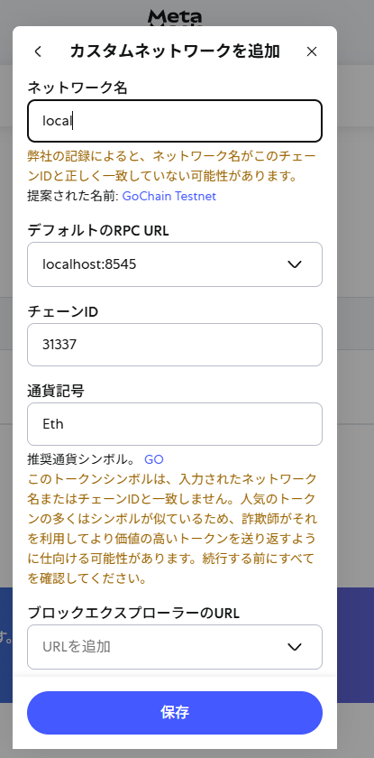

# Quickstart

Goal: boot the whole stack first.

## Startup order

1. `iot-market` (chain + deploy)
2. `iot-market-ui`
3. `simple-storage`
4. `ipfs`
5. `mediator-owner`
6. `mediator-buyer`

## Core commands

```bash
cd iot-market
npx hardhat node
```

In another terminal:

```bash
cd iot-market
npx hardhat run scripts/deployMerchandiseWithIoTMarket.ts --network localhost
```

```bash
cd iot-market-ui
npm run dev
```

```bash
cd simple-storage
cargo run
```

```bash
cd ipfs
docker compose up -d
```

```bash
cd mediator-owner
cargo run -- settings/owner_1.yaml
```

```bash
cd mediator-buyer
cargo run --bin mediator-b
```

## Success check

- Frontend opens at `http://localhost:5173`
- Merchandise list is available
- No critical process exits with error


